

  🌙
  <h1>The Big Bedtime Storybook</h1>
  
170 bedtime stories for ages 4–7 — 127 original tales plus 43 timeless classics.

  

    <input id="story-search" type="search" placeholder="🔍 Search stories…" aria-label="search">
    🔍
  

  
📚 170 stories &nbsp;·&nbsp; 📕 free illustrated PDFs &nbsp;·&nbsp; 🌙 new stories daily

  
<a class="btn btn-read" style="flex:none;padding:13px 34px" href="book/bedtime-storybook.html">📖 Read the whole book in one page</a>

  <a href="book/night-time-stories.pdf">
    🌙
    
      ✨ FEATURED BOOK
      <h2>🌙 The Night-Time Storybook</h2>
      
26 dreamy bedtime stories in one beautiful book — perfect for lights-out reading.

    
    →
  </a>

<main class="shelf">

😴 No stories found — try another word!

<section class="category cat-new" id="cat-new">
  <h2>✨ New Bedtime Stories</h2>
  
Fresh tales, newest first — posted daily.

  

<article class="story-card" data-search="mira and the starlit coins 2026-10-01-mira-and-the-starlit-coins">
  <a class="card-art" href="stories/2026-10-01-mira-and-the-starlit-coins.html" aria-label="Mira and the Starlit Coins">
    ⭐
    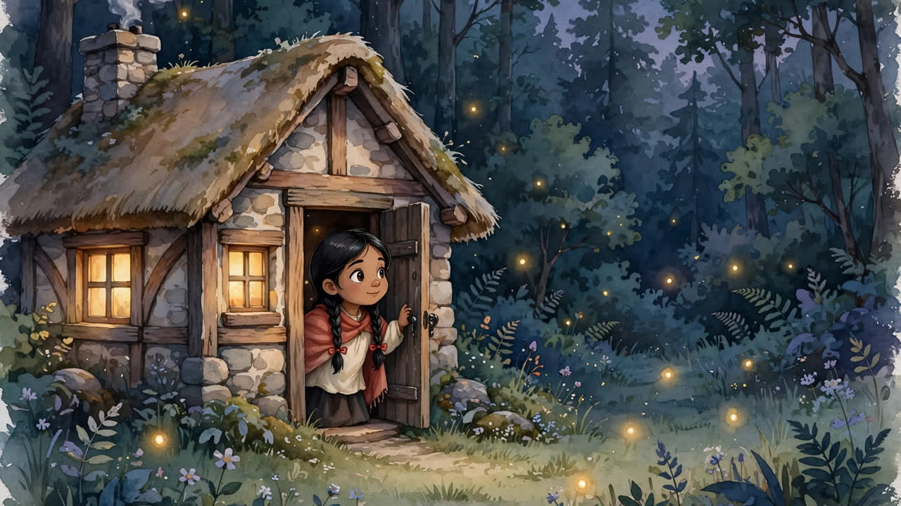
  </a>
  

    <h3><a href="stories/2026-10-01-mira-and-the-starlit-coins.html">Mira and the Starlit Coins</a></h3>
    

      <a class="btn btn-read" href="stories/2026-10-01-mira-and-the-starlit-coins.html">📖 Read</a>
      <a class="btn btn-share" href="https://wa.me/?text=Mira%20and%20the%20Starlit%20Coins%20%E2%80%94%20The%20Big%20Bedtime%20Storybook%0Ahttps%3A%2F%2Fniteshlhsnda-droid.github.io%2Fkids-book-videos%2Fstories%2F2026-10-01-mira-and-the-starlit-coins.html" target="_blank" rel="noopener" title="Share on WhatsApp" aria-label="Share on WhatsApp">📲</a>
    

  

</article>
  

</section>

<section class="category cat-night" id="cat-night">
  <h2>🌙 Night-Time Stories</h2>
  
Gentle tales of moons, stars, fireflies and sleepy friends.

  

<article class="story-card" data-search="a blanket of stars a-blanket-of-stars">
  <a class="card-art" href="stories/a-blanket-of-stars.html" aria-label="A Blanket of Stars">
    ⭐
    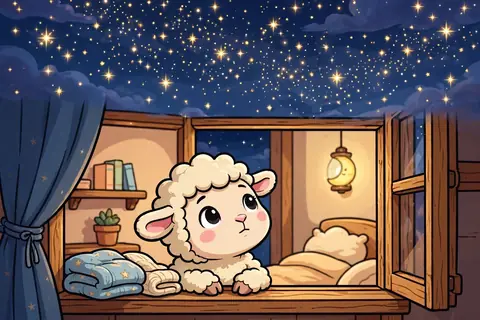
  </a>
  

    <h3><a href="stories/a-blanket-of-stars.html">A Blanket of Stars</a></h3>
    

      <a class="btn btn-read" href="stories/a-blanket-of-stars.html">📖 Read</a>
      <a class="btn btn-pdf" href="book/stories/a-blanket-of-stars.pdf">📕 PDF</a>
      <a class="btn btn-share" href="https://wa.me/?text=A%20Blanket%20of%20Stars%20%E2%80%94%20The%20Big%20Bedtime%20Storybook%0Ahttps%3A%2F%2Fniteshlhsnda-droid.github.io%2Fkids-book-videos%2Fstories%2Fa-blanket-of-stars.html" target="_blank" rel="noopener" title="Share on WhatsApp" aria-label="Share on WhatsApp">📲</a>
    

  

</article>
<article class="story-card" data-search="counting stars to sleep counting-stars-to-sleep">
  <a class="card-art" href="stories/counting-stars-to-sleep.html" aria-label="Counting Stars to Sleep">
    ⭐
    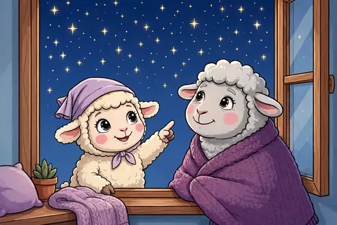
  </a>
  

    <h3><a href="stories/counting-stars-to-sleep.html">Counting Stars to Sleep</a></h3>
    

      <a class="btn btn-read" href="stories/counting-stars-to-sleep.html">📖 Read</a>
      <a class="btn btn-pdf" href="book/stories/counting-stars-to-sleep.pdf">📕 PDF</a>
      <a class="btn btn-share" href="https://wa.me/?text=Counting%20Stars%20to%20Sleep%20%E2%80%94%20The%20Big%20Bedtime%20Storybook%0Ahttps%3A%2F%2Fniteshlhsnda-droid.github.io%2Fkids-book-videos%2Fstories%2Fcounting-stars-to-sleep.html" target="_blank" rel="noopener" title="Share on WhatsApp" aria-label="Share on WhatsApp">📲</a>
    

  

</article>
<article class="story-card" data-search="faye the deer fawn&#x27;s firefly dance faye-the-deer-fawns-firefly-dance">
  <a class="card-art" href="stories/faye-the-deer-fawns-firefly-dance.html" aria-label="Faye the Deer Fawn&#x27;s Firefly Dance">
    ✨
    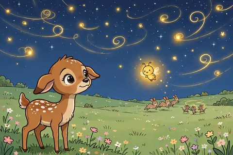
  </a>
  

    <h3><a href="stories/faye-the-deer-fawns-firefly-dance.html">Faye the Deer Fawn&#x27;s Firefly Dance</a></h3>
    

      <a class="btn btn-read" href="stories/faye-the-deer-fawns-firefly-dance.html">📖 Read</a>
      <a class="btn btn-pdf" href="book/stories/faye-the-deer-fawns-firefly-dance.pdf">📕 PDF</a>
      <a class="btn btn-share" href="https://wa.me/?text=Faye%20the%20Deer%20Fawn%27s%20Firefly%20Dance%20%E2%80%94%20The%20Big%20Bedtime%20Storybook%0Ahttps%3A%2F%2Fniteshlhsnda-droid.github.io%2Fkids-book-videos%2Fstories%2Ffaye-the-deer-fawns-firefly-dance.html" target="_blank" rel="noopener" title="Share on WhatsApp" aria-label="Share on WhatsApp">📲</a>
    

  

</article>
<article class="story-card" data-search="hoot&#x27;s sleepy rounds hoots-sleepy-rounds">
  <a class="card-art" href="stories/hoots-sleepy-rounds.html" aria-label="Hoot&#x27;s Sleepy Rounds">
    🦉
    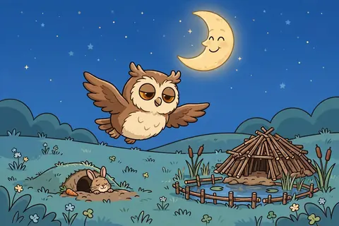
  </a>
  

    <h3><a href="stories/hoots-sleepy-rounds.html">Hoot&#x27;s Sleepy Rounds</a></h3>
    

      <a class="btn btn-read" href="stories/hoots-sleepy-rounds.html">📖 Read</a>
      <a class="btn btn-pdf" href="book/stories/hoots-sleepy-rounds.pdf">📕 PDF</a>
      <a class="btn btn-share" href="https://wa.me/?text=Hoot%27s%20Sleepy%20Rounds%20%E2%80%94%20The%20Big%20Bedtime%20Storybook%0Ahttps%3A%2F%2Fniteshlhsnda-droid.github.io%2Fkids-book-videos%2Fstories%2Fhoots-sleepy-rounds.html" target="_blank" rel="noopener" title="Share on WhatsApp" aria-label="Share on WhatsApp">📲</a>
    

  

</article>
<article class="story-card" data-search="hugo&#x27;s moon blanket mossys-moon-blanket">
  <a class="card-art" href="stories/mossys-moon-blanket.html" aria-label="Hugo&#x27;s Moon Blanket">
    🌙
    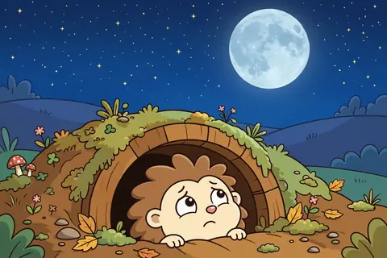
  </a>
  

    <h3><a href="stories/mossys-moon-blanket.html">Hugo&#x27;s Moon Blanket</a></h3>
    

      <a class="btn btn-read" href="stories/mossys-moon-blanket.html">📖 Read</a>
      <a class="btn btn-pdf" href="book/stories/mossys-moon-blanket.pdf">📕 PDF</a>
      <a class="btn btn-share" href="https://wa.me/?text=Hugo%27s%20Moon%20Blanket%20%E2%80%94%20The%20Big%20Bedtime%20Storybook%0Ahttps%3A%2F%2Fniteshlhsnda-droid.github.io%2Fkids-book-videos%2Fstories%2Fmossys-moon-blanket.html" target="_blank" rel="noopener" title="Share on WhatsApp" aria-label="Share on WhatsApp">📲</a>
    

  

</article>
<article class="story-card" data-search="koda the koala and the sleepy leaf koda-the-koala-and-the-sleepy-leaf">
  <a class="card-art" href="stories/koda-the-koala-and-the-sleepy-leaf.html" aria-label="Koda the Koala and the Sleepy Leaf">
    🐨
    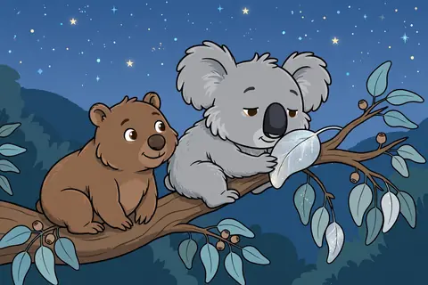
  </a>
  

    <h3><a href="stories/koda-the-koala-and-the-sleepy-leaf.html">Koda the Koala and the Sleepy Leaf</a></h3>
    

      <a class="btn btn-read" href="stories/koda-the-koala-and-the-sleepy-leaf.html">📖 Read</a>
      <a class="btn btn-pdf" href="book/stories/koda-the-koala-and-the-sleepy-leaf.pdf">📕 PDF</a>
      <a class="btn btn-share" href="https://wa.me/?text=Koda%20the%20Koala%20and%20the%20Sleepy%20Leaf%20%E2%80%94%20The%20Big%20Bedtime%20Storybook%0Ahttps%3A%2F%2Fniteshlhsnda-droid.github.io%2Fkids-book-videos%2Fstories%2Fkoda-the-koala-and-the-sleepy-leaf.html" target="_blank" rel="noopener" title="Share on WhatsApp" aria-label="Share on WhatsApp">📲</a>
    

  

</article>
<article class="story-card" data-search="marnie the mole hears the stars marnie-the-mole-hears-the-stars">
  <a class="card-art" href="stories/marnie-the-mole-hears-the-stars.html" aria-label="Marnie the Mole Hears the Stars">
    ⭐
    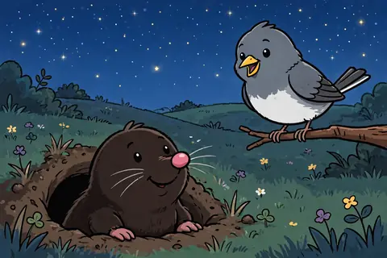
  </a>
  

    <h3><a href="stories/marnie-the-mole-hears-the-stars.html">Marnie the Mole Hears the Stars</a></h3>
    

      <a class="btn btn-read" href="stories/marnie-the-mole-hears-the-stars.html">📖 Read</a>
      <a class="btn btn-pdf" href="book/stories/marnie-the-mole-hears-the-stars.pdf">📕 PDF</a>
      <a class="btn btn-share" href="https://wa.me/?text=Marnie%20the%20Mole%20Hears%20the%20Stars%20%E2%80%94%20The%20Big%20Bedtime%20Storybook%0Ahttps%3A%2F%2Fniteshlhsnda-droid.github.io%2Fkids-book-videos%2Fstories%2Fmarnie-the-mole-hears-the-stars.html" target="_blank" rel="noopener" title="Share on WhatsApp" aria-label="Share on WhatsApp">📲</a>
    

  

</article>
<article class="story-card" data-search="moonbeam mail moonbeam-mail">
  <a class="card-art" href="stories/moonbeam-mail.html" aria-label="Moonbeam Mail">
    🌙
    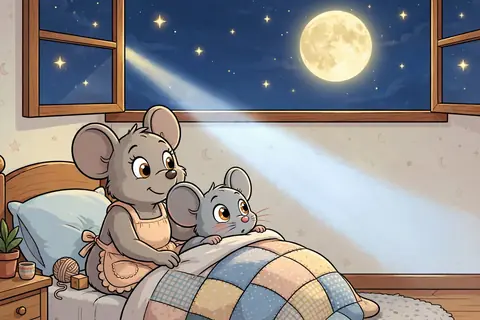
  </a>
  

    <h3><a href="stories/moonbeam-mail.html">Moonbeam Mail</a></h3>
    

      <a class="btn btn-read" href="stories/moonbeam-mail.html">📖 Read</a>
      <a class="btn btn-pdf" href="book/stories/moonbeam-mail.pdf">📕 PDF</a>
      <a class="btn btn-share" href="https://wa.me/?text=Moonbeam%20Mail%20%E2%80%94%20The%20Big%20Bedtime%20Storybook%0Ahttps%3A%2F%2Fniteshlhsnda-droid.github.io%2Fkids-book-videos%2Fstories%2Fmoonbeam-mail.html" target="_blank" rel="noopener" title="Share on WhatsApp" aria-label="Share on WhatsApp">📲</a>
    

  

</article>
<article class="story-card" data-search="sun and moon take turns sun-and-moon-take-turns">
  <a class="card-art" href="stories/sun-and-moon-take-turns.html" aria-label="Sun and Moon Take Turns">
    🌙
    
  </a>
  

    <h3><a href="stories/sun-and-moon-take-turns.html">Sun and Moon Take Turns</a></h3>
    

      <a class="btn btn-read" href="stories/sun-and-moon-take-turns.html">📖 Read</a>
      <a class="btn btn-pdf" href="book/stories/sun-and-moon-take-turns.pdf">📕 PDF</a>
      <a class="btn btn-share" href="https://wa.me/?text=Sun%20and%20Moon%20Take%20Turns%20%E2%80%94%20The%20Big%20Bedtime%20Storybook%0Ahttps%3A%2F%2Fniteshlhsnda-droid.github.io%2Fkids-book-videos%2Fstories%2Fsun-and-moon-take-turns.html" target="_blank" rel="noopener" title="Share on WhatsApp" aria-label="Share on WhatsApp">📲</a>
    

  

</article>
<article class="story-card" data-search="sunny says goodnight sunny-says-goodnight">
  <a class="card-art" href="stories/sunny-says-goodnight.html" aria-label="Sunny Says Goodnight">
    🌙
    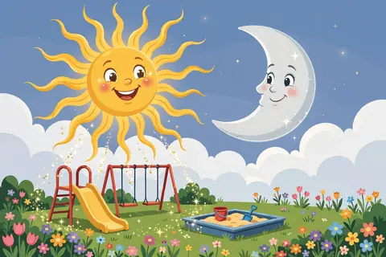
  </a>
  

    <h3><a href="stories/sunny-says-goodnight.html">Sunny Says Goodnight</a></h3>
    

      <a class="btn btn-read" href="stories/sunny-says-goodnight.html">📖 Read</a>
      <a class="btn btn-pdf" href="book/stories/sunny-says-goodnight.pdf">📕 PDF</a>
      <a class="btn btn-share" href="https://wa.me/?text=Sunny%20Says%20Goodnight%20%E2%80%94%20The%20Big%20Bedtime%20Storybook%0Ahttps%3A%2F%2Fniteshlhsnda-droid.github.io%2Fkids-book-videos%2Fstories%2Fsunny-says-goodnight.html" target="_blank" rel="noopener" title="Share on WhatsApp" aria-label="Share on WhatsApp">📲</a>
    

  

</article>
<article class="story-card" data-search="teddy&#x27;s midnight picnic teddys-midnight-picnic">
  <a class="card-art" href="stories/teddys-midnight-picnic.html" aria-label="Teddy&#x27;s Midnight Picnic">
    🧺
    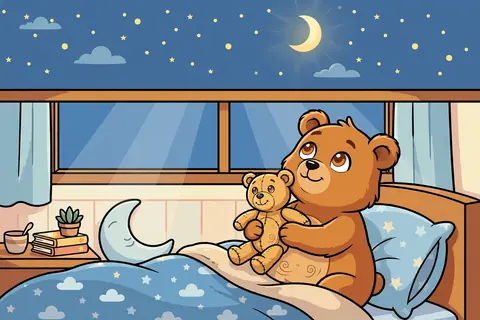
  </a>
  

    <h3><a href="stories/teddys-midnight-picnic.html">Teddy&#x27;s Midnight Picnic</a></h3>
    

      <a class="btn btn-read" href="stories/teddys-midnight-picnic.html">📖 Read</a>
      <a class="btn btn-pdf" href="book/stories/teddys-midnight-picnic.pdf">📕 PDF</a>
      <a class="btn btn-share" href="https://wa.me/?text=Teddy%27s%20Midnight%20Picnic%20%E2%80%94%20The%20Big%20Bedtime%20Storybook%0Ahttps%3A%2F%2Fniteshlhsnda-droid.github.io%2Fkids-book-videos%2Fstories%2Fteddys-midnight-picnic.html" target="_blank" rel="noopener" title="Share on WhatsApp" aria-label="Share on WhatsApp">📲</a>
    

  

</article>
<article class="story-card" data-search="the brave little firefly the-brave-little-firefly">
  <a class="card-art" href="stories/the-brave-little-firefly.html" aria-label="The Brave Little Firefly">
    ✨
    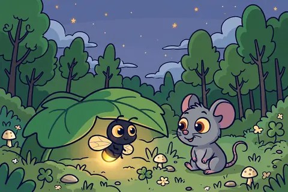
  </a>
  

    <h3><a href="stories/the-brave-little-firefly.html">The Brave Little Firefly</a></h3>
    

      <a class="btn btn-read" href="stories/the-brave-little-firefly.html">📖 Read</a>
      <a class="btn btn-pdf" href="book/stories/the-brave-little-firefly.pdf">📕 PDF</a>
      <a class="btn btn-share" href="https://wa.me/?text=The%20Brave%20Little%20Firefly%20%E2%80%94%20The%20Big%20Bedtime%20Storybook%0Ahttps%3A%2F%2Fniteshlhsnda-droid.github.io%2Fkids-book-videos%2Fstories%2Fthe-brave-little-firefly.html" target="_blank" rel="noopener" title="Share on WhatsApp" aria-label="Share on WhatsApp">📲</a>
    

  

</article>
<article class="story-card" data-search="the dream boat the-dream-boat">
  <a class="card-art" href="stories/the-dream-boat.html" aria-label="The Dream Boat">
    ⛵
    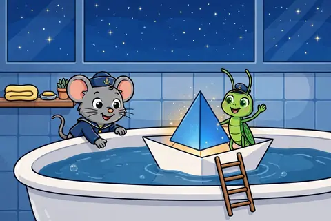
  </a>
  

    <h3><a href="stories/the-dream-boat.html">The Dream Boat</a></h3>
    

      <a class="btn btn-read" href="stories/the-dream-boat.html">📖 Read</a>
      <a class="btn btn-pdf" href="book/stories/the-dream-boat.pdf">📕 PDF</a>
      <a class="btn btn-share" href="https://wa.me/?text=The%20Dream%20Boat%20%E2%80%94%20The%20Big%20Bedtime%20Storybook%0Ahttps%3A%2F%2Fniteshlhsnda-droid.github.io%2Fkids-book-videos%2Fstories%2Fthe-dream-boat.html" target="_blank" rel="noopener" title="Share on WhatsApp" aria-label="Share on WhatsApp">📲</a>
    

  

</article>
<article class="story-card" data-search="the dream collector&#x27;s pillow the-dream-collectors-pillow">
  <a class="card-art" href="stories/the-dream-collectors-pillow.html" aria-label="The Dream Collector&#x27;s Pillow">
    💭
    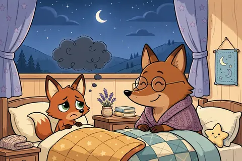
  </a>
  

    <h3><a href="stories/the-dream-collectors-pillow.html">The Dream Collector&#x27;s Pillow</a></h3>
    

      <a class="btn btn-read" href="stories/the-dream-collectors-pillow.html">📖 Read</a>
      <a class="btn btn-pdf" href="book/stories/the-dream-collectors-pillow.pdf">📕 PDF</a>
      <a class="btn btn-share" href="https://wa.me/?text=The%20Dream%20Collector%27s%20Pillow%20%E2%80%94%20The%20Big%20Bedtime%20Storybook%0Ahttps%3A%2F%2Fniteshlhsnda-droid.github.io%2Fkids-book-videos%2Fstories%2Fthe-dream-collectors-pillow.html" target="_blank" rel="noopener" title="Share on WhatsApp" aria-label="Share on WhatsApp">📲</a>
    

  

</article>
<article class="story-card" data-search="the dream garden the-dream-garden">
  <a class="card-art" href="stories/the-dream-garden.html" aria-label="The Dream Garden">
    🌸
    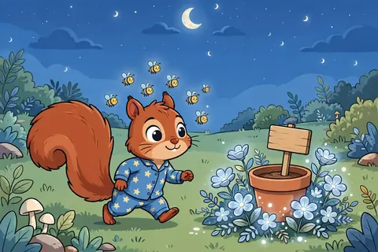
  </a>
  

    <h3><a href="stories/the-dream-garden.html">The Dream Garden</a></h3>
    

      <a class="btn btn-read" href="stories/the-dream-garden.html">📖 Read</a>
      <a class="btn btn-pdf" href="book/stories/the-dream-garden.pdf">📕 PDF</a>
      <a class="btn btn-share" href="https://wa.me/?text=The%20Dream%20Garden%20%E2%80%94%20The%20Big%20Bedtime%20Storybook%0Ahttps%3A%2F%2Fniteshlhsnda-droid.github.io%2Fkids-book-videos%2Fstories%2Fthe-dream-garden.html" target="_blank" rel="noopener" title="Share on WhatsApp" aria-label="Share on WhatsApp">📲</a>
    

  

</article>
<article class="story-card" data-search="the firefly dance the-firefly-dance">
  <a class="card-art" href="stories/the-firefly-dance.html" aria-label="The Firefly Dance">
    ✨
    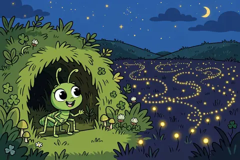
  </a>
  

    <h3><a href="stories/the-firefly-dance.html">The Firefly Dance</a></h3>
    

      <a class="btn btn-read" href="stories/the-firefly-dance.html">📖 Read</a>
      <a class="btn btn-pdf" href="book/stories/the-firefly-dance.pdf">📕 PDF</a>
      <a class="btn btn-share" href="https://wa.me/?text=The%20Firefly%20Dance%20%E2%80%94%20The%20Big%20Bedtime%20Storybook%0Ahttps%3A%2F%2Fniteshlhsnda-droid.github.io%2Fkids-book-videos%2Fstories%2Fthe-firefly-dance.html" target="_blank" rel="noopener" title="Share on WhatsApp" aria-label="Share on WhatsApp">📲</a>
    

  

</article>
<article class="story-card" data-search="the goodnight zoo the-goodnight-zoo">
  <a class="card-art" href="stories/the-goodnight-zoo.html" aria-label="The Goodnight Zoo">
    🦁
    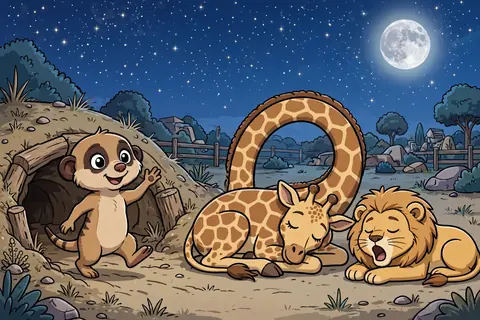
  </a>
  

    <h3><a href="stories/the-goodnight-zoo.html">The Goodnight Zoo</a></h3>
    

      <a class="btn btn-read" href="stories/the-goodnight-zoo.html">📖 Read</a>
      <a class="btn btn-pdf" href="book/stories/the-goodnight-zoo.pdf">📕 PDF</a>
      <a class="btn btn-share" href="https://wa.me/?text=The%20Goodnight%20Zoo%20%E2%80%94%20The%20Big%20Bedtime%20Storybook%0Ahttps%3A%2F%2Fniteshlhsnda-droid.github.io%2Fkids-book-videos%2Fstories%2Fthe-goodnight-zoo.html" target="_blank" rel="noopener" title="Share on WhatsApp" aria-label="Share on WhatsApp">📲</a>
    

  

</article>
<article class="story-card" data-search="the lullaby river the-lullaby-river">
  <a class="card-art" href="stories/the-lullaby-river.html" aria-label="The Lullaby River">
    🎵
    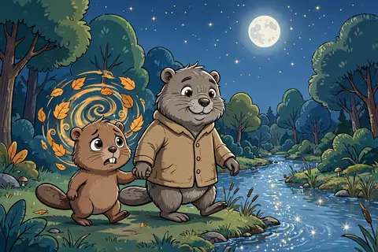
  </a>
  

    <h3><a href="stories/the-lullaby-river.html">The Lullaby River</a></h3>
    

      <a class="btn btn-read" href="stories/the-lullaby-river.html">📖 Read</a>
      <a class="btn btn-pdf" href="book/stories/the-lullaby-river.pdf">📕 PDF</a>
      <a class="btn btn-share" href="https://wa.me/?text=The%20Lullaby%20River%20%E2%80%94%20The%20Big%20Bedtime%20Storybook%0Ahttps%3A%2F%2Fniteshlhsnda-droid.github.io%2Fkids-book-videos%2Fstories%2Fthe-lullaby-river.html" target="_blank" rel="noopener" title="Share on WhatsApp" aria-label="Share on WhatsApp">📲</a>
    

  

</article>
<article class="story-card" data-search="the moon shares its light the-moon-shares-its-light">
  <a class="card-art" href="stories/the-moon-shares-its-light.html" aria-label="The Moon Shares Its Light">
    🌙
    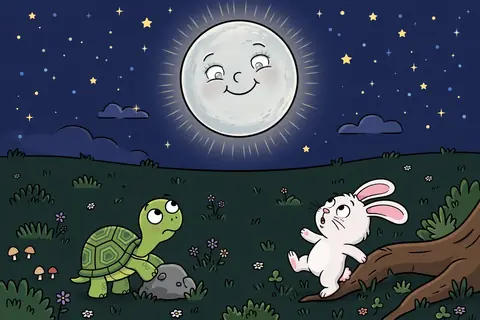
  </a>
  

    <h3><a href="stories/the-moon-shares-its-light.html">The Moon Shares Its Light</a></h3>
    

      <a class="btn btn-read" href="stories/the-moon-shares-its-light.html">📖 Read</a>
      <a class="btn btn-pdf" href="book/stories/the-moon-shares-its-light.pdf">📕 PDF</a>
      <a class="btn btn-share" href="https://wa.me/?text=The%20Moon%20Shares%20Its%20Light%20%E2%80%94%20The%20Big%20Bedtime%20Storybook%0Ahttps%3A%2F%2Fniteshlhsnda-droid.github.io%2Fkids-book-videos%2Fstories%2Fthe-moon-shares-its-light.html" target="_blank" rel="noopener" title="Share on WhatsApp" aria-label="Share on WhatsApp">📲</a>
    

  

</article>
<article class="story-card" data-search="the night bakery the-night-bakery">
  <a class="card-art" href="stories/the-night-bakery.html" aria-label="The Night Bakery">
    🍞
    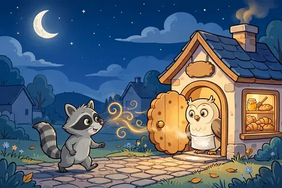
  </a>
  

    <h3><a href="stories/the-night-bakery.html">The Night Bakery</a></h3>
    

      <a class="btn btn-read" href="stories/the-night-bakery.html">📖 Read</a>
      <a class="btn btn-pdf" href="book/stories/the-night-bakery.pdf">📕 PDF</a>
      <a class="btn btn-share" href="https://wa.me/?text=The%20Night%20Bakery%20%E2%80%94%20The%20Big%20Bedtime%20Storybook%0Ahttps%3A%2F%2Fniteshlhsnda-droid.github.io%2Fkids-book-videos%2Fstories%2Fthe-night-bakery.html" target="_blank" rel="noopener" title="Share on WhatsApp" aria-label="Share on WhatsApp">📲</a>
    

  

</article>
<article class="story-card" data-search="the night sounds lullaby night-sounds-lullaby">
  <a class="card-art" href="stories/night-sounds-lullaby.html" aria-label="The Night Sounds Lullaby">
    🎵
    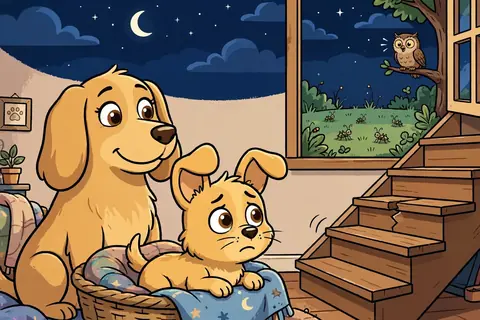
  </a>
  

    <h3><a href="stories/night-sounds-lullaby.html">The Night Sounds Lullaby</a></h3>
    

      <a class="btn btn-read" href="stories/night-sounds-lullaby.html">📖 Read</a>
      <a class="btn btn-pdf" href="book/stories/night-sounds-lullaby.pdf">📕 PDF</a>
      <a class="btn btn-share" href="https://wa.me/?text=The%20Night%20Sounds%20Lullaby%20%E2%80%94%20The%20Big%20Bedtime%20Storybook%0Ahttps%3A%2F%2Fniteshlhsnda-droid.github.io%2Fkids-book-videos%2Fstories%2Fnight-sounds-lullaby.html" target="_blank" rel="noopener" title="Share on WhatsApp" aria-label="Share on WhatsApp">📲</a>
    

  

</article>
<article class="story-card" data-search="the night train to sleepy hollow the-night-train">
  <a class="card-art" href="stories/the-night-train.html" aria-label="The Night Train to Sleepy Hollow">
    🚂
    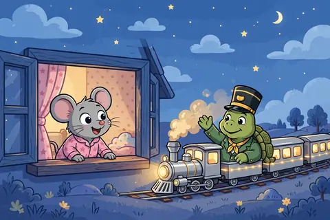
  </a>
  

    <h3><a href="stories/the-night-train.html">The Night Train to Sleepy Hollow</a></h3>
    

      <a class="btn btn-read" href="stories/the-night-train.html">📖 Read</a>
      <a class="btn btn-pdf" href="book/stories/the-night-train.pdf">📕 PDF</a>
      <a class="btn btn-share" href="https://wa.me/?text=The%20Night%20Train%20to%20Sleepy%20Hollow%20%E2%80%94%20The%20Big%20Bedtime%20Storybook%0Ahttps%3A%2F%2Fniteshlhsnda-droid.github.io%2Fkids-book-videos%2Fstories%2Fthe-night-train.html" target="_blank" rel="noopener" title="Share on WhatsApp" aria-label="Share on WhatsApp">📲</a>
    

  

</article>
<article class="story-card" data-search="the sleepy lighthouse the-sleepy-lighthouse">
  <a class="card-art" href="stories/the-sleepy-lighthouse.html" aria-label="The Sleepy Lighthouse">
    😴
    
  </a>
  

    <h3><a href="stories/the-sleepy-lighthouse.html">The Sleepy Lighthouse</a></h3>
    

      <a class="btn btn-read" href="stories/the-sleepy-lighthouse.html">📖 Read</a>
      <a class="btn btn-pdf" href="book/stories/the-sleepy-lighthouse.pdf">📕 PDF</a>
      <a class="btn btn-share" href="https://wa.me/?text=The%20Sleepy%20Lighthouse%20%E2%80%94%20The%20Big%20Bedtime%20Storybook%0Ahttps%3A%2F%2Fniteshlhsnda-droid.github.io%2Fkids-book-videos%2Fstories%2Fthe-sleepy-lighthouse.html" target="_blank" rel="noopener" title="Share on WhatsApp" aria-label="Share on WhatsApp">📲</a>
    

  

</article>
<article class="story-card" data-search="the wind&#x27;s bedtime song the-winds-bedtime-song">
  <a class="card-art" href="stories/the-winds-bedtime-song.html" aria-label="The Wind&#x27;s Bedtime Song">
    🍃
    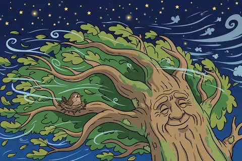
  </a>
  

    <h3><a href="stories/the-winds-bedtime-song.html">The Wind&#x27;s Bedtime Song</a></h3>
    

      <a class="btn btn-read" href="stories/the-winds-bedtime-song.html">📖 Read</a>
      <a class="btn btn-pdf" href="book/stories/the-winds-bedtime-song.pdf">📕 PDF</a>
      <a class="btn btn-share" href="https://wa.me/?text=The%20Wind%27s%20Bedtime%20Song%20%E2%80%94%20The%20Big%20Bedtime%20Storybook%0Ahttps%3A%2F%2Fniteshlhsnda-droid.github.io%2Fkids-book-videos%2Fstories%2Fthe-winds-bedtime-song.html" target="_blank" rel="noopener" title="Share on WhatsApp" aria-label="Share on WhatsApp">📲</a>
    

  

</article>
<article class="story-card" data-search="where do birds sleep? where-do-birds-sleep">
  <a class="card-art" href="stories/where-do-birds-sleep.html" aria-label="Where Do Birds Sleep?">
    🐦
    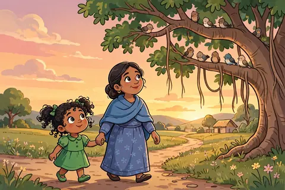
  </a>
  

    <h3><a href="stories/where-do-birds-sleep.html">Where Do Birds Sleep?</a></h3>
    

      <a class="btn btn-read" href="stories/where-do-birds-sleep.html">📖 Read</a>
      <a class="btn btn-pdf" href="book/stories/where-do-birds-sleep.pdf">📕 PDF</a>
      <a class="btn btn-share" href="https://wa.me/?text=Where%20Do%20Birds%20Sleep%3F%20%E2%80%94%20The%20Big%20Bedtime%20Storybook%0Ahttps%3A%2F%2Fniteshlhsnda-droid.github.io%2Fkids-book-videos%2Fstories%2Fwhere-do-birds-sleep.html" target="_blank" rel="noopener" title="Share on WhatsApp" aria-label="Share on WhatsApp">📲</a>
    

  

</article>
<article class="story-card" data-search="willa the bunny and the moonflower 2026-09-21-willa-the-bunny-and-the-moonflower">
  <a class="card-art" href="stories/2026-09-21-willa-the-bunny-and-the-moonflower.html" aria-label="Willa the Bunny and the Moonflower">
    🌙
    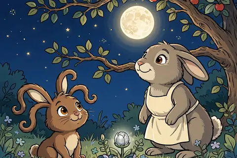
  </a>
  

    <h3><a href="stories/2026-09-21-willa-the-bunny-and-the-moonflower.html">Willa the Bunny and the Moonflower</a></h3>
    

      <a class="btn btn-read" href="stories/2026-09-21-willa-the-bunny-and-the-moonflower.html">📖 Read</a>
      <a class="btn btn-pdf" href="book/stories/2026-09-21-willa-the-bunny-and-the-moonflower.pdf">📕 PDF</a>
      <a class="btn btn-share" href="https://wa.me/?text=Willa%20the%20Bunny%20and%20the%20Moonflower%20%E2%80%94%20The%20Big%20Bedtime%20Storybook%0Ahttps%3A%2F%2Fniteshlhsnda-droid.github.io%2Fkids-book-videos%2Fstories%2F2026-09-21-willa-the-bunny-and-the-moonflower.html" target="_blank" rel="noopener" title="Share on WhatsApp" aria-label="Share on WhatsApp">📲</a>
    

  

</article>
  

</section>

<section class="category cat-bedtime" id="cat-bedtime">
  <h2>📚 Bedtime Tales</h2>
  
Original cozy stories for ages 4–7.

  

<article class="story-card" data-search="a blanket of stars a-blanket-of-stars">
  <a class="card-art" href="stories/a-blanket-of-stars.html" aria-label="A Blanket of Stars">
    ⭐
    
  </a>
  

    <h3><a href="stories/a-blanket-of-stars.html">A Blanket of Stars</a></h3>
    

      <a class="btn btn-read" href="stories/a-blanket-of-stars.html">📖 Read</a>
      <a class="btn btn-pdf" href="book/stories/a-blanket-of-stars.pdf">📕 PDF</a>
      <a class="btn btn-share" href="https://wa.me/?text=A%20Blanket%20of%20Stars%20%E2%80%94%20The%20Big%20Bedtime%20Storybook%0Ahttps%3A%2F%2Fniteshlhsnda-droid.github.io%2Fkids-book-videos%2Fstories%2Fa-blanket-of-stars.html" target="_blank" rel="noopener" title="Share on WhatsApp" aria-label="Share on WhatsApp">📲</a>
    

  

</article>
<article class="story-card" data-search="andy the ant and the fallen crumbs andy-the-ant-and-the-fallen-crumbs">
  <a class="card-art" href="stories/andy-the-ant-and-the-fallen-crumbs.html" aria-label="Andy the Ant and the Fallen Crumbs">
    🐜
    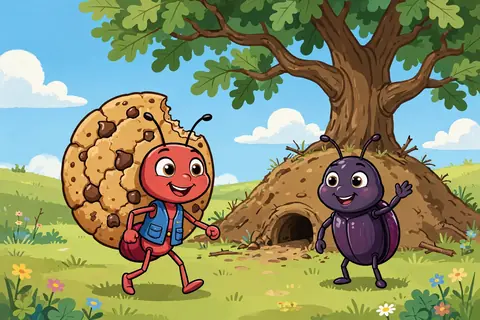
  </a>
  

    <h3><a href="stories/andy-the-ant-and-the-fallen-crumbs.html">Andy the Ant and the Fallen Crumbs</a></h3>
    

      <a class="btn btn-read" href="stories/andy-the-ant-and-the-fallen-crumbs.html">📖 Read</a>
      <a class="btn btn-pdf" href="book/stories/andy-the-ant-and-the-fallen-crumbs.pdf">📕 PDF</a>
      <a class="btn btn-share" href="https://wa.me/?text=Andy%20the%20Ant%20and%20the%20Fallen%20Crumbs%20%E2%80%94%20The%20Big%20Bedtime%20Storybook%0Ahttps%3A%2F%2Fniteshlhsnda-droid.github.io%2Fkids-book-videos%2Fstories%2Fandy-the-ant-and-the-fallen-crumbs.html" target="_blank" rel="noopener" title="Share on WhatsApp" aria-label="Share on WhatsApp">📲</a>
    

  

</article>
<article class="story-card" data-search="benny moves to a new burrow benny-moves-to-a-new-burrow">
  <a class="card-art" href="stories/benny-moves-to-a-new-burrow.html" aria-label="Benny Moves to a New Burrow">
    🌙
    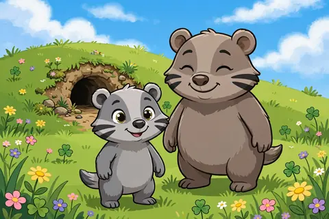
  </a>
  

    <h3><a href="stories/benny-moves-to-a-new-burrow.html">Benny Moves to a New Burrow</a></h3>
    

      <a class="btn btn-read" href="stories/benny-moves-to-a-new-burrow.html">📖 Read</a>
      <a class="btn btn-pdf" href="book/stories/benny-moves-to-a-new-burrow.pdf">📕 PDF</a>
      <a class="btn btn-share" href="https://wa.me/?text=Benny%20Moves%20to%20a%20New%20Burrow%20%E2%80%94%20The%20Big%20Bedtime%20Storybook%0Ahttps%3A%2F%2Fniteshlhsnda-droid.github.io%2Fkids-book-videos%2Fstories%2Fbenny-moves-to-a-new-burrow.html" target="_blank" rel="noopener" title="Share on WhatsApp" aria-label="Share on WhatsApp">📲</a>
    

  

</article>
<article class="story-card" data-search="billy&#x27;s bug garden billys-bug-garden">
  <a class="card-art" href="stories/billys-bug-garden.html" aria-label="Billy&#x27;s Bug Garden">
    🌸
    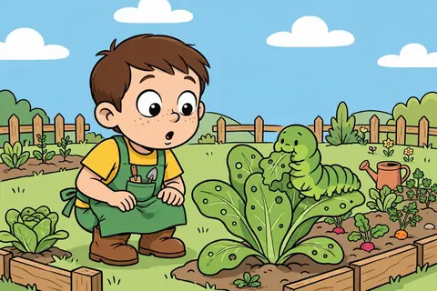
  </a>
  

    <h3><a href="stories/billys-bug-garden.html">Billy&#x27;s Bug Garden</a></h3>
    

      <a class="btn btn-read" href="stories/billys-bug-garden.html">📖 Read</a>
      <a class="btn btn-pdf" href="book/stories/billys-bug-garden.pdf">📕 PDF</a>
      <a class="btn btn-share" href="https://wa.me/?text=Billy%27s%20Bug%20Garden%20%E2%80%94%20The%20Big%20Bedtime%20Storybook%0Ahttps%3A%2F%2Fniteshlhsnda-droid.github.io%2Fkids-book-videos%2Fstories%2Fbillys-bug-garden.html" target="_blank" rel="noopener" title="Share on WhatsApp" aria-label="Share on WhatsApp">📲</a>
    

  

</article>
<article class="story-card" data-search="bobby the beaver cleans up biscuit-the-beaver-cleans-up">
  <a class="card-art" href="stories/biscuit-the-beaver-cleans-up.html" aria-label="Bobby the Beaver Cleans Up">
    🌙
    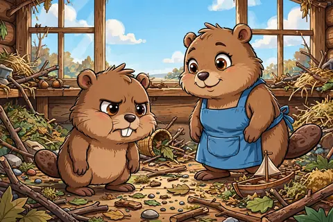
  </a>
  

    <h3><a href="stories/biscuit-the-beaver-cleans-up.html">Bobby the Beaver Cleans Up</a></h3>
    

      <a class="btn btn-read" href="stories/biscuit-the-beaver-cleans-up.html">📖 Read</a>
      <a class="btn btn-pdf" href="book/stories/biscuit-the-beaver-cleans-up.pdf">📕 PDF</a>
      <a class="btn btn-share" href="https://wa.me/?text=Bobby%20the%20Beaver%20Cleans%20Up%20%E2%80%94%20The%20Big%20Bedtime%20Storybook%0Ahttps%3A%2F%2Fniteshlhsnda-droid.github.io%2Fkids-book-videos%2Fstories%2Fbiscuit-the-beaver-cleans-up.html" target="_blank" rel="noopener" title="Share on WhatsApp" aria-label="Share on WhatsApp">📲</a>
    

  

</article>
<article class="story-card" data-search="bobby&#x27;s bubble bay bobbys-bubble-bay">
  <a class="card-art" href="stories/bobbys-bubble-bay.html" aria-label="Bobby&#x27;s Bubble Bay">
    🌙
    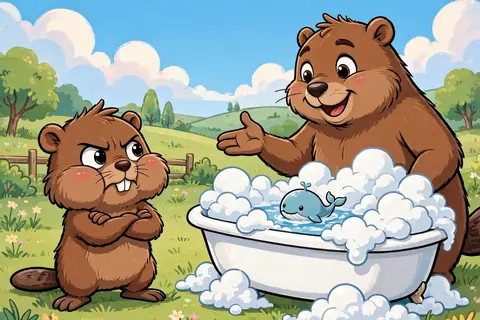
  </a>
  

    <h3><a href="stories/bobbys-bubble-bay.html">Bobby&#x27;s Bubble Bay</a></h3>
    

      <a class="btn btn-read" href="stories/bobbys-bubble-bay.html">📖 Read</a>
      <a class="btn btn-pdf" href="book/stories/bobbys-bubble-bay.pdf">📕 PDF</a>
      <a class="btn btn-share" href="https://wa.me/?text=Bobby%27s%20Bubble%20Bay%20%E2%80%94%20The%20Big%20Bedtime%20Storybook%0Ahttps%3A%2F%2Fniteshlhsnda-droid.github.io%2Fkids-book-videos%2Fstories%2Fbobbys-bubble-bay.html" target="_blank" rel="noopener" title="Share on WhatsApp" aria-label="Share on WhatsApp">📲</a>
    

  

</article>
<article class="story-card" data-search="bobo learns to listen bobo-learns-to-listen">
  <a class="card-art" href="stories/bobo-learns-to-listen.html" aria-label="Bobo Learns to Listen">
    🌙
    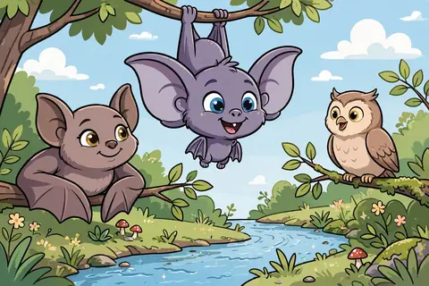
  </a>
  

    <h3><a href="stories/bobo-learns-to-listen.html">Bobo Learns to Listen</a></h3>
    

      <a class="btn btn-read" href="stories/bobo-learns-to-listen.html">📖 Read</a>
      <a class="btn btn-pdf" href="book/stories/bobo-learns-to-listen.pdf">📕 PDF</a>
      <a class="btn btn-share" href="https://wa.me/?text=Bobo%20Learns%20to%20Listen%20%E2%80%94%20The%20Big%20Bedtime%20Storybook%0Ahttps%3A%2F%2Fniteshlhsnda-droid.github.io%2Fkids-book-videos%2Fstories%2Fbobo-learns-to-listen.html" target="_blank" rel="noopener" title="Share on WhatsApp" aria-label="Share on WhatsApp">📲</a>
    

  

</article>
<article class="story-card" data-search="bounce the puppy&#x27;s gentle paws bounce-the-puppys-gentle-paws">
  <a class="card-art" href="stories/bounce-the-puppys-gentle-paws.html" aria-label="Bounce the Puppy&#x27;s Gentle Paws">
    🐶
    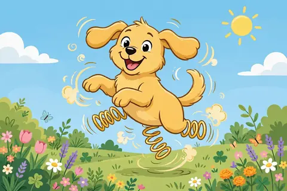
  </a>
  

    <h3><a href="stories/bounce-the-puppys-gentle-paws.html">Bounce the Puppy&#x27;s Gentle Paws</a></h3>
    

      <a class="btn btn-read" href="stories/bounce-the-puppys-gentle-paws.html">📖 Read</a>
      <a class="btn btn-pdf" href="book/stories/bounce-the-puppys-gentle-paws.pdf">📕 PDF</a>
      <a class="btn btn-share" href="https://wa.me/?text=Bounce%20the%20Puppy%27s%20Gentle%20Paws%20%E2%80%94%20The%20Big%20Bedtime%20Storybook%0Ahttps%3A%2F%2Fniteshlhsnda-droid.github.io%2Fkids-book-videos%2Fstories%2Fbounce-the-puppys-gentle-paws.html" target="_blank" rel="noopener" title="Share on WhatsApp" aria-label="Share on WhatsApp">📲</a>
    

  

</article>
<article class="story-card" data-search="bram the badger and the whispering pines 2026-09-24-bram-the-badger-and-the-whispering-woods">
  <a class="card-art" href="stories/2026-09-24-bram-the-badger-and-the-whispering-woods.html" aria-label="Bram the Badger and the Whispering Pines">
    🦡
    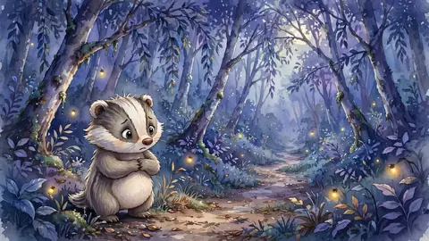
  </a>
  

    <h3><a href="stories/2026-09-24-bram-the-badger-and-the-whispering-woods.html">Bram the Badger and the Whispering Pines</a></h3>
    

      <a class="btn btn-read" href="stories/2026-09-24-bram-the-badger-and-the-whispering-woods.html">📖 Read</a>
      <a class="btn btn-share" href="https://wa.me/?text=Bram%20the%20Badger%20and%20the%20Whispering%20Pines%20%E2%80%94%20The%20Big%20Bedtime%20Storybook%0Ahttps%3A%2F%2Fniteshlhsnda-droid.github.io%2Fkids-book-videos%2Fstories%2F2026-09-24-bram-the-badger-and-the-whispering-woods.html" target="_blank" rel="noopener" title="Share on WhatsApp" aria-label="Share on WhatsApp">📲</a>
    

  

</article>
<article class="story-card" data-search="bramble the bear cub and the high honey bramble-the-bear-cub-and-the-high-honey">
  <a class="card-art" href="stories/bramble-the-bear-cub-and-the-high-honey.html" aria-label="Bramble the Bear Cub and the High Honey">
    🐻
    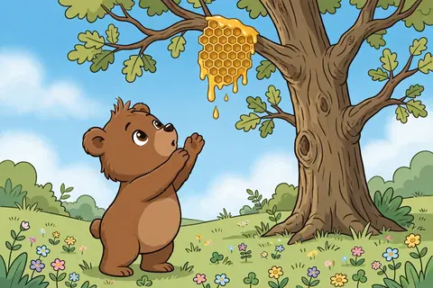
  </a>
  

    <h3><a href="stories/bramble-the-bear-cub-and-the-high-honey.html">Bramble the Bear Cub and the High Honey</a></h3>
    

      <a class="btn btn-read" href="stories/bramble-the-bear-cub-and-the-high-honey.html">📖 Read</a>
      <a class="btn btn-pdf" href="book/stories/bramble-the-bear-cub-and-the-high-honey.pdf">📕 PDF</a>
      <a class="btn btn-share" href="https://wa.me/?text=Bramble%20the%20Bear%20Cub%20and%20the%20High%20Honey%20%E2%80%94%20The%20Big%20Bedtime%20Storybook%0Ahttps%3A%2F%2Fniteshlhsnda-droid.github.io%2Fkids-book-videos%2Fstories%2Fbramble-the-bear-cub-and-the-high-honey.html" target="_blank" rel="noopener" title="Share on WhatsApp" aria-label="Share on WhatsApp">📲</a>
    

  

</article>
<article class="story-card" data-search="bruno and the rumbling sky bruno-and-the-rumbling-sky">
  <a class="card-art" href="stories/bruno-and-the-rumbling-sky.html" aria-label="Bruno and the Rumbling Sky">
    🌙
    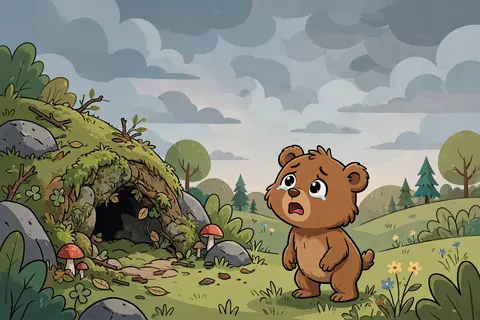
  </a>
  

    <h3><a href="stories/bruno-and-the-rumbling-sky.html">Bruno and the Rumbling Sky</a></h3>
    

      <a class="btn btn-read" href="stories/bruno-and-the-rumbling-sky.html">📖 Read</a>
      <a class="btn btn-pdf" href="book/stories/bruno-and-the-rumbling-sky.pdf">📕 PDF</a>
      <a class="btn btn-share" href="https://wa.me/?text=Bruno%20and%20the%20Rumbling%20Sky%20%E2%80%94%20The%20Big%20Bedtime%20Storybook%0Ahttps%3A%2F%2Fniteshlhsnda-droid.github.io%2Fkids-book-videos%2Fstories%2Fbruno-and-the-rumbling-sky.html" target="_blank" rel="noopener" title="Share on WhatsApp" aria-label="Share on WhatsApp">📲</a>
    

  

</article>
<article class="story-card" data-search="buzzy the bee finds her buzz buzzy-the-bee-finds-her-buzz">
  <a class="card-art" href="stories/buzzy-the-bee-finds-her-buzz.html" aria-label="Buzzy the Bee Finds Her Buzz">
    🐝
    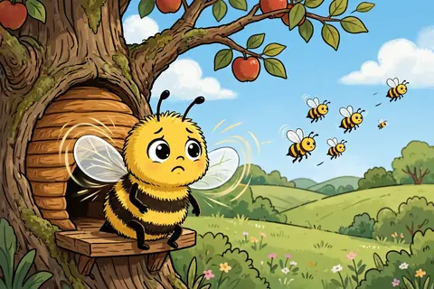
  </a>
  

    <h3><a href="stories/buzzy-the-bee-finds-her-buzz.html">Buzzy the Bee Finds Her Buzz</a></h3>
    

      <a class="btn btn-read" href="stories/buzzy-the-bee-finds-her-buzz.html">📖 Read</a>
      <a class="btn btn-pdf" href="book/stories/buzzy-the-bee-finds-her-buzz.pdf">📕 PDF</a>
      <a class="btn btn-share" href="https://wa.me/?text=Buzzy%20the%20Bee%20Finds%20Her%20Buzz%20%E2%80%94%20The%20Big%20Bedtime%20Storybook%0Ahttps%3A%2F%2Fniteshlhsnda-droid.github.io%2Fkids-book-videos%2Fstories%2Fbuzzy-the-bee-finds-her-buzz.html" target="_blank" rel="noopener" title="Share on WhatsApp" aria-label="Share on WhatsApp">📲</a>
    

  

</article>
<article class="story-card" data-search="chiku shares his acorns chiku-shares-his-acorns">
  <a class="card-art" href="stories/chiku-shares-his-acorns.html" aria-label="Chiku Shares His Acorns">
    🐇
    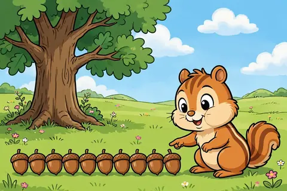
  </a>
  

    <h3><a href="stories/chiku-shares-his-acorns.html">Chiku Shares His Acorns</a></h3>
    

      <a class="btn btn-read" href="stories/chiku-shares-his-acorns.html">📖 Read</a>
      <a class="btn btn-pdf" href="book/stories/chiku-shares-his-acorns.pdf">📕 PDF</a>
      <a class="btn btn-share" href="https://wa.me/?text=Chiku%20Shares%20His%20Acorns%20%E2%80%94%20The%20Big%20Bedtime%20Storybook%0Ahttps%3A%2F%2Fniteshlhsnda-droid.github.io%2Fkids-book-videos%2Fstories%2Fchiku-shares-his-acorns.html" target="_blank" rel="noopener" title="Share on WhatsApp" aria-label="Share on WhatsApp">📲</a>
    

  

</article>
<article class="story-card" data-search="chira the chick and the way home chira-the-chick-and-the-way-home">
  <a class="card-art" href="stories/chira-the-chick-and-the-way-home.html" aria-label="Chira the Chick and the Way Home">
    🌙
    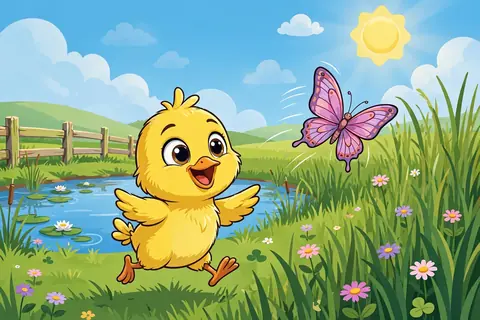
  </a>
  

    <h3><a href="stories/chira-the-chick-and-the-way-home.html">Chira the Chick and the Way Home</a></h3>
    

      <a class="btn btn-read" href="stories/chira-the-chick-and-the-way-home.html">📖 Read</a>
      <a class="btn btn-pdf" href="book/stories/chira-the-chick-and-the-way-home.pdf">📕 PDF</a>
      <a class="btn btn-share" href="https://wa.me/?text=Chira%20the%20Chick%20and%20the%20Way%20Home%20%E2%80%94%20The%20Big%20Bedtime%20Storybook%0Ahttps%3A%2F%2Fniteshlhsnda-droid.github.io%2Fkids-book-videos%2Fstories%2Fchira-the-chick-and-the-way-home.html" target="_blank" rel="noopener" title="Share on WhatsApp" aria-label="Share on WhatsApp">📲</a>
    

  

</article>
<article class="story-card" data-search="cleo the kitten and the lost button cleo-the-kitten-and-the-lost-button">
  <a class="card-art" href="stories/cleo-the-kitten-and-the-lost-button.html" aria-label="Cleo the Kitten and the Lost Button">
    🐱
    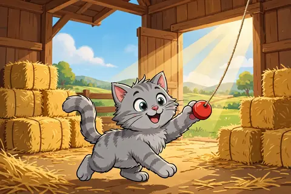
  </a>
  

    <h3><a href="stories/cleo-the-kitten-and-the-lost-button.html">Cleo the Kitten and the Lost Button</a></h3>
    

      <a class="btn btn-read" href="stories/cleo-the-kitten-and-the-lost-button.html">📖 Read</a>
      <a class="btn btn-pdf" href="book/stories/cleo-the-kitten-and-the-lost-button.pdf">📕 PDF</a>
      <a class="btn btn-share" href="https://wa.me/?text=Cleo%20the%20Kitten%20and%20the%20Lost%20Button%20%E2%80%94%20The%20Big%20Bedtime%20Storybook%0Ahttps%3A%2F%2Fniteshlhsnda-droid.github.io%2Fkids-book-videos%2Fstories%2Fcleo-the-kitten-and-the-lost-button.html" target="_blank" rel="noopener" title="Share on WhatsApp" aria-label="Share on WhatsApp">📲</a>
    

  

</article>
<article class="story-card" data-search="counting stars to sleep counting-stars-to-sleep">
  <a class="card-art" href="stories/counting-stars-to-sleep.html" aria-label="Counting Stars to Sleep">
    ⭐
    
  </a>
  

    <h3><a href="stories/counting-stars-to-sleep.html">Counting Stars to Sleep</a></h3>
    

      <a class="btn btn-read" href="stories/counting-stars-to-sleep.html">📖 Read</a>
      <a class="btn btn-pdf" href="book/stories/counting-stars-to-sleep.pdf">📕 PDF</a>
      <a class="btn btn-share" href="https://wa.me/?text=Counting%20Stars%20to%20Sleep%20%E2%80%94%20The%20Big%20Bedtime%20Storybook%0Ahttps%3A%2F%2Fniteshlhsnda-droid.github.io%2Fkids-book-videos%2Fstories%2Fcounting-stars-to-sleep.html" target="_blank" rel="noopener" title="Share on WhatsApp" aria-label="Share on WhatsApp">📲</a>
    

  

</article>
<article class="story-card" data-search="daisy the duckling&#x27;s soft quack dilly-the-ducklings-soft-quack">
  <a class="card-art" href="stories/dilly-the-ducklings-soft-quack.html" aria-label="Daisy the Duckling&#x27;s Soft Quack">
    🦆
    
  </a>
  

    <h3><a href="stories/dilly-the-ducklings-soft-quack.html">Daisy the Duckling&#x27;s Soft Quack</a></h3>
    

      <a class="btn btn-read" href="stories/dilly-the-ducklings-soft-quack.html">📖 Read</a>
      <a class="btn btn-pdf" href="book/stories/dilly-the-ducklings-soft-quack.pdf">📕 PDF</a>
      <a class="btn btn-share" href="https://wa.me/?text=Daisy%20the%20Duckling%27s%20Soft%20Quack%20%E2%80%94%20The%20Big%20Bedtime%20Storybook%0Ahttps%3A%2F%2Fniteshlhsnda-droid.github.io%2Fkids-book-videos%2Fstories%2Fdilly-the-ducklings-soft-quack.html" target="_blank" rel="noopener" title="Share on WhatsApp" aria-label="Share on WhatsApp">📲</a>
    

  

</article>
<article class="story-card" data-search="daisy the grateful duckling daisy-the-grateful-duckling">
  <a class="card-art" href="stories/daisy-the-grateful-duckling.html" aria-label="Daisy the Grateful Duckling">
    🦆
    
  </a>
  

    <h3><a href="stories/daisy-the-grateful-duckling.html">Daisy the Grateful Duckling</a></h3>
    

      <a class="btn btn-read" href="stories/daisy-the-grateful-duckling.html">📖 Read</a>
      <a class="btn btn-pdf" href="book/stories/daisy-the-grateful-duckling.pdf">📕 PDF</a>
      <a class="btn btn-share" href="https://wa.me/?text=Daisy%20the%20Grateful%20Duckling%20%E2%80%94%20The%20Big%20Bedtime%20Storybook%0Ahttps%3A%2F%2Fniteshlhsnda-droid.github.io%2Fkids-book-videos%2Fstories%2Fdaisy-the-grateful-duckling.html" target="_blank" rel="noopener" title="Share on WhatsApp" aria-label="Share on WhatsApp">📲</a>
    

  

</article>
<article class="story-card" data-search="dancing with fireflies dancing-with-fireflies">
  <a class="card-art" href="stories/dancing-with-fireflies.html" aria-label="Dancing with Fireflies">
    🌙
    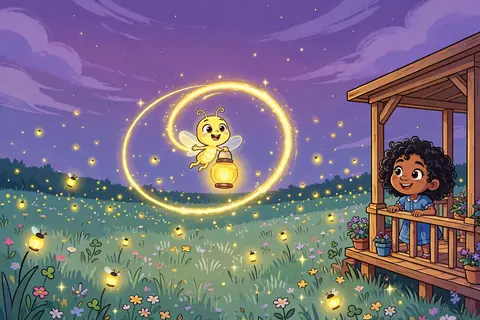
  </a>
  

    <h3><a href="stories/dancing-with-fireflies.html">Dancing with Fireflies</a></h3>
    

      <a class="btn btn-read" href="stories/dancing-with-fireflies.html">📖 Read</a>
      <a class="btn btn-pdf" href="book/stories/dancing-with-fireflies.pdf">📕 PDF</a>
      <a class="btn btn-share" href="https://wa.me/?text=Dancing%20with%20Fireflies%20%E2%80%94%20The%20Big%20Bedtime%20Storybook%0Ahttps%3A%2F%2Fniteshlhsnda-droid.github.io%2Fkids-book-videos%2Fstories%2Fdancing-with-fireflies.html" target="_blank" rel="noopener" title="Share on WhatsApp" aria-label="Share on WhatsApp">📲</a>
    

  

</article>
<article class="story-card" data-search="dev&#x27;s first day of school devs-first-day-of-school">
  <a class="card-art" href="stories/devs-first-day-of-school.html" aria-label="Dev&#x27;s First Day of School">
    🌙
    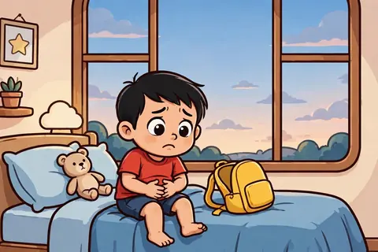
  </a>
  

    <h3><a href="stories/devs-first-day-of-school.html">Dev&#x27;s First Day of School</a></h3>
    

      <a class="btn btn-read" href="stories/devs-first-day-of-school.html">📖 Read</a>
      <a class="btn btn-pdf" href="book/stories/devs-first-day-of-school.pdf">📕 PDF</a>
      <a class="btn btn-share" href="https://wa.me/?text=Dev%27s%20First%20Day%20of%20School%20%E2%80%94%20The%20Big%20Bedtime%20Storybook%0Ahttps%3A%2F%2Fniteshlhsnda-droid.github.io%2Fkids-book-videos%2Fstories%2Fdevs-first-day-of-school.html" target="_blank" rel="noopener" title="Share on WhatsApp" aria-label="Share on WhatsApp">📲</a>
    

  

</article>
<article class="story-card" data-search="dusty the donkey&#x27;s long ears dusty-the-donkeys-long-ears">
  <a class="card-art" href="stories/dusty-the-donkeys-long-ears.html" aria-label="Dusty the Donkey&#x27;s Long Ears">
    🌙
    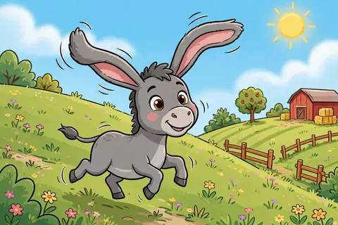
  </a>
  

    <h3><a href="stories/dusty-the-donkeys-long-ears.html">Dusty the Donkey&#x27;s Long Ears</a></h3>
    

      <a class="btn btn-read" href="stories/dusty-the-donkeys-long-ears.html">📖 Read</a>
      <a class="btn btn-pdf" href="book/stories/dusty-the-donkeys-long-ears.pdf">📕 PDF</a>
      <a class="btn btn-share" href="https://wa.me/?text=Dusty%20the%20Donkey%27s%20Long%20Ears%20%E2%80%94%20The%20Big%20Bedtime%20Storybook%0Ahttps%3A%2F%2Fniteshlhsnda-droid.github.io%2Fkids-book-videos%2Fstories%2Fdusty-the-donkeys-long-ears.html" target="_blank" rel="noopener" title="Share on WhatsApp" aria-label="Share on WhatsApp">📲</a>
    

  

</article>
<article class="story-card" data-search="ella is kind to someone new ella-is-kind-to-someone-new">
  <a class="card-art" href="stories/ella-is-kind-to-someone-new.html" aria-label="Ella Is Kind to Someone New">
    🌙
    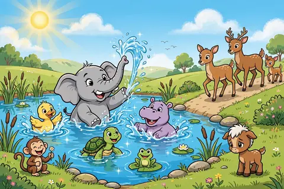
  </a>
  

    <h3><a href="stories/ella-is-kind-to-someone-new.html">Ella Is Kind to Someone New</a></h3>
    

      <a class="btn btn-read" href="stories/ella-is-kind-to-someone-new.html">📖 Read</a>
      <a class="btn btn-pdf" href="book/stories/ella-is-kind-to-someone-new.pdf">📕 PDF</a>
      <a class="btn btn-share" href="https://wa.me/?text=Ella%20Is%20Kind%20to%20Someone%20New%20%E2%80%94%20The%20Big%20Bedtime%20Storybook%0Ahttps%3A%2F%2Fniteshlhsnda-droid.github.io%2Fkids-book-videos%2Fstories%2Fella-is-kind-to-someone-new.html" target="_blank" rel="noopener" title="Share on WhatsApp" aria-label="Share on WhatsApp">📲</a>
    

  

</article>
<article class="story-card" data-search="faye the deer fawn&#x27;s firefly dance faye-the-deer-fawns-firefly-dance">
  <a class="card-art" href="stories/faye-the-deer-fawns-firefly-dance.html" aria-label="Faye the Deer Fawn&#x27;s Firefly Dance">
    ✨
    
  </a>
  

    <h3><a href="stories/faye-the-deer-fawns-firefly-dance.html">Faye the Deer Fawn&#x27;s Firefly Dance</a></h3>
    

      <a class="btn btn-read" href="stories/faye-the-deer-fawns-firefly-dance.html">📖 Read</a>
      <a class="btn btn-pdf" href="book/stories/faye-the-deer-fawns-firefly-dance.pdf">📕 PDF</a>
      <a class="btn btn-share" href="https://wa.me/?text=Faye%20the%20Deer%20Fawn%27s%20Firefly%20Dance%20%E2%80%94%20The%20Big%20Bedtime%20Storybook%0Ahttps%3A%2F%2Fniteshlhsnda-droid.github.io%2Fkids-book-videos%2Fstories%2Ffaye-the-deer-fawns-firefly-dance.html" target="_blank" rel="noopener" title="Share on WhatsApp" aria-label="Share on WhatsApp">📲</a>
    

  

</article>
<article class="story-card" data-search="fergus the frog finds his croak fergus-the-frog-finds-his-croak">
  <a class="card-art" href="stories/fergus-the-frog-finds-his-croak.html" aria-label="Fergus the Frog Finds His Croak">
    🐸
    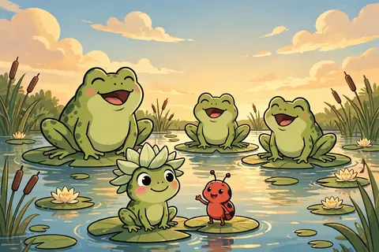
  </a>
  

    <h3><a href="stories/fergus-the-frog-finds-his-croak.html">Fergus the Frog Finds His Croak</a></h3>
    

      <a class="btn btn-read" href="stories/fergus-the-frog-finds-his-croak.html">📖 Read</a>
      <a class="btn btn-pdf" href="book/stories/fergus-the-frog-finds-his-croak.pdf">📕 PDF</a>
      <a class="btn btn-share" href="https://wa.me/?text=Fergus%20the%20Frog%20Finds%20His%20Croak%20%E2%80%94%20The%20Big%20Bedtime%20Storybook%0Ahttps%3A%2F%2Fniteshlhsnda-droid.github.io%2Fkids-book-videos%2Fstories%2Ffergus-the-frog-finds-his-croak.html" target="_blank" rel="noopener" title="Share on WhatsApp" aria-label="Share on WhatsApp">📲</a>
    

  

</article>
<article class="story-card" data-search="greta the goose&#x27;s soft honk greta-the-gooses-soft-honk">
  <a class="card-art" href="stories/greta-the-gooses-soft-honk.html" aria-label="Greta the Goose&#x27;s Soft Honk">
    🌙
    
  </a>
  

    <h3><a href="stories/greta-the-gooses-soft-honk.html">Greta the Goose&#x27;s Soft Honk</a></h3>
    

      <a class="btn btn-read" href="stories/greta-the-gooses-soft-honk.html">📖 Read</a>
      <a class="btn btn-pdf" href="book/stories/greta-the-gooses-soft-honk.pdf">📕 PDF</a>
      <a class="btn btn-share" href="https://wa.me/?text=Greta%20the%20Goose%27s%20Soft%20Honk%20%E2%80%94%20The%20Big%20Bedtime%20Storybook%0Ahttps%3A%2F%2Fniteshlhsnda-droid.github.io%2Fkids-book-videos%2Fstories%2Fgreta-the-gooses-soft-honk.html" target="_blank" rel="noopener" title="Share on WhatsApp" aria-label="Share on WhatsApp">📲</a>
    

  

</article>
<article class="story-card" data-search="hazel the hamster shares a nibble hazel-the-hamster-shares-a-nibble">
  <a class="card-art" href="stories/hazel-the-hamster-shares-a-nibble.html" aria-label="Hazel the Hamster Shares a Nibble">
    🐇
    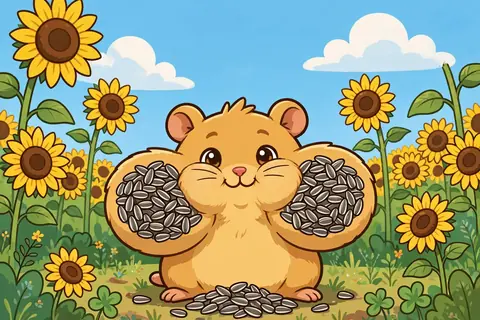
  </a>
  

    <h3><a href="stories/hazel-the-hamster-shares-a-nibble.html">Hazel the Hamster Shares a Nibble</a></h3>
    

      <a class="btn btn-read" href="stories/hazel-the-hamster-shares-a-nibble.html">📖 Read</a>
      <a class="btn btn-pdf" href="book/stories/hazel-the-hamster-shares-a-nibble.pdf">📕 PDF</a>
      <a class="btn btn-share" href="https://wa.me/?text=Hazel%20the%20Hamster%20Shares%20a%20Nibble%20%E2%80%94%20The%20Big%20Bedtime%20Storybook%0Ahttps%3A%2F%2Fniteshlhsnda-droid.github.io%2Fkids-book-videos%2Fstories%2Fhazel-the-hamster-shares-a-nibble.html" target="_blank" rel="noopener" title="Share on WhatsApp" aria-label="Share on WhatsApp">📲</a>
    

  

</article>
<article class="story-card" data-search="hoofy the camel and the helpful hump 2026-09-25-hoofy-the-camel-and-the-helpful-hump">
  <a class="card-art" href="stories/2026-09-25-hoofy-the-camel-and-the-helpful-hump.html" aria-label="Hoofy the Camel and the Helpful Hump">
    🐪
    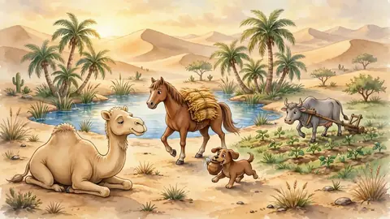
  </a>
  

    <h3><a href="stories/2026-09-25-hoofy-the-camel-and-the-helpful-hump.html">Hoofy the Camel and the Helpful Hump</a></h3>
    

      <a class="btn btn-read" href="stories/2026-09-25-hoofy-the-camel-and-the-helpful-hump.html">📖 Read</a>
      <a class="btn btn-share" href="https://wa.me/?text=Hoofy%20the%20Camel%20and%20the%20Helpful%20Hump%20%E2%80%94%20The%20Big%20Bedtime%20Storybook%0Ahttps%3A%2F%2Fniteshlhsnda-droid.github.io%2Fkids-book-videos%2Fstories%2F2026-09-25-hoofy-the-camel-and-the-helpful-hump.html" target="_blank" rel="noopener" title="Share on WhatsApp" aria-label="Share on WhatsApp">📲</a>
    

  

</article>
<article class="story-card" data-search="hoot&#x27;s sleepy rounds hoots-sleepy-rounds">
  <a class="card-art" href="stories/hoots-sleepy-rounds.html" aria-label="Hoot&#x27;s Sleepy Rounds">
    🦉
    
  </a>
  

    <h3><a href="stories/hoots-sleepy-rounds.html">Hoot&#x27;s Sleepy Rounds</a></h3>
    

      <a class="btn btn-read" href="stories/hoots-sleepy-rounds.html">📖 Read</a>
      <a class="btn btn-pdf" href="book/stories/hoots-sleepy-rounds.pdf">📕 PDF</a>
      <a class="btn btn-share" href="https://wa.me/?text=Hoot%27s%20Sleepy%20Rounds%20%E2%80%94%20The%20Big%20Bedtime%20Storybook%0Ahttps%3A%2F%2Fniteshlhsnda-droid.github.io%2Fkids-book-videos%2Fstories%2Fhoots-sleepy-rounds.html" target="_blank" rel="noopener" title="Share on WhatsApp" aria-label="Share on WhatsApp">📲</a>
    

  

</article>
<article class="story-card" data-search="how the elephant got its trunk classic-how-the-elephant-got-its-trunk">
  <a class="card-art" href="stories/classic-how-the-elephant-got-its-trunk.html" aria-label="How the Elephant Got Its Trunk">
    🐜
    
  </a>
  

    <h3><a href="stories/classic-how-the-elephant-got-its-trunk.html">How the Elephant Got Its Trunk</a></h3>
    

      <a class="btn btn-read" href="stories/classic-how-the-elephant-got-its-trunk.html">📖 Read</a>
      <a class="btn btn-share" href="https://wa.me/?text=How%20the%20Elephant%20Got%20Its%20Trunk%20%E2%80%94%20The%20Big%20Bedtime%20Storybook%0Ahttps%3A%2F%2Fniteshlhsnda-droid.github.io%2Fkids-book-videos%2Fstories%2Fclassic-how-the-elephant-got-its-trunk.html" target="_blank" rel="noopener" title="Share on WhatsApp" aria-label="Share on WhatsApp">📲</a>
    

  

</article>
<article class="story-card" data-search="hugo counts to ten nellie-counts-to-ten">
  <a class="card-art" href="stories/nellie-counts-to-ten.html" aria-label="Hugo Counts to Ten">
    🌙
    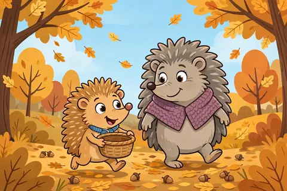
  </a>
  

    <h3><a href="stories/nellie-counts-to-ten.html">Hugo Counts to Ten</a></h3>
    

      <a class="btn btn-read" href="stories/nellie-counts-to-ten.html">📖 Read</a>
      <a class="btn btn-pdf" href="book/stories/nellie-counts-to-ten.pdf">📕 PDF</a>
      <a class="btn btn-share" href="https://wa.me/?text=Hugo%20Counts%20to%20Ten%20%E2%80%94%20The%20Big%20Bedtime%20Storybook%0Ahttps%3A%2F%2Fniteshlhsnda-droid.github.io%2Fkids-book-videos%2Fstories%2Fnellie-counts-to-ten.html" target="_blank" rel="noopener" title="Share on WhatsApp" aria-label="Share on WhatsApp">📲</a>
    

  

</article>
<article class="story-card" data-search="hugo the hedgehog&#x27;s gentle hug holly-the-hedgehogs-gentle-hug">
  <a class="card-art" href="stories/holly-the-hedgehogs-gentle-hug.html" aria-label="Hugo the Hedgehog&#x27;s Gentle Hug">
    🦔
    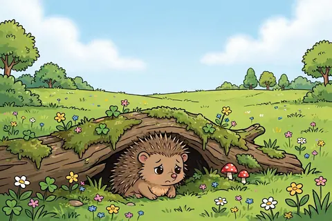
  </a>
  

    <h3><a href="stories/holly-the-hedgehogs-gentle-hug.html">Hugo the Hedgehog&#x27;s Gentle Hug</a></h3>
    

      <a class="btn btn-read" href="stories/holly-the-hedgehogs-gentle-hug.html">📖 Read</a>
      <a class="btn btn-pdf" href="book/stories/holly-the-hedgehogs-gentle-hug.pdf">📕 PDF</a>
      <a class="btn btn-share" href="https://wa.me/?text=Hugo%20the%20Hedgehog%27s%20Gentle%20Hug%20%E2%80%94%20The%20Big%20Bedtime%20Storybook%0Ahttps%3A%2F%2Fniteshlhsnda-droid.github.io%2Fkids-book-videos%2Fstories%2Fholly-the-hedgehogs-gentle-hug.html" target="_blank" rel="noopener" title="Share on WhatsApp" aria-label="Share on WhatsApp">📲</a>
    

  

</article>
<article class="story-card" data-search="hugo tries again hugo-tries-again">
  <a class="card-art" href="stories/hugo-tries-again.html" aria-label="Hugo Tries Again">
    🌙
    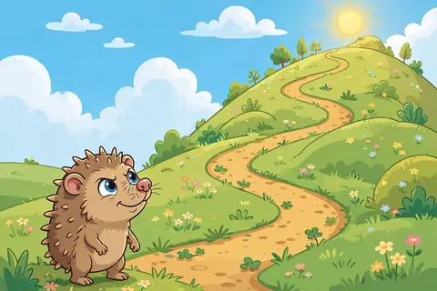
  </a>
  

    <h3><a href="stories/hugo-tries-again.html">Hugo Tries Again</a></h3>
    

      <a class="btn btn-read" href="stories/hugo-tries-again.html">📖 Read</a>
      <a class="btn btn-pdf" href="book/stories/hugo-tries-again.pdf">📕 PDF</a>
      <a class="btn btn-share" href="https://wa.me/?text=Hugo%20Tries%20Again%20%E2%80%94%20The%20Big%20Bedtime%20Storybook%0Ahttps%3A%2F%2Fniteshlhsnda-droid.github.io%2Fkids-book-videos%2Fstories%2Fhugo-tries-again.html" target="_blank" rel="noopener" title="Share on WhatsApp" aria-label="Share on WhatsApp">📲</a>
    

  

</article>
<article class="story-card" data-search="hugo&#x27;s moon blanket mossys-moon-blanket">
  <a class="card-art" href="stories/mossys-moon-blanket.html" aria-label="Hugo&#x27;s Moon Blanket">
    🌙
    
  </a>
  

    <h3><a href="stories/mossys-moon-blanket.html">Hugo&#x27;s Moon Blanket</a></h3>
    

      <a class="btn btn-read" href="stories/mossys-moon-blanket.html">📖 Read</a>
      <a class="btn btn-pdf" href="book/stories/mossys-moon-blanket.pdf">📕 PDF</a>
      <a class="btn btn-share" href="https://wa.me/?text=Hugo%27s%20Moon%20Blanket%20%E2%80%94%20The%20Big%20Bedtime%20Storybook%0Ahttps%3A%2F%2Fniteshlhsnda-droid.github.io%2Fkids-book-videos%2Fstories%2Fmossys-moon-blanket.html" target="_blank" rel="noopener" title="Share on WhatsApp" aria-label="Share on WhatsApp">📲</a>
    

  

</article>
<article class="story-card" data-search="juju says please and thank you juju-says-please-and-thank-you">
  <a class="card-art" href="stories/juju-says-please-and-thank-you.html" aria-label="Juju Says Please and Thank You">
    🌙
    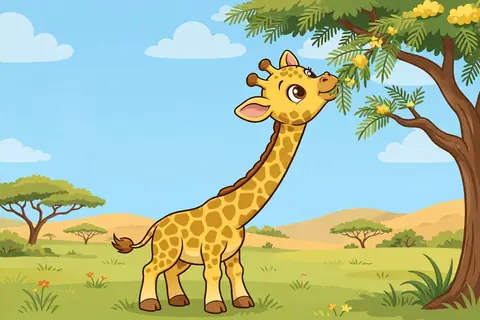
  </a>
  

    <h3><a href="stories/juju-says-please-and-thank-you.html">Juju Says Please and Thank You</a></h3>
    

      <a class="btn btn-read" href="stories/juju-says-please-and-thank-you.html">📖 Read</a>
      <a class="btn btn-pdf" href="book/stories/juju-says-please-and-thank-you.pdf">📕 PDF</a>
      <a class="btn btn-share" href="https://wa.me/?text=Juju%20Says%20Please%20and%20Thank%20You%20%E2%80%94%20The%20Big%20Bedtime%20Storybook%0Ahttps%3A%2F%2Fniteshlhsnda-droid.github.io%2Fkids-book-videos%2Fstories%2Fjuju-says-please-and-thank-you.html" target="_blank" rel="noopener" title="Share on WhatsApp" aria-label="Share on WhatsApp">📲</a>
    

  

</article>
<article class="story-card" data-search="kabir misses grandma kabir-misses-grandma">
  <a class="card-art" href="stories/kabir-misses-grandma.html" aria-label="Kabir Misses Grandma">
    🌙
    
  </a>
  

    <h3><a href="stories/kabir-misses-grandma.html">Kabir Misses Grandma</a></h3>
    

      <a class="btn btn-read" href="stories/kabir-misses-grandma.html">📖 Read</a>
      <a class="btn btn-pdf" href="book/stories/kabir-misses-grandma.pdf">📕 PDF</a>
      <a class="btn btn-share" href="https://wa.me/?text=Kabir%20Misses%20Grandma%20%E2%80%94%20The%20Big%20Bedtime%20Storybook%0Ahttps%3A%2F%2Fniteshlhsnda-droid.github.io%2Fkids-book-videos%2Fstories%2Fkabir-misses-grandma.html" target="_blank" rel="noopener" title="Share on WhatsApp" aria-label="Share on WhatsApp">📲</a>
    

  

</article>
<article class="story-card" data-search="kiki says sorry kiki-says-sorry">
  <a class="card-art" href="stories/kiki-says-sorry.html" aria-label="Kiki Says Sorry">
    🌙
    
  </a>
  

    <h3><a href="stories/kiki-says-sorry.html">Kiki Says Sorry</a></h3>
    

      <a class="btn btn-read" href="stories/kiki-says-sorry.html">📖 Read</a>
      <a class="btn btn-pdf" href="book/stories/kiki-says-sorry.pdf">📕 PDF</a>
      <a class="btn btn-share" href="https://wa.me/?text=Kiki%20Says%20Sorry%20%E2%80%94%20The%20Big%20Bedtime%20Storybook%0Ahttps%3A%2F%2Fniteshlhsnda-droid.github.io%2Fkids-book-videos%2Fstories%2Fkiki-says-sorry.html" target="_blank" rel="noopener" title="Share on WhatsApp" aria-label="Share on WhatsApp">📲</a>
    

  

</article>
<article class="story-card" data-search="koda the koala and the sleepy leaf koda-the-koala-and-the-sleepy-leaf">
  <a class="card-art" href="stories/koda-the-koala-and-the-sleepy-leaf.html" aria-label="Koda the Koala and the Sleepy Leaf">
    🐨
    
  </a>
  

    <h3><a href="stories/koda-the-koala-and-the-sleepy-leaf.html">Koda the Koala and the Sleepy Leaf</a></h3>
    

      <a class="btn btn-read" href="stories/koda-the-koala-and-the-sleepy-leaf.html">📖 Read</a>
      <a class="btn btn-pdf" href="book/stories/koda-the-koala-and-the-sleepy-leaf.pdf">📕 PDF</a>
      <a class="btn btn-share" href="https://wa.me/?text=Koda%20the%20Koala%20and%20the%20Sleepy%20Leaf%20%E2%80%94%20The%20Big%20Bedtime%20Storybook%0Ahttps%3A%2F%2Fniteshlhsnda-droid.github.io%2Fkids-book-videos%2Fstories%2Fkoda-the-koala-and-the-sleepy-leaf.html" target="_blank" rel="noopener" title="Share on WhatsApp" aria-label="Share on WhatsApp">📲</a>
    

  

</article>
<article class="story-card" data-search="koko the parrot learns to listen koko-the-parrot-learns-to-listen">
  <a class="card-art" href="stories/koko-the-parrot-learns-to-listen.html" aria-label="Koko the Parrot Learns to Listen">
    🌙
    
  </a>
  

    <h3><a href="stories/koko-the-parrot-learns-to-listen.html">Koko the Parrot Learns to Listen</a></h3>
    

      <a class="btn btn-read" href="stories/koko-the-parrot-learns-to-listen.html">📖 Read</a>
      <a class="btn btn-pdf" href="book/stories/koko-the-parrot-learns-to-listen.pdf">📕 PDF</a>
      <a class="btn btn-share" href="https://wa.me/?text=Koko%20the%20Parrot%20Learns%20to%20Listen%20%E2%80%94%20The%20Big%20Bedtime%20Storybook%0Ahttps%3A%2F%2Fniteshlhsnda-droid.github.io%2Fkids-book-videos%2Fstories%2Fkoko-the-parrot-learns-to-listen.html" target="_blank" rel="noopener" title="Share on WhatsApp" aria-label="Share on WhatsApp">📲</a>
    

  

</article>
<article class="story-card" data-search="leo tells the truth leo-tells-the-truth">
  <a class="card-art" href="stories/leo-tells-the-truth.html" aria-label="Leo Tells the Truth">
    🌙
    
  </a>
  

    <h3><a href="stories/leo-tells-the-truth.html">Leo Tells the Truth</a></h3>
    

      <a class="btn btn-read" href="stories/leo-tells-the-truth.html">📖 Read</a>
      <a class="btn btn-pdf" href="book/stories/leo-tells-the-truth.pdf">📕 PDF</a>
      <a class="btn btn-share" href="https://wa.me/?text=Leo%20Tells%20the%20Truth%20%E2%80%94%20The%20Big%20Bedtime%20Storybook%0Ahttps%3A%2F%2Fniteshlhsnda-droid.github.io%2Fkids-book-videos%2Fstories%2Fleo-tells-the-truth.html" target="_blank" rel="noopener" title="Share on WhatsApp" aria-label="Share on WhatsApp">📲</a>
    

  

</article>
<article class="story-card" data-search="lolo the lamb and the rumbly clouds luna-the-lamb-and-the-rumbly-clouds">
  <a class="card-art" href="stories/luna-the-lamb-and-the-rumbly-clouds.html" aria-label="Lolo the Lamb and the Rumbly Clouds">
    ☁️
    
  </a>
  

    <h3><a href="stories/luna-the-lamb-and-the-rumbly-clouds.html">Lolo the Lamb and the Rumbly Clouds</a></h3>
    

      <a class="btn btn-read" href="stories/luna-the-lamb-and-the-rumbly-clouds.html">📖 Read</a>
      <a class="btn btn-pdf" href="book/stories/luna-the-lamb-and-the-rumbly-clouds.pdf">📕 PDF</a>
      <a class="btn btn-share" href="https://wa.me/?text=Lolo%20the%20Lamb%20and%20the%20Rumbly%20Clouds%20%E2%80%94%20The%20Big%20Bedtime%20Storybook%0Ahttps%3A%2F%2Fniteshlhsnda-droid.github.io%2Fkids-book-videos%2Fstories%2Fluna-the-lamb-and-the-rumbly-clouds.html" target="_blank" rel="noopener" title="Share on WhatsApp" aria-label="Share on WhatsApp">📲</a>
    

  

</article>
<article class="story-card" data-search="lolo welcomes her baby brother lila-welcomes-her-baby-brother">
  <a class="card-art" href="stories/lila-welcomes-her-baby-brother.html" aria-label="Lolo Welcomes Her Baby Brother">
    🌙
    
  </a>
  

    <h3><a href="stories/lila-welcomes-her-baby-brother.html">Lolo Welcomes Her Baby Brother</a></h3>
    

      <a class="btn btn-read" href="stories/lila-welcomes-her-baby-brother.html">📖 Read</a>
      <a class="btn btn-pdf" href="book/stories/lila-welcomes-her-baby-brother.pdf">📕 PDF</a>
      <a class="btn btn-share" href="https://wa.me/?text=Lolo%20Welcomes%20Her%20Baby%20Brother%20%E2%80%94%20The%20Big%20Bedtime%20Storybook%0Ahttps%3A%2F%2Fniteshlhsnda-droid.github.io%2Fkids-book-videos%2Fstories%2Flila-welcomes-her-baby-brother.html" target="_blank" rel="noopener" title="Share on WhatsApp" aria-label="Share on WhatsApp">📲</a>
    

  

</article>
<article class="story-card" data-search="lulu the ladybug&#x27;s missing spot lulu-the-ladybugs-missing-spot">
  <a class="card-art" href="stories/lulu-the-ladybugs-missing-spot.html" aria-label="Lulu the Ladybug&#x27;s Missing Spot">
    🌙
    
  </a>
  

    <h3><a href="stories/lulu-the-ladybugs-missing-spot.html">Lulu the Ladybug&#x27;s Missing Spot</a></h3>
    

      <a class="btn btn-read" href="stories/lulu-the-ladybugs-missing-spot.html">📖 Read</a>
      <a class="btn btn-pdf" href="book/stories/lulu-the-ladybugs-missing-spot.pdf">📕 PDF</a>
      <a class="btn btn-share" href="https://wa.me/?text=Lulu%20the%20Ladybug%27s%20Missing%20Spot%20%E2%80%94%20The%20Big%20Bedtime%20Storybook%0Ahttps%3A%2F%2Fniteshlhsnda-droid.github.io%2Fkids-book-videos%2Fstories%2Flulu-the-ladybugs-missing-spot.html" target="_blank" rel="noopener" title="Share on WhatsApp" aria-label="Share on WhatsApp">📲</a>
    

  

</article>
<article class="story-card" data-search="marnie the mole hears the stars marnie-the-mole-hears-the-stars">
  <a class="card-art" href="stories/marnie-the-mole-hears-the-stars.html" aria-label="Marnie the Mole Hears the Stars">
    ⭐
    
  </a>
  

    <h3><a href="stories/marnie-the-mole-hears-the-stars.html">Marnie the Mole Hears the Stars</a></h3>
    

      <a class="btn btn-read" href="stories/marnie-the-mole-hears-the-stars.html">📖 Read</a>
      <a class="btn btn-pdf" href="book/stories/marnie-the-mole-hears-the-stars.pdf">📕 PDF</a>
      <a class="btn btn-share" href="https://wa.me/?text=Marnie%20the%20Mole%20Hears%20the%20Stars%20%E2%80%94%20The%20Big%20Bedtime%20Storybook%0Ahttps%3A%2F%2Fniteshlhsnda-droid.github.io%2Fkids-book-videos%2Fstories%2Fmarnie-the-mole-hears-the-stars.html" target="_blank" rel="noopener" title="Share on WhatsApp" aria-label="Share on WhatsApp">📲</a>
    

  

</article>
<article class="story-card" data-search="milo the mole learns patience milo-the-mole-learns-patience">
  <a class="card-art" href="stories/milo-the-mole-learns-patience.html" aria-label="Milo the Mole Learns Patience">
    🦔
    
  </a>
  

    <h3><a href="stories/milo-the-mole-learns-patience.html">Milo the Mole Learns Patience</a></h3>
    

      <a class="btn btn-read" href="stories/milo-the-mole-learns-patience.html">📖 Read</a>
      <a class="btn btn-pdf" href="book/stories/milo-the-mole-learns-patience.pdf">📕 PDF</a>
      <a class="btn btn-share" href="https://wa.me/?text=Milo%20the%20Mole%20Learns%20Patience%20%E2%80%94%20The%20Big%20Bedtime%20Storybook%0Ahttps%3A%2F%2Fniteshlhsnda-droid.github.io%2Fkids-book-videos%2Fstories%2Fmilo-the-mole-learns-patience.html" target="_blank" rel="noopener" title="Share on WhatsApp" aria-label="Share on WhatsApp">📲</a>
    

  

</article>
<article class="story-card" data-search="mimi and the broken boat moss-and-the-broken-boat">
  <a class="card-art" href="stories/moss-and-the-broken-boat.html" aria-label="Mimi and the Broken Boat">
    ⛵
    
  </a>
  

    <h3><a href="stories/moss-and-the-broken-boat.html">Mimi and the Broken Boat</a></h3>
    

      <a class="btn btn-read" href="stories/moss-and-the-broken-boat.html">📖 Read</a>
      <a class="btn btn-pdf" href="book/stories/moss-and-the-broken-boat.pdf">📕 PDF</a>
      <a class="btn btn-share" href="https://wa.me/?text=Mimi%20and%20the%20Broken%20Boat%20%E2%80%94%20The%20Big%20Bedtime%20Storybook%0Ahttps%3A%2F%2Fniteshlhsnda-droid.github.io%2Fkids-book-videos%2Fstories%2Fmoss-and-the-broken-boat.html" target="_blank" rel="noopener" title="Share on WhatsApp" aria-label="Share on WhatsApp">📲</a>
    

  

</article>
<article class="story-card" data-search="moonbeam mail moonbeam-mail">
  <a class="card-art" href="stories/moonbeam-mail.html" aria-label="Moonbeam Mail">
    🌙
    
  </a>
  

    <h3><a href="stories/moonbeam-mail.html">Moonbeam Mail</a></h3>
    

      <a class="btn btn-read" href="stories/moonbeam-mail.html">📖 Read</a>
      <a class="btn btn-pdf" href="book/stories/moonbeam-mail.pdf">📕 PDF</a>
      <a class="btn btn-share" href="https://wa.me/?text=Moonbeam%20Mail%20%E2%80%94%20The%20Big%20Bedtime%20Storybook%0Ahttps%3A%2F%2Fniteshlhsnda-droid.github.io%2Fkids-book-videos%2Fstories%2Fmoonbeam-mail.html" target="_blank" rel="noopener" title="Share on WhatsApp" aria-label="Share on WhatsApp">📲</a>
    

  

</article>
<article class="story-card" data-search="nasruddin and the borrowed pot classic-nasruddin-and-the-borrowed-pot">
  <a class="card-art" href="stories/classic-nasruddin-and-the-borrowed-pot.html" aria-label="Nasruddin and the Borrowed Pot">
    🌙
    
  </a>
  

    <h3><a href="stories/classic-nasruddin-and-the-borrowed-pot.html">Nasruddin and the Borrowed Pot</a></h3>
    

      <a class="btn btn-read" href="stories/classic-nasruddin-and-the-borrowed-pot.html">📖 Read</a>
      <a class="btn btn-share" href="https://wa.me/?text=Nasruddin%20and%20the%20Borrowed%20Pot%20%E2%80%94%20The%20Big%20Bedtime%20Storybook%0Ahttps%3A%2F%2Fniteshlhsnda-droid.github.io%2Fkids-book-videos%2Fstories%2Fclassic-nasruddin-and-the-borrowed-pot.html" target="_blank" rel="noopener" title="Share on WhatsApp" aria-label="Share on WhatsApp">📲</a>
    

  

</article>
<article class="story-card" data-search="nia and the sleepy star 2026-09-22-nia-and-the-sleepy-star">
  <a class="card-art" href="stories/2026-09-22-nia-and-the-sleepy-star.html" aria-label="Nia and the Sleepy Star">
    ⭐
    
  </a>
  

    <h3><a href="stories/2026-09-22-nia-and-the-sleepy-star.html">Nia and the Sleepy Star</a></h3>
    

      <a class="btn btn-read" href="stories/2026-09-22-nia-and-the-sleepy-star.html">📖 Read</a>
      <a class="btn btn-share" href="https://wa.me/?text=Nia%20and%20the%20Sleepy%20Star%20%E2%80%94%20The%20Big%20Bedtime%20Storybook%0Ahttps%3A%2F%2Fniteshlhsnda-droid.github.io%2Fkids-book-videos%2Fstories%2F2026-09-22-nia-and-the-sleepy-star.html" target="_blank" rel="noopener" title="Share on WhatsApp" aria-label="Share on WhatsApp">📲</a>
    

  

</article>
<article class="story-card" data-search="nibbles the rabbit and the sleepy moon nibbles-the-rabbit-and-the-sleepy-moon">
  <a class="card-art" href="stories/nibbles-the-rabbit-and-the-sleepy-moon.html" aria-label="Nibbles the Rabbit and the Sleepy Moon">
    🌙
    
  </a>
  

    <h3><a href="stories/nibbles-the-rabbit-and-the-sleepy-moon.html">Nibbles the Rabbit and the Sleepy Moon</a></h3>
    

      <a class="btn btn-read" href="stories/nibbles-the-rabbit-and-the-sleepy-moon.html">📖 Read</a>
      <a class="btn btn-share" href="https://wa.me/?text=Nibbles%20the%20Rabbit%20and%20the%20Sleepy%20Moon%20%E2%80%94%20The%20Big%20Bedtime%20Storybook%0Ahttps%3A%2F%2Fniteshlhsnda-droid.github.io%2Fkids-book-videos%2Fstories%2Fnibbles-the-rabbit-and-the-sleepy-moon.html" target="_blank" rel="noopener" title="Share on WhatsApp" aria-label="Share on WhatsApp">📲</a>
    

  

</article>
<article class="story-card" data-search="ollie the otter feels angry ollie-the-otter-feels-angry">
  <a class="card-art" href="stories/ollie-the-otter-feels-angry.html" aria-label="Ollie the Otter Feels Angry">
    🦦
    
  </a>
  

    <h3><a href="stories/ollie-the-otter-feels-angry.html">Ollie the Otter Feels Angry</a></h3>
    

      <a class="btn btn-read" href="stories/ollie-the-otter-feels-angry.html">📖 Read</a>
      <a class="btn btn-pdf" href="book/stories/ollie-the-otter-feels-angry.pdf">📕 PDF</a>
      <a class="btn btn-share" href="https://wa.me/?text=Ollie%20the%20Otter%20Feels%20Angry%20%E2%80%94%20The%20Big%20Bedtime%20Storybook%0Ahttps%3A%2F%2Fniteshlhsnda-droid.github.io%2Fkids-book-videos%2Fstories%2Follie-the-otter-feels-angry.html" target="_blank" rel="noopener" title="Share on WhatsApp" aria-label="Share on WhatsApp">📲</a>
    

  

</article>
<article class="story-card" data-search="ollie the otter&#x27;s lost pebble ozzie-the-otters-lost-pebble">
  <a class="card-art" href="stories/ozzie-the-otters-lost-pebble.html" aria-label="Ollie the Otter&#x27;s Lost Pebble">
    🦦
    
  </a>
  

    <h3><a href="stories/ozzie-the-otters-lost-pebble.html">Ollie the Otter&#x27;s Lost Pebble</a></h3>
    

      <a class="btn btn-read" href="stories/ozzie-the-otters-lost-pebble.html">📖 Read</a>
      <a class="btn btn-pdf" href="book/stories/ozzie-the-otters-lost-pebble.pdf">📕 PDF</a>
      <a class="btn btn-share" href="https://wa.me/?text=Ollie%20the%20Otter%27s%20Lost%20Pebble%20%E2%80%94%20The%20Big%20Bedtime%20Storybook%0Ahttps%3A%2F%2Fniteshlhsnda-droid.github.io%2Fkids-book-videos%2Fstories%2Fozzie-the-otters-lost-pebble.html" target="_blank" rel="noopener" title="Share on WhatsApp" aria-label="Share on WhatsApp">📲</a>
    

  

</article>
<article class="story-card" data-search="oona the owl and the night song 2026-09-30-oona-the-owl-and-the-night-song">
  <a class="card-art" href="stories/2026-09-30-oona-the-owl-and-the-night-song.html" aria-label="Oona the Owl and the Night Song">
    🦉
    
  </a>
  

    <h3><a href="stories/2026-09-30-oona-the-owl-and-the-night-song.html">Oona the Owl and the Night Song</a></h3>
    

      <a class="btn btn-read" href="stories/2026-09-30-oona-the-owl-and-the-night-song.html">📖 Read</a>
      <a class="btn btn-share" href="https://wa.me/?text=Oona%20the%20Owl%20and%20the%20Night%20Song%20%E2%80%94%20The%20Big%20Bedtime%20Storybook%0Ahttps%3A%2F%2Fniteshlhsnda-droid.github.io%2Fkids-book-videos%2Fstories%2F2026-09-30-oona-the-owl-and-the-night-song.html" target="_blank" rel="noopener" title="Share on WhatsApp" aria-label="Share on WhatsApp">📲</a>
    

  

</article>
<article class="story-card" data-search="petal the butterfly&#x27;s first flight petal-the-butterflys-first-flight">
  <a class="card-art" href="stories/petal-the-butterflys-first-flight.html" aria-label="Petal the Butterfly&#x27;s First Flight">
    🦋
    
  </a>
  

    <h3><a href="stories/petal-the-butterflys-first-flight.html">Petal the Butterfly&#x27;s First Flight</a></h3>
    

      <a class="btn btn-read" href="stories/petal-the-butterflys-first-flight.html">📖 Read</a>
      <a class="btn btn-pdf" href="book/stories/petal-the-butterflys-first-flight.pdf">📕 PDF</a>
      <a class="btn btn-share" href="https://wa.me/?text=Petal%20the%20Butterfly%27s%20First%20Flight%20%E2%80%94%20The%20Big%20Bedtime%20Storybook%0Ahttps%3A%2F%2Fniteshlhsnda-droid.github.io%2Fkids-book-videos%2Fstories%2Fpetal-the-butterflys-first-flight.html" target="_blank" rel="noopener" title="Share on WhatsApp" aria-label="Share on WhatsApp">📲</a>
    

  

</article>
<article class="story-card" data-search="piku is brave at the doctor piku-is-brave-at-the-doctor">
  <a class="card-art" href="stories/piku-is-brave-at-the-doctor.html" aria-label="Piku Is Brave at the Doctor">
    🌙
    
  </a>
  

    <h3><a href="stories/piku-is-brave-at-the-doctor.html">Piku Is Brave at the Doctor</a></h3>
    

      <a class="btn btn-read" href="stories/piku-is-brave-at-the-doctor.html">📖 Read</a>
      <a class="btn btn-pdf" href="book/stories/piku-is-brave-at-the-doctor.pdf">📕 PDF</a>
      <a class="btn btn-share" href="https://wa.me/?text=Piku%20Is%20Brave%20at%20the%20Doctor%20%E2%80%94%20The%20Big%20Bedtime%20Storybook%0Ahttps%3A%2F%2Fniteshlhsnda-droid.github.io%2Fkids-book-videos%2Fstories%2Fpiku-is-brave-at-the-doctor.html" target="_blank" rel="noopener" title="Share on WhatsApp" aria-label="Share on WhatsApp">📲</a>
    

  

</article>
<article class="story-card" data-search="pip the firefly&#x27;s big night pip-the-fireflys-big-night">
  <a class="card-art" href="stories/pip-the-fireflys-big-night.html" aria-label="Pip the Firefly&#x27;s Big Night">
    ✨
    
  </a>
  

    <h3><a href="stories/pip-the-fireflys-big-night.html">Pip the Firefly&#x27;s Big Night</a></h3>
    

      <a class="btn btn-read" href="stories/pip-the-fireflys-big-night.html">📖 Read</a>
      <a class="btn btn-share" href="https://wa.me/?text=Pip%20the%20Firefly%27s%20Big%20Night%20%E2%80%94%20The%20Big%20Bedtime%20Storybook%0Ahttps%3A%2F%2Fniteshlhsnda-droid.github.io%2Fkids-book-videos%2Fstories%2Fpip-the-fireflys-big-night.html" target="_blank" rel="noopener" title="Share on WhatsApp" aria-label="Share on WhatsApp">📲</a>
    

  

</article>
<article class="story-card" data-search="pip the penguin and the slippery hill pip-the-penguin-and-the-slippery-hill">
  <a class="card-art" href="stories/pip-the-penguin-and-the-slippery-hill.html" aria-label="Pip the Penguin and the Slippery Hill">
    🐧
    
  </a>
  

    <h3><a href="stories/pip-the-penguin-and-the-slippery-hill.html">Pip the Penguin and the Slippery Hill</a></h3>
    

      <a class="btn btn-read" href="stories/pip-the-penguin-and-the-slippery-hill.html">📖 Read</a>
      <a class="btn btn-pdf" href="book/stories/pip-the-penguin-and-the-slippery-hill.pdf">📕 PDF</a>
      <a class="btn btn-share" href="https://wa.me/?text=Pip%20the%20Penguin%20and%20the%20Slippery%20Hill%20%E2%80%94%20The%20Big%20Bedtime%20Storybook%0Ahttps%3A%2F%2Fniteshlhsnda-droid.github.io%2Fkids-book-videos%2Fstories%2Fpip-the-penguin-and-the-slippery-hill.html" target="_blank" rel="noopener" title="Share on WhatsApp" aria-label="Share on WhatsApp">📲</a>
    

  

</article>
<article class="story-card" data-search="pippa&#x27;s big rainy day pippas-big-rainy-day">
  <a class="card-art" href="stories/pippas-big-rainy-day.html" aria-label="Pippa&#x27;s Big Rainy Day">
    🌧️
    
  </a>
  

    <h3><a href="stories/pippas-big-rainy-day.html">Pippa&#x27;s Big Rainy Day</a></h3>
    

      <a class="btn btn-read" href="stories/pippas-big-rainy-day.html">📖 Read</a>
      <a class="btn btn-pdf" href="book/stories/pippas-big-rainy-day.pdf">📕 PDF</a>
      <a class="btn btn-share" href="https://wa.me/?text=Pippa%27s%20Big%20Rainy%20Day%20%E2%80%94%20The%20Big%20Bedtime%20Storybook%0Ahttps%3A%2F%2Fniteshlhsnda-droid.github.io%2Fkids-book-videos%2Fstories%2Fpippas-big-rainy-day.html" target="_blank" rel="noopener" title="Share on WhatsApp" aria-label="Share on WhatsApp">📲</a>
    

  

</article>
<article class="story-card" data-search="pogo the proud puffin pogo-the-proud-puffin">
  <a class="card-art" href="stories/pogo-the-proud-puffin.html" aria-label="Pogo the Proud Puffin">
    🌙
    
  </a>
  

    <h3><a href="stories/pogo-the-proud-puffin.html">Pogo the Proud Puffin</a></h3>
    

      <a class="btn btn-read" href="stories/pogo-the-proud-puffin.html">📖 Read</a>
      <a class="btn btn-pdf" href="book/stories/pogo-the-proud-puffin.pdf">📕 PDF</a>
      <a class="btn btn-share" href="https://wa.me/?text=Pogo%20the%20Proud%20Puffin%20%E2%80%94%20The%20Big%20Bedtime%20Storybook%0Ahttps%3A%2F%2Fniteshlhsnda-droid.github.io%2Fkids-book-videos%2Fstories%2Fpogo-the-proud-puffin.html" target="_blank" rel="noopener" title="Share on WhatsApp" aria-label="Share on WhatsApp">📲</a>
    

  

</article>
<article class="story-card" data-search="poppy the porcupine and the patchwork quilt 2026-09-28-poppy-the-porcupine-and-the-patchwork-quilt">
  <a class="card-art" href="stories/2026-09-28-poppy-the-porcupine-and-the-patchwork-quilt.html" aria-label="Poppy the Porcupine and the Patchwork Quilt">
    🦔
    
  </a>
  

    <h3><a href="stories/2026-09-28-poppy-the-porcupine-and-the-patchwork-quilt.html">Poppy the Porcupine and the Patchwork Quilt</a></h3>
    

      <a class="btn btn-read" href="stories/2026-09-28-poppy-the-porcupine-and-the-patchwork-quilt.html">📖 Read</a>
      <a class="btn btn-share" href="https://wa.me/?text=Poppy%20the%20Porcupine%20and%20the%20Patchwork%20Quilt%20%E2%80%94%20The%20Big%20Bedtime%20Storybook%0Ahttps%3A%2F%2Fniteshlhsnda-droid.github.io%2Fkids-book-videos%2Fstories%2F2026-09-28-poppy-the-porcupine-and-the-patchwork-quilt.html" target="_blank" rel="noopener" title="Share on WhatsApp" aria-label="Share on WhatsApp">📲</a>
    

  

</article>
<article class="story-card" data-search="prince milo and the little white cat 2026-09-27-prince-milo-and-the-little-white-cat">
  <a class="card-art" href="stories/2026-09-27-prince-milo-and-the-little-white-cat.html" aria-label="Prince Milo and the Little White Cat">
    🐱
    
  </a>
  

    <h3><a href="stories/2026-09-27-prince-milo-and-the-little-white-cat.html">Prince Milo and the Little White Cat</a></h3>
    

      <a class="btn btn-read" href="stories/2026-09-27-prince-milo-and-the-little-white-cat.html">📖 Read</a>
      <a class="btn btn-share" href="https://wa.me/?text=Prince%20Milo%20and%20the%20Little%20White%20Cat%20%E2%80%94%20The%20Big%20Bedtime%20Storybook%0Ahttps%3A%2F%2Fniteshlhsnda-droid.github.io%2Fkids-book-videos%2Fstories%2F2026-09-27-prince-milo-and-the-little-white-cat.html" target="_blank" rel="noopener" title="Share on WhatsApp" aria-label="Share on WhatsApp">📲</a>
    

  

</article>
<article class="story-card" data-search="puss in boots classic-puss-in-boots">
  <a class="card-art" href="stories/classic-puss-in-boots.html" aria-label="Puss in Boots">
    🌙
    
  </a>
  

    <h3><a href="stories/classic-puss-in-boots.html">Puss in Boots</a></h3>
    

      <a class="btn btn-read" href="stories/classic-puss-in-boots.html">📖 Read</a>
      <a class="btn btn-share" href="https://wa.me/?text=Puss%20in%20Boots%20%E2%80%94%20The%20Big%20Bedtime%20Storybook%0Ahttps%3A%2F%2Fniteshlhsnda-droid.github.io%2Fkids-book-videos%2Fstories%2Fclassic-puss-in-boots.html" target="_blank" rel="noopener" title="Share on WhatsApp" aria-label="Share on WhatsApp">📲</a>
    

  

</article>
<article class="story-card" data-search="ravi helps grandpa ravi-helps-grandpa">
  <a class="card-art" href="stories/ravi-helps-grandpa.html" aria-label="Ravi Helps Grandpa">
    🌙
    
  </a>
  

    <h3><a href="stories/ravi-helps-grandpa.html">Ravi Helps Grandpa</a></h3>
    

      <a class="btn btn-read" href="stories/ravi-helps-grandpa.html">📖 Read</a>
      <a class="btn btn-pdf" href="book/stories/ravi-helps-grandpa.pdf">📕 PDF</a>
      <a class="btn btn-share" href="https://wa.me/?text=Ravi%20Helps%20Grandpa%20%E2%80%94%20The%20Big%20Bedtime%20Storybook%0Ahttps%3A%2F%2Fniteshlhsnda-droid.github.io%2Fkids-book-videos%2Fstories%2Fravi-helps-grandpa.html" target="_blank" rel="noopener" title="Share on WhatsApp" aria-label="Share on WhatsApp">📲</a>
    

  

</article>
<article class="story-card" data-search="rory the jealous raccoon rory-the-jealous-raccoon">
  <a class="card-art" href="stories/rory-the-jealous-raccoon.html" aria-label="Rory the Jealous Raccoon">
    🌙
    
  </a>
  

    <h3><a href="stories/rory-the-jealous-raccoon.html">Rory the Jealous Raccoon</a></h3>
    

      <a class="btn btn-read" href="stories/rory-the-jealous-raccoon.html">📖 Read</a>
      <a class="btn btn-pdf" href="book/stories/rory-the-jealous-raccoon.pdf">📕 PDF</a>
      <a class="btn btn-share" href="https://wa.me/?text=Rory%20the%20Jealous%20Raccoon%20%E2%80%94%20The%20Big%20Bedtime%20Storybook%0Ahttps%3A%2F%2Fniteshlhsnda-droid.github.io%2Fkids-book-videos%2Fstories%2Frory-the-jealous-raccoon.html" target="_blank" rel="noopener" title="Share on WhatsApp" aria-label="Share on WhatsApp">📲</a>
    

  

</article>
<article class="story-card" data-search="sam the friendly scarecrow sam-the-friendly-scarecrow">
  <a class="card-art" href="stories/sam-the-friendly-scarecrow.html" aria-label="Sam the Friendly Scarecrow">
    🐦
    
  </a>
  

    <h3><a href="stories/sam-the-friendly-scarecrow.html">Sam the Friendly Scarecrow</a></h3>
    

      <a class="btn btn-read" href="stories/sam-the-friendly-scarecrow.html">📖 Read</a>
      <a class="btn btn-pdf" href="book/stories/sam-the-friendly-scarecrow.pdf">📕 PDF</a>
      <a class="btn btn-share" href="https://wa.me/?text=Sam%20the%20Friendly%20Scarecrow%20%E2%80%94%20The%20Big%20Bedtime%20Storybook%0Ahttps%3A%2F%2Fniteshlhsnda-droid.github.io%2Fkids-book-videos%2Fstories%2Fsam-the-friendly-scarecrow.html" target="_blank" rel="noopener" title="Share on WhatsApp" aria-label="Share on WhatsApp">📲</a>
    

  

</article>
<article class="story-card" data-search="sandy the crab&#x27;s sideways tag sandy-the-crabs-sideways-tag">
  <a class="card-art" href="stories/sandy-the-crabs-sideways-tag.html" aria-label="Sandy the Crab&#x27;s Sideways Tag">
    🦀
    
  </a>
  

    <h3><a href="stories/sandy-the-crabs-sideways-tag.html">Sandy the Crab&#x27;s Sideways Tag</a></h3>
    

      <a class="btn btn-read" href="stories/sandy-the-crabs-sideways-tag.html">📖 Read</a>
      <a class="btn btn-pdf" href="book/stories/sandy-the-crabs-sideways-tag.pdf">📕 PDF</a>
      <a class="btn btn-share" href="https://wa.me/?text=Sandy%20the%20Crab%27s%20Sideways%20Tag%20%E2%80%94%20The%20Big%20Bedtime%20Storybook%0Ahttps%3A%2F%2Fniteshlhsnda-droid.github.io%2Fkids-book-videos%2Fstories%2Fsandy-the-crabs-sideways-tag.html" target="_blank" rel="noopener" title="Share on WhatsApp" aria-label="Share on WhatsApp">📲</a>
    

  

</article>
<article class="story-card" data-search="shadow tag shadow-tag">
  <a class="card-art" href="stories/shadow-tag.html" aria-label="Shadow Tag">
    🌙
    
  </a>
  

    <h3><a href="stories/shadow-tag.html">Shadow Tag</a></h3>
    

      <a class="btn btn-read" href="stories/shadow-tag.html">📖 Read</a>
      <a class="btn btn-pdf" href="book/stories/shadow-tag.pdf">📕 PDF</a>
      <a class="btn btn-share" href="https://wa.me/?text=Shadow%20Tag%20%E2%80%94%20The%20Big%20Bedtime%20Storybook%0Ahttps%3A%2F%2Fniteshlhsnda-droid.github.io%2Fkids-book-videos%2Fstories%2Fshadow-tag.html" target="_blank" rel="noopener" title="Share on WhatsApp" aria-label="Share on WhatsApp">📲</a>
    

  

</article>
<article class="story-card" data-search="sona forgives her friend sona-forgives-her-friend">
  <a class="card-art" href="stories/sona-forgives-her-friend.html" aria-label="Sona Forgives Her Friend">
    🌙
    
  </a>
  

    <h3><a href="stories/sona-forgives-her-friend.html">Sona Forgives Her Friend</a></h3>
    

      <a class="btn btn-read" href="stories/sona-forgives-her-friend.html">📖 Read</a>
      <a class="btn btn-pdf" href="book/stories/sona-forgives-her-friend.pdf">📕 PDF</a>
      <a class="btn btn-share" href="https://wa.me/?text=Sona%20Forgives%20Her%20Friend%20%E2%80%94%20The%20Big%20Bedtime%20Storybook%0Ahttps%3A%2F%2Fniteshlhsnda-droid.github.io%2Fkids-book-videos%2Fstories%2Fsona-forgives-her-friend.html" target="_blank" rel="noopener" title="Share on WhatsApp" aria-label="Share on WhatsApp">📲</a>
    

  

</article>
<article class="story-card" data-search="suki the snail delivers the invitation suki-the-snail-delivers-the-invitation">
  <a class="card-art" href="stories/suki-the-snail-delivers-the-invitation.html" aria-label="Suki the Snail Delivers the Invitation">
    🐌
    
  </a>
  

    <h3><a href="stories/suki-the-snail-delivers-the-invitation.html">Suki the Snail Delivers the Invitation</a></h3>
    

      <a class="btn btn-read" href="stories/suki-the-snail-delivers-the-invitation.html">📖 Read</a>
      <a class="btn btn-pdf" href="book/stories/suki-the-snail-delivers-the-invitation.pdf">📕 PDF</a>
      <a class="btn btn-share" href="https://wa.me/?text=Suki%20the%20Snail%20Delivers%20the%20Invitation%20%E2%80%94%20The%20Big%20Bedtime%20Storybook%0Ahttps%3A%2F%2Fniteshlhsnda-droid.github.io%2Fkids-book-videos%2Fstories%2Fsuki-the-snail-delivers-the-invitation.html" target="_blank" rel="noopener" title="Share on WhatsApp" aria-label="Share on WhatsApp">📲</a>
    

  

</article>
<article class="story-card" data-search="sun and moon take turns sun-and-moon-take-turns">
  <a class="card-art" href="stories/sun-and-moon-take-turns.html" aria-label="Sun and Moon Take Turns">
    🌙
    
  </a>
  

    <h3><a href="stories/sun-and-moon-take-turns.html">Sun and Moon Take Turns</a></h3>
    

      <a class="btn btn-read" href="stories/sun-and-moon-take-turns.html">📖 Read</a>
      <a class="btn btn-pdf" href="book/stories/sun-and-moon-take-turns.pdf">📕 PDF</a>
      <a class="btn btn-share" href="https://wa.me/?text=Sun%20and%20Moon%20Take%20Turns%20%E2%80%94%20The%20Big%20Bedtime%20Storybook%0Ahttps%3A%2F%2Fniteshlhsnda-droid.github.io%2Fkids-book-videos%2Fstories%2Fsun-and-moon-take-turns.html" target="_blank" rel="noopener" title="Share on WhatsApp" aria-label="Share on WhatsApp">📲</a>
    

  

</article>
<article class="story-card" data-search="sunny says goodnight sunny-says-goodnight">
  <a class="card-art" href="stories/sunny-says-goodnight.html" aria-label="Sunny Says Goodnight">
    🌙
    
  </a>
  

    <h3><a href="stories/sunny-says-goodnight.html">Sunny Says Goodnight</a></h3>
    

      <a class="btn btn-read" href="stories/sunny-says-goodnight.html">📖 Read</a>
      <a class="btn btn-pdf" href="book/stories/sunny-says-goodnight.pdf">📕 PDF</a>
      <a class="btn btn-share" href="https://wa.me/?text=Sunny%20Says%20Goodnight%20%E2%80%94%20The%20Big%20Bedtime%20Storybook%0Ahttps%3A%2F%2Fniteshlhsnda-droid.github.io%2Fkids-book-videos%2Fstories%2Fsunny-says-goodnight.html" target="_blank" rel="noopener" title="Share on WhatsApp" aria-label="Share on WhatsApp">📲</a>
    

  

</article>
<article class="story-card" data-search="suri the squirrel shares one acorn sable-the-squirrel-shares-one-acorn">
  <a class="card-art" href="stories/sable-the-squirrel-shares-one-acorn.html" aria-label="Suri the Squirrel Shares One Acorn">
    🐇
    
  </a>
  

    <h3><a href="stories/sable-the-squirrel-shares-one-acorn.html">Suri the Squirrel Shares One Acorn</a></h3>
    

      <a class="btn btn-read" href="stories/sable-the-squirrel-shares-one-acorn.html">📖 Read</a>
      <a class="btn btn-pdf" href="book/stories/sable-the-squirrel-shares-one-acorn.pdf">📕 PDF</a>
      <a class="btn btn-share" href="https://wa.me/?text=Suri%20the%20Squirrel%20Shares%20One%20Acorn%20%E2%80%94%20The%20Big%20Bedtime%20Storybook%0Ahttps%3A%2F%2Fniteshlhsnda-droid.github.io%2Fkids-book-videos%2Fstories%2Fsable-the-squirrel-shares-one-acorn.html" target="_blank" rel="noopener" title="Share on WhatsApp" aria-label="Share on WhatsApp">📲</a>
    

  

</article>
<article class="story-card" data-search="tara feels left out tara-feels-left-out">
  <a class="card-art" href="stories/tara-feels-left-out.html" aria-label="Tara Feels Left Out">
    🌙
    
  </a>
  

    <h3><a href="stories/tara-feels-left-out.html">Tara Feels Left Out</a></h3>
    

      <a class="btn btn-read" href="stories/tara-feels-left-out.html">📖 Read</a>
      <a class="btn btn-pdf" href="book/stories/tara-feels-left-out.pdf">📕 PDF</a>
      <a class="btn btn-share" href="https://wa.me/?text=Tara%20Feels%20Left%20Out%20%E2%80%94%20The%20Big%20Bedtime%20Storybook%0Ahttps%3A%2F%2Fniteshlhsnda-droid.github.io%2Fkids-book-videos%2Fstories%2Ftara-feels-left-out.html" target="_blank" rel="noopener" title="Share on WhatsApp" aria-label="Share on WhatsApp">📲</a>
    

  

</article>
<article class="story-card" data-search="teddy&#x27;s midnight picnic teddys-midnight-picnic">
  <a class="card-art" href="stories/teddys-midnight-picnic.html" aria-label="Teddy&#x27;s Midnight Picnic">
    🧺
    
  </a>
  

    <h3><a href="stories/teddys-midnight-picnic.html">Teddy&#x27;s Midnight Picnic</a></h3>
    

      <a class="btn btn-read" href="stories/teddys-midnight-picnic.html">📖 Read</a>
      <a class="btn btn-pdf" href="book/stories/teddys-midnight-picnic.pdf">📕 PDF</a>
      <a class="btn btn-share" href="https://wa.me/?text=Teddy%27s%20Midnight%20Picnic%20%E2%80%94%20The%20Big%20Bedtime%20Storybook%0Ahttps%3A%2F%2Fniteshlhsnda-droid.github.io%2Fkids-book-videos%2Fstories%2Fteddys-midnight-picnic.html" target="_blank" rel="noopener" title="Share on WhatsApp" aria-label="Share on WhatsApp">📲</a>
    

  

</article>
<article class="story-card" data-search="tessa the shy tortoise tessa-the-shy-tortoise">
  <a class="card-art" href="stories/tessa-the-shy-tortoise.html" aria-label="Tessa the Shy Tortoise">
    🐢
    
  </a>
  

    <h3><a href="stories/tessa-the-shy-tortoise.html">Tessa the Shy Tortoise</a></h3>
    

      <a class="btn btn-read" href="stories/tessa-the-shy-tortoise.html">📖 Read</a>
      <a class="btn btn-pdf" href="book/stories/tessa-the-shy-tortoise.pdf">📕 PDF</a>
      <a class="btn btn-share" href="https://wa.me/?text=Tessa%20the%20Shy%20Tortoise%20%E2%80%94%20The%20Big%20Bedtime%20Storybook%0Ahttps%3A%2F%2Fniteshlhsnda-droid.github.io%2Fkids-book-videos%2Fstories%2Ftessa-the-shy-tortoise.html" target="_blank" rel="noopener" title="Share on WhatsApp" aria-label="Share on WhatsApp">📲</a>
    

  

</article>
<article class="story-card" data-search="the ant picnic the-ant-picnic">
  <a class="card-art" href="stories/the-ant-picnic.html" aria-label="The Ant Picnic">
    🐜
    
  </a>
  

    <h3><a href="stories/the-ant-picnic.html">The Ant Picnic</a></h3>
    

      <a class="btn btn-read" href="stories/the-ant-picnic.html">📖 Read</a>
      <a class="btn btn-pdf" href="book/stories/the-ant-picnic.pdf">📕 PDF</a>
      <a class="btn btn-share" href="https://wa.me/?text=The%20Ant%20Picnic%20%E2%80%94%20The%20Big%20Bedtime%20Storybook%0Ahttps%3A%2F%2Fniteshlhsnda-droid.github.io%2Fkids-book-videos%2Fstories%2Fthe-ant-picnic.html" target="_blank" rel="noopener" title="Share on WhatsApp" aria-label="Share on WhatsApp">📲</a>
    

  

</article>
<article class="story-card" data-search="the blanket fort of whispers the-blanket-fort">
  <a class="card-art" href="stories/the-blanket-fort.html" aria-label="The Blanket Fort of Whispers">
    🌙
    
  </a>
  

    <h3><a href="stories/the-blanket-fort.html">The Blanket Fort of Whispers</a></h3>
    

      <a class="btn btn-read" href="stories/the-blanket-fort.html">📖 Read</a>
      <a class="btn btn-pdf" href="book/stories/the-blanket-fort.pdf">📕 PDF</a>
      <a class="btn btn-share" href="https://wa.me/?text=The%20Blanket%20Fort%20of%20Whispers%20%E2%80%94%20The%20Big%20Bedtime%20Storybook%0Ahttps%3A%2F%2Fniteshlhsnda-droid.github.io%2Fkids-book-videos%2Fstories%2Fthe-blanket-fort.html" target="_blank" rel="noopener" title="Share on WhatsApp" aria-label="Share on WhatsApp">📲</a>
    

  

</article>
<article class="story-card" data-search="the brave little firefly the-brave-little-firefly">
  <a class="card-art" href="stories/the-brave-little-firefly.html" aria-label="The Brave Little Firefly">
    ✨
    
  </a>
  

    <h3><a href="stories/the-brave-little-firefly.html">The Brave Little Firefly</a></h3>
    

      <a class="btn btn-read" href="stories/the-brave-little-firefly.html">📖 Read</a>
      <a class="btn btn-pdf" href="book/stories/the-brave-little-firefly.pdf">📕 PDF</a>
      <a class="btn btn-share" href="https://wa.me/?text=The%20Brave%20Little%20Firefly%20%E2%80%94%20The%20Big%20Bedtime%20Storybook%0Ahttps%3A%2F%2Fniteshlhsnda-droid.github.io%2Fkids-book-videos%2Fstories%2Fthe-brave-little-firefly.html" target="_blank" rel="noopener" title="Share on WhatsApp" aria-label="Share on WhatsApp">📲</a>
    

  

</article>
<article class="story-card" data-search="the brave little parrot classic-the-brave-little-parrot">
  <a class="card-art" href="stories/classic-the-brave-little-parrot.html" aria-label="The Brave Little Parrot">
    🌙
    
  </a>
  

    <h3><a href="stories/classic-the-brave-little-parrot.html">The Brave Little Parrot</a></h3>
    

      <a class="btn btn-read" href="stories/classic-the-brave-little-parrot.html">📖 Read</a>
      <a class="btn btn-share" href="https://wa.me/?text=The%20Brave%20Little%20Parrot%20%E2%80%94%20The%20Big%20Bedtime%20Storybook%0Ahttps%3A%2F%2Fniteshlhsnda-droid.github.io%2Fkids-book-videos%2Fstories%2Fclassic-the-brave-little-parrot.html" target="_blank" rel="noopener" title="Share on WhatsApp" aria-label="Share on WhatsApp">📲</a>
    

  

</article>
<article class="story-card" data-search="the button balloon ride the-button-balloon-ride">
  <a class="card-art" href="stories/the-button-balloon-ride.html" aria-label="The Button Balloon Ride">
    🎈
    
  </a>
  

    <h3><a href="stories/the-button-balloon-ride.html">The Button Balloon Ride</a></h3>
    

      <a class="btn btn-read" href="stories/the-button-balloon-ride.html">📖 Read</a>
      <a class="btn btn-pdf" href="book/stories/the-button-balloon-ride.pdf">📕 PDF</a>
      <a class="btn btn-share" href="https://wa.me/?text=The%20Button%20Balloon%20Ride%20%E2%80%94%20The%20Big%20Bedtime%20Storybook%0Ahttps%3A%2F%2Fniteshlhsnda-droid.github.io%2Fkids-book-videos%2Fstories%2Fthe-button-balloon-ride.html" target="_blank" rel="noopener" title="Share on WhatsApp" aria-label="Share on WhatsApp">📲</a>
    

  

</article>
<article class="story-card" data-search="the chalk garden the-chalk-garden">
  <a class="card-art" href="stories/the-chalk-garden.html" aria-label="The Chalk Garden">
    🌸
    
  </a>
  

    <h3><a href="stories/the-chalk-garden.html">The Chalk Garden</a></h3>
    

      <a class="btn btn-read" href="stories/the-chalk-garden.html">📖 Read</a>
      <a class="btn btn-pdf" href="book/stories/the-chalk-garden.pdf">📕 PDF</a>
      <a class="btn btn-share" href="https://wa.me/?text=The%20Chalk%20Garden%20%E2%80%94%20The%20Big%20Bedtime%20Storybook%0Ahttps%3A%2F%2Fniteshlhsnda-droid.github.io%2Fkids-book-videos%2Fstories%2Fthe-chalk-garden.html" target="_blank" rel="noopener" title="Share on WhatsApp" aria-label="Share on WhatsApp">📲</a>
    

  

</article>
<article class="story-card" data-search="the clock that sings the-clock-that-sings">
  <a class="card-art" href="stories/the-clock-that-sings.html" aria-label="The Clock That Sings">
    🌙
    
  </a>
  

    <h3><a href="stories/the-clock-that-sings.html">The Clock That Sings</a></h3>
    

      <a class="btn btn-read" href="stories/the-clock-that-sings.html">📖 Read</a>
      <a class="btn btn-pdf" href="book/stories/the-clock-that-sings.pdf">📕 PDF</a>
      <a class="btn btn-share" href="https://wa.me/?text=The%20Clock%20That%20Sings%20%E2%80%94%20The%20Big%20Bedtime%20Storybook%0Ahttps%3A%2F%2Fniteshlhsnda-droid.github.io%2Fkids-book-videos%2Fstories%2Fthe-clock-that-sings.html" target="_blank" rel="noopener" title="Share on WhatsApp" aria-label="Share on WhatsApp">📲</a>
    

  

</article>
<article class="story-card" data-search="the cloud shepherd the-cloud-shepherd">
  <a class="card-art" href="stories/the-cloud-shepherd.html" aria-label="The Cloud Shepherd">
    ☁️
    
  </a>
  

    <h3><a href="stories/the-cloud-shepherd.html">The Cloud Shepherd</a></h3>
    

      <a class="btn btn-read" href="stories/the-cloud-shepherd.html">📖 Read</a>
      <a class="btn btn-pdf" href="book/stories/the-cloud-shepherd.pdf">📕 PDF</a>
      <a class="btn btn-share" href="https://wa.me/?text=The%20Cloud%20Shepherd%20%E2%80%94%20The%20Big%20Bedtime%20Storybook%0Ahttps%3A%2F%2Fniteshlhsnda-droid.github.io%2Fkids-book-videos%2Fstories%2Fthe-cloud-shepherd.html" target="_blank" rel="noopener" title="Share on WhatsApp" aria-label="Share on WhatsApp">📲</a>
    

  

</article>
<article class="story-card" data-search="the dream boat the-dream-boat">
  <a class="card-art" href="stories/the-dream-boat.html" aria-label="The Dream Boat">
    ⛵
    
  </a>
  

    <h3><a href="stories/the-dream-boat.html">The Dream Boat</a></h3>
    

      <a class="btn btn-read" href="stories/the-dream-boat.html">📖 Read</a>
      <a class="btn btn-pdf" href="book/stories/the-dream-boat.pdf">📕 PDF</a>
      <a class="btn btn-share" href="https://wa.me/?text=The%20Dream%20Boat%20%E2%80%94%20The%20Big%20Bedtime%20Storybook%0Ahttps%3A%2F%2Fniteshlhsnda-droid.github.io%2Fkids-book-videos%2Fstories%2Fthe-dream-boat.html" target="_blank" rel="noopener" title="Share on WhatsApp" aria-label="Share on WhatsApp">📲</a>
    

  

</article>
<article class="story-card" data-search="the dream collector&#x27;s pillow the-dream-collectors-pillow">
  <a class="card-art" href="stories/the-dream-collectors-pillow.html" aria-label="The Dream Collector&#x27;s Pillow">
    💭
    
  </a>
  

    <h3><a href="stories/the-dream-collectors-pillow.html">The Dream Collector&#x27;s Pillow</a></h3>
    

      <a class="btn btn-read" href="stories/the-dream-collectors-pillow.html">📖 Read</a>
      <a class="btn btn-pdf" href="book/stories/the-dream-collectors-pillow.pdf">📕 PDF</a>
      <a class="btn btn-share" href="https://wa.me/?text=The%20Dream%20Collector%27s%20Pillow%20%E2%80%94%20The%20Big%20Bedtime%20Storybook%0Ahttps%3A%2F%2Fniteshlhsnda-droid.github.io%2Fkids-book-videos%2Fstories%2Fthe-dream-collectors-pillow.html" target="_blank" rel="noopener" title="Share on WhatsApp" aria-label="Share on WhatsApp">📲</a>
    

  

</article>
<article class="story-card" data-search="the dream garden the-dream-garden">
  <a class="card-art" href="stories/the-dream-garden.html" aria-label="The Dream Garden">
    🌸
    
  </a>
  

    <h3><a href="stories/the-dream-garden.html">The Dream Garden</a></h3>
    

      <a class="btn btn-read" href="stories/the-dream-garden.html">📖 Read</a>
      <a class="btn btn-pdf" href="book/stories/the-dream-garden.pdf">📕 PDF</a>
      <a class="btn btn-share" href="https://wa.me/?text=The%20Dream%20Garden%20%E2%80%94%20The%20Big%20Bedtime%20Storybook%0Ahttps%3A%2F%2Fniteshlhsnda-droid.github.io%2Fkids-book-videos%2Fstories%2Fthe-dream-garden.html" target="_blank" rel="noopener" title="Share on WhatsApp" aria-label="Share on WhatsApp">📲</a>
    

  

</article>
<article class="story-card" data-search="the drowsy dragon the-drowsy-dragon">
  <a class="card-art" href="stories/the-drowsy-dragon.html" aria-label="The Drowsy Dragon">
    🌙
    
  </a>
  

    <h3><a href="stories/the-drowsy-dragon.html">The Drowsy Dragon</a></h3>
    

      <a class="btn btn-read" href="stories/the-drowsy-dragon.html">📖 Read</a>
      <a class="btn btn-share" href="https://wa.me/?text=The%20Drowsy%20Dragon%20%E2%80%94%20The%20Big%20Bedtime%20Storybook%0Ahttps%3A%2F%2Fniteshlhsnda-droid.github.io%2Fkids-book-videos%2Fstories%2Fthe-drowsy-dragon.html" target="_blank" rel="noopener" title="Share on WhatsApp" aria-label="Share on WhatsApp">📲</a>
    

  

</article>
<article class="story-card" data-search="the firefly dance the-firefly-dance">
  <a class="card-art" href="stories/the-firefly-dance.html" aria-label="The Firefly Dance">
    ✨
    
  </a>
  

    <h3><a href="stories/the-firefly-dance.html">The Firefly Dance</a></h3>
    

      <a class="btn btn-read" href="stories/the-firefly-dance.html">📖 Read</a>
      <a class="btn btn-pdf" href="book/stories/the-firefly-dance.pdf">📕 PDF</a>
      <a class="btn btn-share" href="https://wa.me/?text=The%20Firefly%20Dance%20%E2%80%94%20The%20Big%20Bedtime%20Storybook%0Ahttps%3A%2F%2Fniteshlhsnda-droid.github.io%2Fkids-book-videos%2Fstories%2Fthe-firefly-dance.html" target="_blank" rel="noopener" title="Share on WhatsApp" aria-label="Share on WhatsApp">📲</a>
    

  

</article>
<article class="story-card" data-search="the first snowflake the-first-snowflake">
  <a class="card-art" href="stories/the-first-snowflake.html" aria-label="The First Snowflake">
    ❄️
    
  </a>
  

    <h3><a href="stories/the-first-snowflake.html">The First Snowflake</a></h3>
    

      <a class="btn btn-read" href="stories/the-first-snowflake.html">📖 Read</a>
      <a class="btn btn-pdf" href="book/stories/the-first-snowflake.pdf">📕 PDF</a>
      <a class="btn btn-share" href="https://wa.me/?text=The%20First%20Snowflake%20%E2%80%94%20The%20Big%20Bedtime%20Storybook%0Ahttps%3A%2F%2Fniteshlhsnda-droid.github.io%2Fkids-book-videos%2Fstories%2Fthe-first-snowflake.html" target="_blank" rel="noopener" title="Share on WhatsApp" aria-label="Share on WhatsApp">📲</a>
    

  

</article>
<article class="story-card" data-search="the golden swan classic-the-golden-swan">
  <a class="card-art" href="stories/classic-the-golden-swan.html" aria-label="The Golden Swan">
    🌙
    
  </a>
  

    <h3><a href="stories/classic-the-golden-swan.html">The Golden Swan</a></h3>
    

      <a class="btn btn-read" href="stories/classic-the-golden-swan.html">📖 Read</a>
      <a class="btn btn-share" href="https://wa.me/?text=The%20Golden%20Swan%20%E2%80%94%20The%20Big%20Bedtime%20Storybook%0Ahttps%3A%2F%2Fniteshlhsnda-droid.github.io%2Fkids-book-videos%2Fstories%2Fclassic-the-golden-swan.html" target="_blank" rel="noopener" title="Share on WhatsApp" aria-label="Share on WhatsApp">📲</a>
    

  

</article>
<article class="story-card" data-search="the goodnight zoo the-goodnight-zoo">
  <a class="card-art" href="stories/the-goodnight-zoo.html" aria-label="The Goodnight Zoo">
    🦁
    
  </a>
  

    <h3><a href="stories/the-goodnight-zoo.html">The Goodnight Zoo</a></h3>
    

      <a class="btn btn-read" href="stories/the-goodnight-zoo.html">📖 Read</a>
      <a class="btn btn-pdf" href="book/stories/the-goodnight-zoo.pdf">📕 PDF</a>
      <a class="btn btn-share" href="https://wa.me/?text=The%20Goodnight%20Zoo%20%E2%80%94%20The%20Big%20Bedtime%20Storybook%0Ahttps%3A%2F%2Fniteshlhsnda-droid.github.io%2Fkids-book-videos%2Fstories%2Fthe-goodnight-zoo.html" target="_blank" rel="noopener" title="Share on WhatsApp" aria-label="Share on WhatsApp">📲</a>
    

  

</article>
<article class="story-card" data-search="the kite that danced the-kite-that-danced">
  <a class="card-art" href="stories/the-kite-that-danced.html" aria-label="The Kite That Danced">
    🪁
    
  </a>
  

    <h3><a href="stories/the-kite-that-danced.html">The Kite That Danced</a></h3>
    

      <a class="btn btn-read" href="stories/the-kite-that-danced.html">📖 Read</a>
      <a class="btn btn-pdf" href="book/stories/the-kite-that-danced.pdf">📕 PDF</a>
      <a class="btn btn-share" href="https://wa.me/?text=The%20Kite%20That%20Danced%20%E2%80%94%20The%20Big%20Bedtime%20Storybook%0Ahttps%3A%2F%2Fniteshlhsnda-droid.github.io%2Fkids-book-videos%2Fstories%2Fthe-kite-that-danced.html" target="_blank" rel="noopener" title="Share on WhatsApp" aria-label="Share on WhatsApp">📲</a>
    

  

</article>
<article class="story-card" data-search="the leaf who wanted to fly the-leaf-who-wanted-to-fly">
  <a class="card-art" href="stories/the-leaf-who-wanted-to-fly.html" aria-label="The Leaf Who Wanted to Fly">
    🐜
    
  </a>
  

    <h3><a href="stories/the-leaf-who-wanted-to-fly.html">The Leaf Who Wanted to Fly</a></h3>
    

      <a class="btn btn-read" href="stories/the-leaf-who-wanted-to-fly.html">📖 Read</a>
      <a class="btn btn-pdf" href="book/stories/the-leaf-who-wanted-to-fly.pdf">📕 PDF</a>
      <a class="btn btn-share" href="https://wa.me/?text=The%20Leaf%20Who%20Wanted%20to%20Fly%20%E2%80%94%20The%20Big%20Bedtime%20Storybook%0Ahttps%3A%2F%2Fniteshlhsnda-droid.github.io%2Fkids-book-videos%2Fstories%2Fthe-leaf-who-wanted-to-fly.html" target="_blank" rel="noopener" title="Share on WhatsApp" aria-label="Share on WhatsApp">📲</a>
    

  

</article>
<article class="story-card" data-search="the little blue train the-little-blue-train">
  <a class="card-art" href="stories/the-little-blue-train.html" aria-label="The Little Blue Train">
    🚂
    
  </a>
  

    <h3><a href="stories/the-little-blue-train.html">The Little Blue Train</a></h3>
    

      <a class="btn btn-read" href="stories/the-little-blue-train.html">📖 Read</a>
      <a class="btn btn-pdf" href="book/stories/the-little-blue-train.pdf">📕 PDF</a>
      <a class="btn btn-share" href="https://wa.me/?text=The%20Little%20Blue%20Train%20%E2%80%94%20The%20Big%20Bedtime%20Storybook%0Ahttps%3A%2F%2Fniteshlhsnda-droid.github.io%2Fkids-book-videos%2Fstories%2Fthe-little-blue-train.html" target="_blank" rel="noopener" title="Share on WhatsApp" aria-label="Share on WhatsApp">📲</a>
    

  

</article>
<article class="story-card" data-search="the lullaby river the-lullaby-river">
  <a class="card-art" href="stories/the-lullaby-river.html" aria-label="The Lullaby River">
    🎵
    
  </a>
  

    <h3><a href="stories/the-lullaby-river.html">The Lullaby River</a></h3>
    

      <a class="btn btn-read" href="stories/the-lullaby-river.html">📖 Read</a>
      <a class="btn btn-pdf" href="book/stories/the-lullaby-river.pdf">📕 PDF</a>
      <a class="btn btn-share" href="https://wa.me/?text=The%20Lullaby%20River%20%E2%80%94%20The%20Big%20Bedtime%20Storybook%0Ahttps%3A%2F%2Fniteshlhsnda-droid.github.io%2Fkids-book-videos%2Fstories%2Fthe-lullaby-river.html" target="_blank" rel="noopener" title="Share on WhatsApp" aria-label="Share on WhatsApp">📲</a>
    

  

</article>
<article class="story-card" data-search="the magic cardboard box the-magic-cardboard-box">
  <a class="card-art" href="stories/the-magic-cardboard-box.html" aria-label="The Magic Cardboard Box">
    🌙
    
  </a>
  

    <h3><a href="stories/the-magic-cardboard-box.html">The Magic Cardboard Box</a></h3>
    

      <a class="btn btn-read" href="stories/the-magic-cardboard-box.html">📖 Read</a>
      <a class="btn btn-pdf" href="book/stories/the-magic-cardboard-box.pdf">📕 PDF</a>
      <a class="btn btn-share" href="https://wa.me/?text=The%20Magic%20Cardboard%20Box%20%E2%80%94%20The%20Big%20Bedtime%20Storybook%0Ahttps%3A%2F%2Fniteshlhsnda-droid.github.io%2Fkids-book-videos%2Fstories%2Fthe-magic-cardboard-box.html" target="_blank" rel="noopener" title="Share on WhatsApp" aria-label="Share on WhatsApp">📲</a>
    

  

</article>
<article class="story-card" data-search="the moon shares its light the-moon-shares-its-light">
  <a class="card-art" href="stories/the-moon-shares-its-light.html" aria-label="The Moon Shares Its Light">
    🌙
    
  </a>
  

    <h3><a href="stories/the-moon-shares-its-light.html">The Moon Shares Its Light</a></h3>
    

      <a class="btn btn-read" href="stories/the-moon-shares-its-light.html">📖 Read</a>
      <a class="btn btn-pdf" href="book/stories/the-moon-shares-its-light.pdf">📕 PDF</a>
      <a class="btn btn-share" href="https://wa.me/?text=The%20Moon%20Shares%20Its%20Light%20%E2%80%94%20The%20Big%20Bedtime%20Storybook%0Ahttps%3A%2F%2Fniteshlhsnda-droid.github.io%2Fkids-book-videos%2Fstories%2Fthe-moon-shares-its-light.html" target="_blank" rel="noopener" title="Share on WhatsApp" aria-label="Share on WhatsApp">📲</a>
    

  

</article>
<article class="story-card" data-search="the moon&#x27;s lost slipper the-moons-lost-slipper">
  <a class="card-art" href="stories/the-moons-lost-slipper.html" aria-label="The Moon&#x27;s Lost Slipper">
    🌙
    
  </a>
  

    <h3><a href="stories/the-moons-lost-slipper.html">The Moon&#x27;s Lost Slipper</a></h3>
    

      <a class="btn btn-read" href="stories/the-moons-lost-slipper.html">📖 Read</a>
      <a class="btn btn-share" href="https://wa.me/?text=The%20Moon%27s%20Lost%20Slipper%20%E2%80%94%20The%20Big%20Bedtime%20Storybook%0Ahttps%3A%2F%2Fniteshlhsnda-droid.github.io%2Fkids-book-videos%2Fstories%2Fthe-moons-lost-slipper.html" target="_blank" rel="noopener" title="Share on WhatsApp" aria-label="Share on WhatsApp">📲</a>
    

  

</article>
<article class="story-card" data-search="the mouse merchant classic-the-mouse-merchant">
  <a class="card-art" href="stories/classic-the-mouse-merchant.html" aria-label="The Mouse Merchant">
    🐜
    
  </a>
  

    <h3><a href="stories/classic-the-mouse-merchant.html">The Mouse Merchant</a></h3>
    

      <a class="btn btn-read" href="stories/classic-the-mouse-merchant.html">📖 Read</a>
      <a class="btn btn-share" href="https://wa.me/?text=The%20Mouse%20Merchant%20%E2%80%94%20The%20Big%20Bedtime%20Storybook%0Ahttps%3A%2F%2Fniteshlhsnda-droid.github.io%2Fkids-book-videos%2Fstories%2Fclassic-the-mouse-merchant.html" target="_blank" rel="noopener" title="Share on WhatsApp" aria-label="Share on WhatsApp">📲</a>
    

  

</article>
<article class="story-card" data-search="the night bakery the-night-bakery">
  <a class="card-art" href="stories/the-night-bakery.html" aria-label="The Night Bakery">
    🍞
    
  </a>
  

    <h3><a href="stories/the-night-bakery.html">The Night Bakery</a></h3>
    

      <a class="btn btn-read" href="stories/the-night-bakery.html">📖 Read</a>
      <a class="btn btn-pdf" href="book/stories/the-night-bakery.pdf">📕 PDF</a>
      <a class="btn btn-share" href="https://wa.me/?text=The%20Night%20Bakery%20%E2%80%94%20The%20Big%20Bedtime%20Storybook%0Ahttps%3A%2F%2Fniteshlhsnda-droid.github.io%2Fkids-book-videos%2Fstories%2Fthe-night-bakery.html" target="_blank" rel="noopener" title="Share on WhatsApp" aria-label="Share on WhatsApp">📲</a>
    

  

</article>
<article class="story-card" data-search="the night sounds lullaby night-sounds-lullaby">
  <a class="card-art" href="stories/night-sounds-lullaby.html" aria-label="The Night Sounds Lullaby">
    🎵
    
  </a>
  

    <h3><a href="stories/night-sounds-lullaby.html">The Night Sounds Lullaby</a></h3>
    

      <a class="btn btn-read" href="stories/night-sounds-lullaby.html">📖 Read</a>
      <a class="btn btn-pdf" href="book/stories/night-sounds-lullaby.pdf">📕 PDF</a>
      <a class="btn btn-share" href="https://wa.me/?text=The%20Night%20Sounds%20Lullaby%20%E2%80%94%20The%20Big%20Bedtime%20Storybook%0Ahttps%3A%2F%2Fniteshlhsnda-droid.github.io%2Fkids-book-videos%2Fstories%2Fnight-sounds-lullaby.html" target="_blank" rel="noopener" title="Share on WhatsApp" aria-label="Share on WhatsApp">📲</a>
    

  

</article>
<article class="story-card" data-search="the night train to sleepy hollow the-night-train">
  <a class="card-art" href="stories/the-night-train.html" aria-label="The Night Train to Sleepy Hollow">
    🚂
    
  </a>
  

    <h3><a href="stories/the-night-train.html">The Night Train to Sleepy Hollow</a></h3>
    

      <a class="btn btn-read" href="stories/the-night-train.html">📖 Read</a>
      <a class="btn btn-pdf" href="book/stories/the-night-train.pdf">📕 PDF</a>
      <a class="btn btn-share" href="https://wa.me/?text=The%20Night%20Train%20to%20Sleepy%20Hollow%20%E2%80%94%20The%20Big%20Bedtime%20Storybook%0Ahttps%3A%2F%2Fniteshlhsnda-droid.github.io%2Fkids-book-videos%2Fstories%2Fthe-night-train.html" target="_blank" rel="noopener" title="Share on WhatsApp" aria-label="Share on WhatsApp">📲</a>
    

  

</article>
<article class="story-card" data-search="the pajama parade the-pajama-parade">
  <a class="card-art" href="stories/the-pajama-parade.html" aria-label="The Pajama Parade">
    🎉
    
  </a>
  

    <h3><a href="stories/the-pajama-parade.html">The Pajama Parade</a></h3>
    

      <a class="btn btn-read" href="stories/the-pajama-parade.html">📖 Read</a>
      <a class="btn btn-pdf" href="book/stories/the-pajama-parade.pdf">📕 PDF</a>
      <a class="btn btn-share" href="https://wa.me/?text=The%20Pajama%20Parade%20%E2%80%94%20The%20Big%20Bedtime%20Storybook%0Ahttps%3A%2F%2Fniteshlhsnda-droid.github.io%2Fkids-book-videos%2Fstories%2Fthe-pajama-parade.html" target="_blank" rel="noopener" title="Share on WhatsApp" aria-label="Share on WhatsApp">📲</a>
    

  

</article>
<article class="story-card" data-search="the paper boat voyage the-paper-boat-voyage">
  <a class="card-art" href="stories/the-paper-boat-voyage.html" aria-label="The Paper Boat Voyage">
    ⛵
    
  </a>
  

    <h3><a href="stories/the-paper-boat-voyage.html">The Paper Boat Voyage</a></h3>
    

      <a class="btn btn-read" href="stories/the-paper-boat-voyage.html">📖 Read</a>
      <a class="btn btn-pdf" href="book/stories/the-paper-boat-voyage.pdf">📕 PDF</a>
      <a class="btn btn-share" href="https://wa.me/?text=The%20Paper%20Boat%20Voyage%20%E2%80%94%20The%20Big%20Bedtime%20Storybook%0Ahttps%3A%2F%2Fniteshlhsnda-droid.github.io%2Fkids-book-videos%2Fstories%2Fthe-paper-boat-voyage.html" target="_blank" rel="noopener" title="Share on WhatsApp" aria-label="Share on WhatsApp">📲</a>
    

  

</article>
<article class="story-card" data-search="the puddle mirror the-puddle-mirror">
  <a class="card-art" href="stories/the-puddle-mirror.html" aria-label="The Puddle Mirror">
    💧
    
  </a>
  

    <h3><a href="stories/the-puddle-mirror.html">The Puddle Mirror</a></h3>
    

      <a class="btn btn-read" href="stories/the-puddle-mirror.html">📖 Read</a>
      <a class="btn btn-pdf" href="book/stories/the-puddle-mirror.pdf">📕 PDF</a>
      <a class="btn btn-share" href="https://wa.me/?text=The%20Puddle%20Mirror%20%E2%80%94%20The%20Big%20Bedtime%20Storybook%0Ahttps%3A%2F%2Fniteshlhsnda-droid.github.io%2Fkids-book-videos%2Fstories%2Fthe-puddle-mirror.html" target="_blank" rel="noopener" title="Share on WhatsApp" aria-label="Share on WhatsApp">📲</a>
    

  

</article>
<article class="story-card" data-search="the rain who sang the-rain-who-sang">
  <a class="card-art" href="stories/the-rain-who-sang.html" aria-label="The Rain Who Sang">
    🌧️
    
  </a>
  

    <h3><a href="stories/the-rain-who-sang.html">The Rain Who Sang</a></h3>
    

      <a class="btn btn-read" href="stories/the-rain-who-sang.html">📖 Read</a>
      <a class="btn btn-pdf" href="book/stories/the-rain-who-sang.pdf">📕 PDF</a>
      <a class="btn btn-share" href="https://wa.me/?text=The%20Rain%20Who%20Sang%20%E2%80%94%20The%20Big%20Bedtime%20Storybook%0Ahttps%3A%2F%2Fniteshlhsnda-droid.github.io%2Fkids-book-videos%2Fstories%2Fthe-rain-who-sang.html" target="_blank" rel="noopener" title="Share on WhatsApp" aria-label="Share on WhatsApp">📲</a>
    

  

</article>
<article class="story-card" data-search="the rainbow&#x27;s promise the-rainbows-promise">
  <a class="card-art" href="stories/the-rainbows-promise.html" aria-label="The Rainbow&#x27;s Promise">
    🌧️
    
  </a>
  

    <h3><a href="stories/the-rainbows-promise.html">The Rainbow&#x27;s Promise</a></h3>
    

      <a class="btn btn-read" href="stories/the-rainbows-promise.html">📖 Read</a>
      <a class="btn btn-pdf" href="book/stories/the-rainbows-promise.pdf">📕 PDF</a>
      <a class="btn btn-share" href="https://wa.me/?text=The%20Rainbow%27s%20Promise%20%E2%80%94%20The%20Big%20Bedtime%20Storybook%0Ahttps%3A%2F%2Fniteshlhsnda-droid.github.io%2Fkids-book-videos%2Fstories%2Fthe-rainbows-promise.html" target="_blank" rel="noopener" title="Share on WhatsApp" aria-label="Share on WhatsApp">📲</a>
    

  

</article>
<article class="story-card" data-search="the sleepy lighthouse the-sleepy-lighthouse">
  <a class="card-art" href="stories/the-sleepy-lighthouse.html" aria-label="The Sleepy Lighthouse">
    😴
    
  </a>
  

    <h3><a href="stories/the-sleepy-lighthouse.html">The Sleepy Lighthouse</a></h3>
    

      <a class="btn btn-read" href="stories/the-sleepy-lighthouse.html">📖 Read</a>
      <a class="btn btn-pdf" href="book/stories/the-sleepy-lighthouse.pdf">📕 PDF</a>
      <a class="btn btn-share" href="https://wa.me/?text=The%20Sleepy%20Lighthouse%20%E2%80%94%20The%20Big%20Bedtime%20Storybook%0Ahttps%3A%2F%2Fniteshlhsnda-droid.github.io%2Fkids-book-videos%2Fstories%2Fthe-sleepy-lighthouse.html" target="_blank" rel="noopener" title="Share on WhatsApp" aria-label="Share on WhatsApp">📲</a>
    

  

</article>
<article class="story-card" data-search="the spring flower parade the-spring-flower-parade">
  <a class="card-art" href="stories/the-spring-flower-parade.html" aria-label="The Spring Flower Parade">
    🌸
    
  </a>
  

    <h3><a href="stories/the-spring-flower-parade.html">The Spring Flower Parade</a></h3>
    

      <a class="btn btn-read" href="stories/the-spring-flower-parade.html">📖 Read</a>
      <a class="btn btn-pdf" href="book/stories/the-spring-flower-parade.pdf">📕 PDF</a>
      <a class="btn btn-share" href="https://wa.me/?text=The%20Spring%20Flower%20Parade%20%E2%80%94%20The%20Big%20Bedtime%20Storybook%0Ahttps%3A%2F%2Fniteshlhsnda-droid.github.io%2Fkids-book-videos%2Fstories%2Fthe-spring-flower-parade.html" target="_blank" rel="noopener" title="Share on WhatsApp" aria-label="Share on WhatsApp">📲</a>
    

  

</article>
<article class="story-card" data-search="the tiny seed that grew the-tiny-seed-that-grew">
  <a class="card-art" href="stories/the-tiny-seed-that-grew.html" aria-label="The Tiny Seed That Grew">
    🌙
    
  </a>
  

    <h3><a href="stories/the-tiny-seed-that-grew.html">The Tiny Seed That Grew</a></h3>
    

      <a class="btn btn-read" href="stories/the-tiny-seed-that-grew.html">📖 Read</a>
      <a class="btn btn-pdf" href="book/stories/the-tiny-seed-that-grew.pdf">📕 PDF</a>
      <a class="btn btn-share" href="https://wa.me/?text=The%20Tiny%20Seed%20That%20Grew%20%E2%80%94%20The%20Big%20Bedtime%20Storybook%0Ahttps%3A%2F%2Fniteshlhsnda-droid.github.io%2Fkids-book-videos%2Fstories%2Fthe-tiny-seed-that-grew.html" target="_blank" rel="noopener" title="Share on WhatsApp" aria-label="Share on WhatsApp">📲</a>
    

  

</article>
<article class="story-card" data-search="the toothbrush boat the-toothbrush-boat">
  <a class="card-art" href="stories/the-toothbrush-boat.html" aria-label="The Toothbrush Boat">
    ⛵
    
  </a>
  

    <h3><a href="stories/the-toothbrush-boat.html">The Toothbrush Boat</a></h3>
    

      <a class="btn btn-read" href="stories/the-toothbrush-boat.html">📖 Read</a>
      <a class="btn btn-pdf" href="book/stories/the-toothbrush-boat.pdf">📕 PDF</a>
      <a class="btn btn-share" href="https://wa.me/?text=The%20Toothbrush%20Boat%20%E2%80%94%20The%20Big%20Bedtime%20Storybook%0Ahttps%3A%2F%2Fniteshlhsnda-droid.github.io%2Fkids-book-videos%2Fstories%2Fthe-toothbrush-boat.html" target="_blank" rel="noopener" title="Share on WhatsApp" aria-label="Share on WhatsApp">📲</a>
    

  

</article>
<article class="story-card" data-search="the whispering trees the-whispering-trees">
  <a class="card-art" href="stories/the-whispering-trees.html" aria-label="The Whispering Trees">
    🌳
    
  </a>
  

    <h3><a href="stories/the-whispering-trees.html">The Whispering Trees</a></h3>
    

      <a class="btn btn-read" href="stories/the-whispering-trees.html">📖 Read</a>
      <a class="btn btn-pdf" href="book/stories/the-whispering-trees.pdf">📕 PDF</a>
      <a class="btn btn-share" href="https://wa.me/?text=The%20Whispering%20Trees%20%E2%80%94%20The%20Big%20Bedtime%20Storybook%0Ahttps%3A%2F%2Fniteshlhsnda-droid.github.io%2Fkids-book-videos%2Fstories%2Fthe-whispering-trees.html" target="_blank" rel="noopener" title="Share on WhatsApp" aria-label="Share on WhatsApp">📲</a>
    

  

</article>
<article class="story-card" data-search="the whispering willow the-whispering-willow">
  <a class="card-art" href="stories/the-whispering-willow.html" aria-label="The Whispering Willow">
    🌙
    
  </a>
  

    <h3><a href="stories/the-whispering-willow.html">The Whispering Willow</a></h3>
    

      <a class="btn btn-read" href="stories/the-whispering-willow.html">📖 Read</a>
      <a class="btn btn-share" href="https://wa.me/?text=The%20Whispering%20Willow%20%E2%80%94%20The%20Big%20Bedtime%20Storybook%0Ahttps%3A%2F%2Fniteshlhsnda-droid.github.io%2Fkids-book-videos%2Fstories%2Fthe-whispering-willow.html" target="_blank" rel="noopener" title="Share on WhatsApp" aria-label="Share on WhatsApp">📲</a>
    

  

</article>
<article class="story-card" data-search="the wind&#x27;s bedtime song the-winds-bedtime-song">
  <a class="card-art" href="stories/the-winds-bedtime-song.html" aria-label="The Wind&#x27;s Bedtime Song">
    🍃
    
  </a>
  

    <h3><a href="stories/the-winds-bedtime-song.html">The Wind&#x27;s Bedtime Song</a></h3>
    

      <a class="btn btn-read" href="stories/the-winds-bedtime-song.html">📖 Read</a>
      <a class="btn btn-pdf" href="book/stories/the-winds-bedtime-song.pdf">📕 PDF</a>
      <a class="btn btn-share" href="https://wa.me/?text=The%20Wind%27s%20Bedtime%20Song%20%E2%80%94%20The%20Big%20Bedtime%20Storybook%0Ahttps%3A%2F%2Fniteshlhsnda-droid.github.io%2Fkids-book-videos%2Fstories%2Fthe-winds-bedtime-song.html" target="_blank" rel="noopener" title="Share on WhatsApp" aria-label="Share on WhatsApp">📲</a>
    

  

</article>
<article class="story-card" data-search="tide and the little wave tide-and-the-little-wave">
  <a class="card-art" href="stories/tide-and-the-little-wave.html" aria-label="Tide and the Little Wave">
    🌊
    
  </a>
  

    <h3><a href="stories/tide-and-the-little-wave.html">Tide and the Little Wave</a></h3>
    

      <a class="btn btn-read" href="stories/tide-and-the-little-wave.html">📖 Read</a>
      <a class="btn btn-pdf" href="book/stories/tide-and-the-little-wave.pdf">📕 PDF</a>
      <a class="btn btn-share" href="https://wa.me/?text=Tide%20and%20the%20Little%20Wave%20%E2%80%94%20The%20Big%20Bedtime%20Storybook%0Ahttps%3A%2F%2Fniteshlhsnda-droid.github.io%2Fkids-book-videos%2Fstories%2Ftide-and-the-little-wave.html" target="_blank" rel="noopener" title="Share on WhatsApp" aria-label="Share on WhatsApp">📲</a>
    

  

</article>
<article class="story-card" data-search="tiko the turtle who hummed tiko-the-turtle-who-hummed">
  <a class="card-art" href="stories/tiko-the-turtle-who-hummed.html" aria-label="Tiko the Turtle Who Hummed">
    🐢
    
  </a>
  

    <h3><a href="stories/tiko-the-turtle-who-hummed.html">Tiko the Turtle Who Hummed</a></h3>
    

      <a class="btn btn-read" href="stories/tiko-the-turtle-who-hummed.html">📖 Read</a>
      <a class="btn btn-pdf" href="book/stories/tiko-the-turtle-who-hummed.pdf">📕 PDF</a>
      <a class="btn btn-share" href="https://wa.me/?text=Tiko%20the%20Turtle%20Who%20Hummed%20%E2%80%94%20The%20Big%20Bedtime%20Storybook%0Ahttps%3A%2F%2Fniteshlhsnda-droid.github.io%2Fkids-book-videos%2Fstories%2Ftiko-the-turtle-who-hummed.html" target="_blank" rel="noopener" title="Share on WhatsApp" aria-label="Share on WhatsApp">📲</a>
    

  

</article>
<article class="story-card" data-search="tilly the tortoise and the racing hare 2026-09-23-tilly-the-tortoise-and-the-racing-hare">
  <a class="card-art" href="stories/2026-09-23-tilly-the-tortoise-and-the-racing-hare.html" aria-label="Tilly the Tortoise and the Racing Hare">
    🐇
    
  </a>
  

    <h3><a href="stories/2026-09-23-tilly-the-tortoise-and-the-racing-hare.html">Tilly the Tortoise and the Racing Hare</a></h3>
    

      <a class="btn btn-read" href="stories/2026-09-23-tilly-the-tortoise-and-the-racing-hare.html">📖 Read</a>
      <a class="btn btn-share" href="https://wa.me/?text=Tilly%20the%20Tortoise%20and%20the%20Racing%20Hare%20%E2%80%94%20The%20Big%20Bedtime%20Storybook%0Ahttps%3A%2F%2Fniteshlhsnda-droid.github.io%2Fkids-book-videos%2Fstories%2F2026-09-23-tilly-the-tortoise-and-the-racing-hare.html" target="_blank" rel="noopener" title="Share on WhatsApp" aria-label="Share on WhatsApp">📲</a>
    

  

</article>
<article class="story-card" data-search="wally the whale sings goodnight wally-the-whale-sings-goodnight">
  <a class="card-art" href="stories/wally-the-whale-sings-goodnight.html" aria-label="Wally the Whale Sings Goodnight">
    🐋
    
  </a>
  

    <h3><a href="stories/wally-the-whale-sings-goodnight.html">Wally the Whale Sings Goodnight</a></h3>
    

      <a class="btn btn-read" href="stories/wally-the-whale-sings-goodnight.html">📖 Read</a>
      <a class="btn btn-share" href="https://wa.me/?text=Wally%20the%20Whale%20Sings%20Goodnight%20%E2%80%94%20The%20Big%20Bedtime%20Storybook%0Ahttps%3A%2F%2Fniteshlhsnda-droid.github.io%2Fkids-book-videos%2Fstories%2Fwally-the-whale-sings-goodnight.html" target="_blank" rel="noopener" title="Share on WhatsApp" aria-label="Share on WhatsApp">📲</a>
    

  

</article>
<article class="story-card" data-search="where do birds sleep? where-do-birds-sleep">
  <a class="card-art" href="stories/where-do-birds-sleep.html" aria-label="Where Do Birds Sleep?">
    🐦
    
  </a>
  

    <h3><a href="stories/where-do-birds-sleep.html">Where Do Birds Sleep?</a></h3>
    

      <a class="btn btn-read" href="stories/where-do-birds-sleep.html">📖 Read</a>
      <a class="btn btn-pdf" href="book/stories/where-do-birds-sleep.pdf">📕 PDF</a>
      <a class="btn btn-share" href="https://wa.me/?text=Where%20Do%20Birds%20Sleep%3F%20%E2%80%94%20The%20Big%20Bedtime%20Storybook%0Ahttps%3A%2F%2Fniteshlhsnda-droid.github.io%2Fkids-book-videos%2Fstories%2Fwhere-do-birds-sleep.html" target="_blank" rel="noopener" title="Share on WhatsApp" aria-label="Share on WhatsApp">📲</a>
    

  

</article>
<article class="story-card" data-search="whistle the wind whistle-the-wind">
  <a class="card-art" href="stories/whistle-the-wind.html" aria-label="Whistle the Wind">
    🍃
    
  </a>
  

    <h3><a href="stories/whistle-the-wind.html">Whistle the Wind</a></h3>
    

      <a class="btn btn-read" href="stories/whistle-the-wind.html">📖 Read</a>
      <a class="btn btn-pdf" href="book/stories/whistle-the-wind.pdf">📕 PDF</a>
      <a class="btn btn-share" href="https://wa.me/?text=Whistle%20the%20Wind%20%E2%80%94%20The%20Big%20Bedtime%20Storybook%0Ahttps%3A%2F%2Fniteshlhsnda-droid.github.io%2Fkids-book-videos%2Fstories%2Fwhistle-the-wind.html" target="_blank" rel="noopener" title="Share on WhatsApp" aria-label="Share on WhatsApp">📲</a>
    

  

</article>
<article class="story-card" data-search="why the sky blushes why-the-sky-blushes">
  <a class="card-art" href="stories/why-the-sky-blushes.html" aria-label="Why the Sky Blushes">
    🌙
    
  </a>
  

    <h3><a href="stories/why-the-sky-blushes.html">Why the Sky Blushes</a></h3>
    

      <a class="btn btn-read" href="stories/why-the-sky-blushes.html">📖 Read</a>
      <a class="btn btn-pdf" href="book/stories/why-the-sky-blushes.pdf">📕 PDF</a>
      <a class="btn btn-share" href="https://wa.me/?text=Why%20the%20Sky%20Blushes%20%E2%80%94%20The%20Big%20Bedtime%20Storybook%0Ahttps%3A%2F%2Fniteshlhsnda-droid.github.io%2Fkids-book-videos%2Fstories%2Fwhy-the-sky-blushes.html" target="_blank" rel="noopener" title="Share on WhatsApp" aria-label="Share on WhatsApp">📲</a>
    

  

</article>
<article class="story-card" data-search="why the sun and the moon live in the sky classic-why-the-sun-and-the-moon-live-in-the-sky">
  <a class="card-art" href="stories/classic-why-the-sun-and-the-moon-live-in-the-sky.html" aria-label="Why the Sun and the Moon Live in the Sky">
    🌙
    
  </a>
  

    <h3><a href="stories/classic-why-the-sun-and-the-moon-live-in-the-sky.html">Why the Sun and the Moon Live in the Sky</a></h3>
    

      <a class="btn btn-read" href="stories/classic-why-the-sun-and-the-moon-live-in-the-sky.html">📖 Read</a>
      <a class="btn btn-share" href="https://wa.me/?text=Why%20the%20Sun%20and%20the%20Moon%20Live%20in%20the%20Sky%20%E2%80%94%20The%20Big%20Bedtime%20Storybook%0Ahttps%3A%2F%2Fniteshlhsnda-droid.github.io%2Fkids-book-videos%2Fstories%2Fclassic-why-the-sun-and-the-moon-live-in-the-sky.html" target="_blank" rel="noopener" title="Share on WhatsApp" aria-label="Share on WhatsApp">📲</a>
    

  

</article>
<article class="story-card" data-search="willa the bunny and the moonflower 2026-09-21-willa-the-bunny-and-the-moonflower">
  <a class="card-art" href="stories/2026-09-21-willa-the-bunny-and-the-moonflower.html" aria-label="Willa the Bunny and the Moonflower">
    🌙
    
  </a>
  

    <h3><a href="stories/2026-09-21-willa-the-bunny-and-the-moonflower.html">Willa the Bunny and the Moonflower</a></h3>
    

      <a class="btn btn-read" href="stories/2026-09-21-willa-the-bunny-and-the-moonflower.html">📖 Read</a>
      <a class="btn btn-pdf" href="book/stories/2026-09-21-willa-the-bunny-and-the-moonflower.pdf">📕 PDF</a>
      <a class="btn btn-share" href="https://wa.me/?text=Willa%20the%20Bunny%20and%20the%20Moonflower%20%E2%80%94%20The%20Big%20Bedtime%20Storybook%0Ahttps%3A%2F%2Fniteshlhsnda-droid.github.io%2Fkids-book-videos%2Fstories%2F2026-09-21-willa-the-bunny-and-the-moonflower.html" target="_blank" rel="noopener" title="Share on WhatsApp" aria-label="Share on WhatsApp">📲</a>
    

  

</article>
<article class="story-card" data-search="willie winkie and the sleepy town 2026-09-29-willie-winkie-and-the-sleepy-town">
  <a class="card-art" href="stories/2026-09-29-willie-winkie-and-the-sleepy-town.html" aria-label="Willie Winkie and the Sleepy Town">
    😴
    
  </a>
  

    <h3><a href="stories/2026-09-29-willie-winkie-and-the-sleepy-town.html">Willie Winkie and the Sleepy Town</a></h3>
    

      <a class="btn btn-read" href="stories/2026-09-29-willie-winkie-and-the-sleepy-town.html">📖 Read</a>
      <a class="btn btn-share" href="https://wa.me/?text=Willie%20Winkie%20and%20the%20Sleepy%20Town%20%E2%80%94%20The%20Big%20Bedtime%20Storybook%0Ahttps%3A%2F%2Fniteshlhsnda-droid.github.io%2Fkids-book-videos%2Fstories%2F2026-09-29-willie-winkie-and-the-sleepy-town.html" target="_blank" rel="noopener" title="Share on WhatsApp" aria-label="Share on WhatsApp">📲</a>
    

  

</article>
<article class="story-card" data-search="willow the whale and the moonlit song 2026-09-26-willow-the-whale-and-the-moonlit-song">
  <a class="card-art" href="stories/2026-09-26-willow-the-whale-and-the-moonlit-song.html" aria-label="Willow the Whale and the Moonlit Song">
    🌙
    
  </a>
  

    <h3><a href="stories/2026-09-26-willow-the-whale-and-the-moonlit-song.html">Willow the Whale and the Moonlit Song</a></h3>
    

      <a class="btn btn-read" href="stories/2026-09-26-willow-the-whale-and-the-moonlit-song.html">📖 Read</a>
      <a class="btn btn-share" href="https://wa.me/?text=Willow%20the%20Whale%20and%20the%20Moonlit%20Song%20%E2%80%94%20The%20Big%20Bedtime%20Storybook%0Ahttps%3A%2F%2Fniteshlhsnda-droid.github.io%2Fkids-book-videos%2Fstories%2F2026-09-26-willow-the-whale-and-the-moonlit-song.html" target="_blank" rel="noopener" title="Share on WhatsApp" aria-label="Share on WhatsApp">📲</a>
    

  

</article>
<article class="story-card" data-search="zara and the tiny ladybird zara-and-the-tiny-ladybird">
  <a class="card-art" href="stories/zara-and-the-tiny-ladybird.html" aria-label="Zara and the Tiny Ladybird">
    🐦
    
  </a>
  

    <h3><a href="stories/zara-and-the-tiny-ladybird.html">Zara and the Tiny Ladybird</a></h3>
    

      <a class="btn btn-read" href="stories/zara-and-the-tiny-ladybird.html">📖 Read</a>
      <a class="btn btn-pdf" href="book/stories/zara-and-the-tiny-ladybird.pdf">📕 PDF</a>
      <a class="btn btn-share" href="https://wa.me/?text=Zara%20and%20the%20Tiny%20Ladybird%20%E2%80%94%20The%20Big%20Bedtime%20Storybook%0Ahttps%3A%2F%2Fniteshlhsnda-droid.github.io%2Fkids-book-videos%2Fstories%2Fzara-and-the-tiny-ladybird.html" target="_blank" rel="noopener" title="Share on WhatsApp" aria-label="Share on WhatsApp">📲</a>
    

  

</article>
<article class="story-card" data-search="ziggy the zebra counts his stripes ziggy-the-zebra-counts-his-stripes">
  <a class="card-art" href="stories/ziggy-the-zebra-counts-his-stripes.html" aria-label="Ziggy the Zebra Counts His Stripes">
    🌙
    
  </a>
  

    <h3><a href="stories/ziggy-the-zebra-counts-his-stripes.html">Ziggy the Zebra Counts His Stripes</a></h3>
    

      <a class="btn btn-read" href="stories/ziggy-the-zebra-counts-his-stripes.html">📖 Read</a>
      <a class="btn btn-share" href="https://wa.me/?text=Ziggy%20the%20Zebra%20Counts%20His%20Stripes%20%E2%80%94%20The%20Big%20Bedtime%20Storybook%0Ahttps%3A%2F%2Fniteshlhsnda-droid.github.io%2Fkids-book-videos%2Fstories%2Fziggy-the-zebra-counts-his-stripes.html" target="_blank" rel="noopener" title="Share on WhatsApp" aria-label="Share on WhatsApp">📲</a>
    

  

</article>
  

</section>

<section class="category cat-classic" id="cat-classic">
  <h2>🏛️ Classic Tales</h2>
  
Timeless tales from Aesop&#x27;s fables and classic fairy tales, retold for bedtime.

  

<article class="story-card" data-search="akbar and birbal and the farmer&#x27;s well classic-akbar-and-birbal-and-the-farmers-well">
  <a class="card-art" href="stories/classic-akbar-and-birbal-and-the-farmers-well.html" aria-label="Akbar and Birbal and the Farmer&#x27;s Well">
    🌙
    
  </a>
  

    <h3><a href="stories/classic-akbar-and-birbal-and-the-farmers-well.html">Akbar and Birbal and the Farmer&#x27;s Well</a></h3>
    

      <a class="btn btn-read" href="stories/classic-akbar-and-birbal-and-the-farmers-well.html">📖 Read</a>
      <a class="btn btn-share" href="https://wa.me/?text=Akbar%20and%20Birbal%20and%20the%20Farmer%27s%20Well%20%E2%80%94%20The%20Big%20Bedtime%20Storybook%0Ahttps%3A%2F%2Fniteshlhsnda-droid.github.io%2Fkids-book-videos%2Fstories%2Fclassic-akbar-and-birbal-and-the-farmers-well.html" target="_blank" rel="noopener" title="Share on WhatsApp" aria-label="Share on WhatsApp">📲</a>
    

  

</article>
<article class="story-card" data-search="akbar and birbal: the longer line classic-akbar-and-birbal-the-longer-line">
  <a class="card-art" href="stories/classic-akbar-and-birbal-the-longer-line.html" aria-label="Akbar and Birbal: The Longer Line">
    🌙
    
  </a>
  

    <h3><a href="stories/classic-akbar-and-birbal-the-longer-line.html">Akbar and Birbal: The Longer Line</a></h3>
    

      <a class="btn btn-read" href="stories/classic-akbar-and-birbal-the-longer-line.html">📖 Read</a>
      <a class="btn btn-share" href="https://wa.me/?text=Akbar%20and%20Birbal%3A%20The%20Longer%20Line%20%E2%80%94%20The%20Big%20Bedtime%20Storybook%0Ahttps%3A%2F%2Fniteshlhsnda-droid.github.io%2Fkids-book-videos%2Fstories%2Fclassic-akbar-and-birbal-the-longer-line.html" target="_blank" rel="noopener" title="Share on WhatsApp" aria-label="Share on WhatsApp">📲</a>
    

  

</article>
<article class="story-card" data-search="cinderella classic-cinderella">
  <a class="card-art" href="stories/classic-cinderella.html" aria-label="Cinderella">
    🌙
    
  </a>
  

    <h3><a href="stories/classic-cinderella.html">Cinderella</a></h3>
    

      <a class="btn btn-read" href="stories/classic-cinderella.html">📖 Read</a>
      <a class="btn btn-pdf" href="book/stories/classic-cinderella.pdf">📕 PDF</a>
      <a class="btn btn-share" href="https://wa.me/?text=Cinderella%20%E2%80%94%20The%20Big%20Bedtime%20Storybook%0Ahttps%3A%2F%2Fniteshlhsnda-droid.github.io%2Fkids-book-videos%2Fstories%2Fclassic-cinderella.html" target="_blank" rel="noopener" title="Share on WhatsApp" aria-label="Share on WhatsApp">📲</a>
    

  

</article>
<article class="story-card" data-search="goldilocks and the three bears classic-goldilocks-and-the-three-bears">
  <a class="card-art" href="stories/classic-goldilocks-and-the-three-bears.html" aria-label="Goldilocks and the Three Bears">
    🐻
    
  </a>
  

    <h3><a href="stories/classic-goldilocks-and-the-three-bears.html">Goldilocks and the Three Bears</a></h3>
    

      <a class="btn btn-read" href="stories/classic-goldilocks-and-the-three-bears.html">📖 Read</a>
      <a class="btn btn-pdf" href="book/stories/classic-goldilocks-and-the-three-bears.pdf">📕 PDF</a>
      <a class="btn btn-share" href="https://wa.me/?text=Goldilocks%20and%20the%20Three%20Bears%20%E2%80%94%20The%20Big%20Bedtime%20Storybook%0Ahttps%3A%2F%2Fniteshlhsnda-droid.github.io%2Fkids-book-videos%2Fstories%2Fclassic-goldilocks-and-the-three-bears.html" target="_blank" rel="noopener" title="Share on WhatsApp" aria-label="Share on WhatsApp">📲</a>
    

  

</article>
<article class="story-card" data-search="how the birds picked a king classic-how-the-birds-picked-a-king">
  <a class="card-art" href="stories/classic-how-the-birds-picked-a-king.html" aria-label="How the Birds Picked a King">
    🐦
    
  </a>
  

    <h3><a href="stories/classic-how-the-birds-picked-a-king.html">How the Birds Picked a King</a></h3>
    

      <a class="btn btn-read" href="stories/classic-how-the-birds-picked-a-king.html">📖 Read</a>
      <a class="btn btn-share" href="https://wa.me/?text=How%20the%20Birds%20Picked%20a%20King%20%E2%80%94%20The%20Big%20Bedtime%20Storybook%0Ahttps%3A%2F%2Fniteshlhsnda-droid.github.io%2Fkids-book-videos%2Fstories%2Fclassic-how-the-birds-picked-a-king.html" target="_blank" rel="noopener" title="Share on WhatsApp" aria-label="Share on WhatsApp">📲</a>
    

  

</article>
<article class="story-card" data-search="king sibi and the dove classic-king-sibi-and-the-dove">
  <a class="card-art" href="stories/classic-king-sibi-and-the-dove.html" aria-label="King Sibi and the Dove">
    🌙
    
  </a>
  

    <h3><a href="stories/classic-king-sibi-and-the-dove.html">King Sibi and the Dove</a></h3>
    

      <a class="btn btn-read" href="stories/classic-king-sibi-and-the-dove.html">📖 Read</a>
      <a class="btn btn-share" href="https://wa.me/?text=King%20Sibi%20and%20the%20Dove%20%E2%80%94%20The%20Big%20Bedtime%20Storybook%0Ahttps%3A%2F%2Fniteshlhsnda-droid.github.io%2Fkids-book-videos%2Fstories%2Fclassic-king-sibi-and-the-dove.html" target="_blank" rel="noopener" title="Share on WhatsApp" aria-label="Share on WhatsApp">📲</a>
    

  

</article>
<article class="story-card" data-search="little red riding hood classic-little-red-riding-hood">
  <a class="card-art" href="stories/classic-little-red-riding-hood.html" aria-label="Little Red Riding Hood">
    🌙
    
  </a>
  

    <h3><a href="stories/classic-little-red-riding-hood.html">Little Red Riding Hood</a></h3>
    

      <a class="btn btn-read" href="stories/classic-little-red-riding-hood.html">📖 Read</a>
      <a class="btn btn-pdf" href="book/stories/classic-little-red-riding-hood.pdf">📕 PDF</a>
      <a class="btn btn-share" href="https://wa.me/?text=Little%20Red%20Riding%20Hood%20%E2%80%94%20The%20Big%20Bedtime%20Storybook%0Ahttps%3A%2F%2Fniteshlhsnda-droid.github.io%2Fkids-book-videos%2Fstories%2Fclassic-little-red-riding-hood.html" target="_blank" rel="noopener" title="Share on WhatsApp" aria-label="Share on WhatsApp">📲</a>
    

  

</article>
<article class="story-card" data-search="nasruddin and the moon in the well classic-nasruddin-and-the-moon-in-the-well">
  <a class="card-art" href="stories/classic-nasruddin-and-the-moon-in-the-well.html" aria-label="Nasruddin and the Moon in the Well">
    🌙
    
  </a>
  

    <h3><a href="stories/classic-nasruddin-and-the-moon-in-the-well.html">Nasruddin and the Moon in the Well</a></h3>
    

      <a class="btn btn-read" href="stories/classic-nasruddin-and-the-moon-in-the-well.html">📖 Read</a>
      <a class="btn btn-share" href="https://wa.me/?text=Nasruddin%20and%20the%20Moon%20in%20the%20Well%20%E2%80%94%20The%20Big%20Bedtime%20Storybook%0Ahttps%3A%2F%2Fniteshlhsnda-droid.github.io%2Fkids-book-videos%2Fstories%2Fclassic-nasruddin-and-the-moon-in-the-well.html" target="_blank" rel="noopener" title="Share on WhatsApp" aria-label="Share on WhatsApp">📲</a>
    

  

</article>
<article class="story-card" data-search="nasruddin counts his donkeys classic-nasruddin-counts-his-donkeys">
  <a class="card-art" href="stories/classic-nasruddin-counts-his-donkeys.html" aria-label="Nasruddin Counts His Donkeys">
    🌙
    
  </a>
  

    <h3><a href="stories/classic-nasruddin-counts-his-donkeys.html">Nasruddin Counts His Donkeys</a></h3>
    

      <a class="btn btn-read" href="stories/classic-nasruddin-counts-his-donkeys.html">📖 Read</a>
      <a class="btn btn-share" href="https://wa.me/?text=Nasruddin%20Counts%20His%20Donkeys%20%E2%80%94%20The%20Big%20Bedtime%20Storybook%0Ahttps%3A%2F%2Fniteshlhsnda-droid.github.io%2Fkids-book-videos%2Fstories%2Fclassic-nasruddin-counts-his-donkeys.html" target="_blank" rel="noopener" title="Share on WhatsApp" aria-label="Share on WhatsApp">📲</a>
    

  

</article>
<article class="story-card" data-search="tenali rama and the cat who loved hot milk classic-tenali-rama-and-the-cat-who-loved-hot-milk">
  <a class="card-art" href="stories/classic-tenali-rama-and-the-cat-who-loved-hot-milk.html" aria-label="Tenali Rama and the Cat Who Loved Hot Milk">
    🐱
    
  </a>
  

    <h3><a href="stories/classic-tenali-rama-and-the-cat-who-loved-hot-milk.html">Tenali Rama and the Cat Who Loved Hot Milk</a></h3>
    

      <a class="btn btn-read" href="stories/classic-tenali-rama-and-the-cat-who-loved-hot-milk.html">📖 Read</a>
      <a class="btn btn-share" href="https://wa.me/?text=Tenali%20Rama%20and%20the%20Cat%20Who%20Loved%20Hot%20Milk%20%E2%80%94%20The%20Big%20Bedtime%20Storybook%0Ahttps%3A%2F%2Fniteshlhsnda-droid.github.io%2Fkids-book-videos%2Fstories%2Fclassic-tenali-rama-and-the-cat-who-loved-hot-milk.html" target="_blank" rel="noopener" title="Share on WhatsApp" aria-label="Share on WhatsApp">📲</a>
    

  

</article>
<article class="story-card" data-search="tenali rama and the goddess kali classic-tenali-rama-and-the-goddess-kali">
  <a class="card-art" href="stories/classic-tenali-rama-and-the-goddess-kali.html" aria-label="Tenali Rama and the Goddess Kali">
    🌙
    
  </a>
  

    <h3><a href="stories/classic-tenali-rama-and-the-goddess-kali.html">Tenali Rama and the Goddess Kali</a></h3>
    

      <a class="btn btn-read" href="stories/classic-tenali-rama-and-the-goddess-kali.html">📖 Read</a>
      <a class="btn btn-share" href="https://wa.me/?text=Tenali%20Rama%20and%20the%20Goddess%20Kali%20%E2%80%94%20The%20Big%20Bedtime%20Storybook%0Ahttps%3A%2F%2Fniteshlhsnda-droid.github.io%2Fkids-book-videos%2Fstories%2Fclassic-tenali-rama-and-the-goddess-kali.html" target="_blank" rel="noopener" title="Share on WhatsApp" aria-label="Share on WhatsApp">📲</a>
    

  

</article>
<article class="story-card" data-search="the banyan deer classic-the-banyan-deer">
  <a class="card-art" href="stories/classic-the-banyan-deer.html" aria-label="The Banyan Deer">
    🌙
    
  </a>
  

    <h3><a href="stories/classic-the-banyan-deer.html">The Banyan Deer</a></h3>
    

      <a class="btn btn-read" href="stories/classic-the-banyan-deer.html">📖 Read</a>
      <a class="btn btn-share" href="https://wa.me/?text=The%20Banyan%20Deer%20%E2%80%94%20The%20Big%20Bedtime%20Storybook%0Ahttps%3A%2F%2Fniteshlhsnda-droid.github.io%2Fkids-book-videos%2Fstories%2Fclassic-the-banyan-deer.html" target="_blank" rel="noopener" title="Share on WhatsApp" aria-label="Share on WhatsApp">📲</a>
    

  

</article>
<article class="story-card" data-search="the bear and the bees classic-the-bear-and-the-bees">
  <a class="card-art" href="stories/classic-the-bear-and-the-bees.html" aria-label="The Bear and the Bees">
    🐻
    
  </a>
  

    <h3><a href="stories/classic-the-bear-and-the-bees.html">The Bear and the Bees</a></h3>
    

      <a class="btn btn-read" href="stories/classic-the-bear-and-the-bees.html">📖 Read</a>
      <a class="btn btn-share" href="https://wa.me/?text=The%20Bear%20and%20the%20Bees%20%E2%80%94%20The%20Big%20Bedtime%20Storybook%0Ahttps%3A%2F%2Fniteshlhsnda-droid.github.io%2Fkids-book-videos%2Fstories%2Fclassic-the-bear-and-the-bees.html" target="_blank" rel="noopener" title="Share on WhatsApp" aria-label="Share on WhatsApp">📲</a>
    

  

</article>
<article class="story-card" data-search="the bharunda birds classic-the-bharunda-birds">
  <a class="card-art" href="stories/classic-the-bharunda-birds.html" aria-label="The Bharunda Birds">
    🐦
    
  </a>
  

    <h3><a href="stories/classic-the-bharunda-birds.html">The Bharunda Birds</a></h3>
    

      <a class="btn btn-read" href="stories/classic-the-bharunda-birds.html">📖 Read</a>
      <a class="btn btn-share" href="https://wa.me/?text=The%20Bharunda%20Birds%20%E2%80%94%20The%20Big%20Bedtime%20Storybook%0Ahttps%3A%2F%2Fniteshlhsnda-droid.github.io%2Fkids-book-videos%2Fstories%2Fclassic-the-bharunda-birds.html" target="_blank" rel="noopener" title="Share on WhatsApp" aria-label="Share on WhatsApp">📲</a>
    

  

</article>
<article class="story-card" data-search="the cat&#x27;s judgment classic-the-cats-judgment">
  <a class="card-art" href="stories/classic-the-cats-judgment.html" aria-label="The Cat&#x27;s Judgment">
    🐱
    
  </a>
  

    <h3><a href="stories/classic-the-cats-judgment.html">The Cat&#x27;s Judgment</a></h3>
    

      <a class="btn btn-read" href="stories/classic-the-cats-judgment.html">📖 Read</a>
      <a class="btn btn-share" href="https://wa.me/?text=The%20Cat%27s%20Judgment%20%E2%80%94%20The%20Big%20Bedtime%20Storybook%0Ahttps%3A%2F%2Fniteshlhsnda-droid.github.io%2Fkids-book-videos%2Fstories%2Fclassic-the-cats-judgment.html" target="_blank" rel="noopener" title="Share on WhatsApp" aria-label="Share on WhatsApp">📲</a>
    

  

</article>
<article class="story-card" data-search="the cave that talked classic-the-cave-that-talked">
  <a class="card-art" href="stories/classic-the-cave-that-talked.html" aria-label="The Cave That Talked">
    🌙
    
  </a>
  

    <h3><a href="stories/classic-the-cave-that-talked.html">The Cave That Talked</a></h3>
    

      <a class="btn btn-read" href="stories/classic-the-cave-that-talked.html">📖 Read</a>
      <a class="btn btn-share" href="https://wa.me/?text=The%20Cave%20That%20Talked%20%E2%80%94%20The%20Big%20Bedtime%20Storybook%0Ahttps%3A%2F%2Fniteshlhsnda-droid.github.io%2Fkids-book-videos%2Fstories%2Fclassic-the-cave-that-talked.html" target="_blank" rel="noopener" title="Share on WhatsApp" aria-label="Share on WhatsApp">📲</a>
    

  

</article>
<article class="story-card" data-search="the crows and the owl classic-the-crows-and-the-owl">
  <a class="card-art" href="stories/classic-the-crows-and-the-owl.html" aria-label="The Crows and the Owl">
    🦉
    
  </a>
  

    <h3><a href="stories/classic-the-crows-and-the-owl.html">The Crows and the Owl</a></h3>
    

      <a class="btn btn-read" href="stories/classic-the-crows-and-the-owl.html">📖 Read</a>
      <a class="btn btn-share" href="https://wa.me/?text=The%20Crows%20and%20the%20Owl%20%E2%80%94%20The%20Big%20Bedtime%20Storybook%0Ahttps%3A%2F%2Fniteshlhsnda-droid.github.io%2Fkids-book-videos%2Fstories%2Fclassic-the-crows-and-the-owl.html" target="_blank" rel="noopener" title="Share on WhatsApp" aria-label="Share on WhatsApp">📲</a>
    

  

</article>
<article class="story-card" data-search="the dog, the rooster and the fox classic-the-dog-the-rooster-and-the-fox">
  <a class="card-art" href="stories/classic-the-dog-the-rooster-and-the-fox.html" aria-label="The Dog, the Rooster and the Fox">
    🐶
    
  </a>
  

    <h3><a href="stories/classic-the-dog-the-rooster-and-the-fox.html">The Dog, the Rooster and the Fox</a></h3>
    

      <a class="btn btn-read" href="stories/classic-the-dog-the-rooster-and-the-fox.html">📖 Read</a>
      <a class="btn btn-share" href="https://wa.me/?text=The%20Dog%2C%20the%20Rooster%20and%20the%20Fox%20%E2%80%94%20The%20Big%20Bedtime%20Storybook%0Ahttps%3A%2F%2Fniteshlhsnda-droid.github.io%2Fkids-book-videos%2Fstories%2Fclassic-the-dog-the-rooster-and-the-fox.html" target="_blank" rel="noopener" title="Share on WhatsApp" aria-label="Share on WhatsApp">📲</a>
    

  

</article>
<article class="story-card" data-search="the doves and the hunter classic-the-doves-and-the-hunter">
  <a class="card-art" href="stories/classic-the-doves-and-the-hunter.html" aria-label="The Doves and the Hunter">
    🌙
    
  </a>
  

    <h3><a href="stories/classic-the-doves-and-the-hunter.html">The Doves and the Hunter</a></h3>
    

      <a class="btn btn-read" href="stories/classic-the-doves-and-the-hunter.html">📖 Read</a>
      <a class="btn btn-share" href="https://wa.me/?text=The%20Doves%20and%20the%20Hunter%20%E2%80%94%20The%20Big%20Bedtime%20Storybook%0Ahttps%3A%2F%2Fniteshlhsnda-droid.github.io%2Fkids-book-videos%2Fstories%2Fclassic-the-doves-and-the-hunter.html" target="_blank" rel="noopener" title="Share on WhatsApp" aria-label="Share on WhatsApp">📲</a>
    

  

</article>
<article class="story-card" data-search="the elephant and the dog classic-the-elephant-and-the-dog">
  <a class="card-art" href="stories/classic-the-elephant-and-the-dog.html" aria-label="The Elephant and the Dog">
    🐶
    
  </a>
  

    <h3><a href="stories/classic-the-elephant-and-the-dog.html">The Elephant and the Dog</a></h3>
    

      <a class="btn btn-read" href="stories/classic-the-elephant-and-the-dog.html">📖 Read</a>
      <a class="btn btn-share" href="https://wa.me/?text=The%20Elephant%20and%20the%20Dog%20%E2%80%94%20The%20Big%20Bedtime%20Storybook%0Ahttps%3A%2F%2Fniteshlhsnda-droid.github.io%2Fkids-book-videos%2Fstories%2Fclassic-the-elephant-and-the-dog.html" target="_blank" rel="noopener" title="Share on WhatsApp" aria-label="Share on WhatsApp">📲</a>
    

  

</article>
<article class="story-card" data-search="the foolish friend classic-the-foolish-friend">
  <a class="card-art" href="stories/classic-the-foolish-friend.html" aria-label="The Foolish Friend">
    🌙
    
  </a>
  

    <h3><a href="stories/classic-the-foolish-friend.html">The Foolish Friend</a></h3>
    

      <a class="btn btn-read" href="stories/classic-the-foolish-friend.html">📖 Read</a>
      <a class="btn btn-share" href="https://wa.me/?text=The%20Foolish%20Friend%20%E2%80%94%20The%20Big%20Bedtime%20Storybook%0Ahttps%3A%2F%2Fniteshlhsnda-droid.github.io%2Fkids-book-videos%2Fstories%2Fclassic-the-foolish-friend.html" target="_blank" rel="noopener" title="Share on WhatsApp" aria-label="Share on WhatsApp">📲</a>
    

  

</article>
<article class="story-card" data-search="the frogs who rode the snake classic-the-frogs-who-rode-the-snake">
  <a class="card-art" href="stories/classic-the-frogs-who-rode-the-snake.html" aria-label="The Frogs Who Rode the Snake">
    🐸
    
  </a>
  

    <h3><a href="stories/classic-the-frogs-who-rode-the-snake.html">The Frogs Who Rode the Snake</a></h3>
    

      <a class="btn btn-read" href="stories/classic-the-frogs-who-rode-the-snake.html">📖 Read</a>
      <a class="btn btn-share" href="https://wa.me/?text=The%20Frogs%20Who%20Rode%20the%20Snake%20%E2%80%94%20The%20Big%20Bedtime%20Storybook%0Ahttps%3A%2F%2Fniteshlhsnda-droid.github.io%2Fkids-book-videos%2Fstories%2Fclassic-the-frogs-who-rode-the-snake.html" target="_blank" rel="noopener" title="Share on WhatsApp" aria-label="Share on WhatsApp">📲</a>
    

  

</article>
<article class="story-card" data-search="the gold-giving snake classic-the-gold-giving-snake">
  <a class="card-art" href="stories/classic-the-gold-giving-snake.html" aria-label="The Gold-Giving Snake">
    🌙
    
  </a>
  

    <h3><a href="stories/classic-the-gold-giving-snake.html">The Gold-Giving Snake</a></h3>
    

      <a class="btn btn-read" href="stories/classic-the-gold-giving-snake.html">📖 Read</a>
      <a class="btn btn-share" href="https://wa.me/?text=The%20Gold-Giving%20Snake%20%E2%80%94%20The%20Big%20Bedtime%20Storybook%0Ahttps%3A%2F%2Fniteshlhsnda-droid.github.io%2Fkids-book-videos%2Fstories%2Fclassic-the-gold-giving-snake.html" target="_blank" rel="noopener" title="Share on WhatsApp" aria-label="Share on WhatsApp">📲</a>
    

  

</article>
<article class="story-card" data-search="the golden bangle classic-the-golden-bangle">
  <a class="card-art" href="stories/classic-the-golden-bangle.html" aria-label="The Golden Bangle">
    🌙
    
  </a>
  

    <h3><a href="stories/classic-the-golden-bangle.html">The Golden Bangle</a></h3>
    

      <a class="btn btn-read" href="stories/classic-the-golden-bangle.html">📖 Read</a>
      <a class="btn btn-share" href="https://wa.me/?text=The%20Golden%20Bangle%20%E2%80%94%20The%20Big%20Bedtime%20Storybook%0Ahttps%3A%2F%2Fniteshlhsnda-droid.github.io%2Fkids-book-videos%2Fstories%2Fclassic-the-golden-bangle.html" target="_blank" rel="noopener" title="Share on WhatsApp" aria-label="Share on WhatsApp">📲</a>
    

  

</article>
<article class="story-card" data-search="the hares and the frogs classic-the-hares-and-the-frogs">
  <a class="card-art" href="stories/classic-the-hares-and-the-frogs.html" aria-label="The Hares and the Frogs">
    🐸
    
  </a>
  

    <h3><a href="stories/classic-the-hares-and-the-frogs.html">The Hares and the Frogs</a></h3>
    

      <a class="btn btn-read" href="stories/classic-the-hares-and-the-frogs.html">📖 Read</a>
      <a class="btn btn-share" href="https://wa.me/?text=The%20Hares%20and%20the%20Frogs%20%E2%80%94%20The%20Big%20Bedtime%20Storybook%0Ahttps%3A%2F%2Fniteshlhsnda-droid.github.io%2Fkids-book-videos%2Fstories%2Fclassic-the-hares-and-the-frogs.html" target="_blank" rel="noopener" title="Share on WhatsApp" aria-label="Share on WhatsApp">📲</a>
    

  

</article>
<article class="story-card" data-search="the kind doves classic-the-kind-doves">
  <a class="card-art" href="stories/classic-the-kind-doves.html" aria-label="The Kind Doves">
    🌙
    
  </a>
  

    <h3><a href="stories/classic-the-kind-doves.html">The Kind Doves</a></h3>
    

      <a class="btn btn-read" href="stories/classic-the-kind-doves.html">📖 Read</a>
      <a class="btn btn-share" href="https://wa.me/?text=The%20Kind%20Doves%20%E2%80%94%20The%20Big%20Bedtime%20Storybook%0Ahttps%3A%2F%2Fniteshlhsnda-droid.github.io%2Fkids-book-videos%2Fstories%2Fclassic-the-kind-doves.html" target="_blank" rel="noopener" title="Share on WhatsApp" aria-label="Share on WhatsApp">📲</a>
    

  

</article>
<article class="story-card" data-search="the lion and the mouse classic-the-lion-and-the-mouse">
  <a class="card-art" href="stories/classic-the-lion-and-the-mouse.html" aria-label="The Lion and the Mouse">
    🦁
    
  </a>
  

    <h3><a href="stories/classic-the-lion-and-the-mouse.html">The Lion and the Mouse</a></h3>
    

      <a class="btn btn-read" href="stories/classic-the-lion-and-the-mouse.html">📖 Read</a>
      <a class="btn btn-pdf" href="book/stories/classic-the-lion-and-the-mouse.pdf">📕 PDF</a>
      <a class="btn btn-share" href="https://wa.me/?text=The%20Lion%20and%20the%20Mouse%20%E2%80%94%20The%20Big%20Bedtime%20Storybook%0Ahttps%3A%2F%2Fniteshlhsnda-droid.github.io%2Fkids-book-videos%2Fstories%2Fclassic-the-lion-and-the-mouse.html" target="_blank" rel="noopener" title="Share on WhatsApp" aria-label="Share on WhatsApp">📲</a>
    

  

</article>
<article class="story-card" data-search="the lion and the woodpecker classic-the-lion-and-the-woodpecker">
  <a class="card-art" href="stories/classic-the-lion-and-the-woodpecker.html" aria-label="The Lion and the Woodpecker">
    🦁
    
  </a>
  

    <h3><a href="stories/classic-the-lion-and-the-woodpecker.html">The Lion and the Woodpecker</a></h3>
    

      <a class="btn btn-read" href="stories/classic-the-lion-and-the-woodpecker.html">📖 Read</a>
      <a class="btn btn-share" href="https://wa.me/?text=The%20Lion%20and%20the%20Woodpecker%20%E2%80%94%20The%20Big%20Bedtime%20Storybook%0Ahttps%3A%2F%2Fniteshlhsnda-droid.github.io%2Fkids-book-videos%2Fstories%2Fclassic-the-lion-and-the-woodpecker.html" target="_blank" rel="noopener" title="Share on WhatsApp" aria-label="Share on WhatsApp">📲</a>
    

  

</article>
<article class="story-card" data-search="the lion-makers classic-the-lion-makers">
  <a class="card-art" href="stories/classic-the-lion-makers.html" aria-label="The Lion-Makers">
    🦁
    
  </a>
  

    <h3><a href="stories/classic-the-lion-makers.html">The Lion-Makers</a></h3>
    

      <a class="btn btn-read" href="stories/classic-the-lion-makers.html">📖 Read</a>
      <a class="btn btn-share" href="https://wa.me/?text=The%20Lion-Makers%20%E2%80%94%20The%20Big%20Bedtime%20Storybook%0Ahttps%3A%2F%2Fniteshlhsnda-droid.github.io%2Fkids-book-videos%2Fstories%2Fclassic-the-lion-makers.html" target="_blank" rel="noopener" title="Share on WhatsApp" aria-label="Share on WhatsApp">📲</a>
    

  

</article>
<article class="story-card" data-search="the loyal mongoose classic-the-loyal-mongoose">
  <a class="card-art" href="stories/classic-the-loyal-mongoose.html" aria-label="The Loyal Mongoose">
    🌙
    
  </a>
  

    <h3><a href="stories/classic-the-loyal-mongoose.html">The Loyal Mongoose</a></h3>
    

      <a class="btn btn-read" href="stories/classic-the-loyal-mongoose.html">📖 Read</a>
      <a class="btn btn-share" href="https://wa.me/?text=The%20Loyal%20Mongoose%20%E2%80%94%20The%20Big%20Bedtime%20Storybook%0Ahttps%3A%2F%2Fniteshlhsnda-droid.github.io%2Fkids-book-videos%2Fstories%2Fclassic-the-loyal-mongoose.html" target="_blank" rel="noopener" title="Share on WhatsApp" aria-label="Share on WhatsApp">📲</a>
    

  

</article>
<article class="story-card" data-search="the magic paintbrush classic-the-magic-paintbrush">
  <a class="card-art" href="stories/classic-the-magic-paintbrush.html" aria-label="The Magic Paintbrush">
    🌙
    
  </a>
  

    <h3><a href="stories/classic-the-magic-paintbrush.html">The Magic Paintbrush</a></h3>
    

      <a class="btn btn-read" href="stories/classic-the-magic-paintbrush.html">📖 Read</a>
      <a class="btn btn-share" href="https://wa.me/?text=The%20Magic%20Paintbrush%20%E2%80%94%20The%20Big%20Bedtime%20Storybook%0Ahttps%3A%2F%2Fniteshlhsnda-droid.github.io%2Fkids-book-videos%2Fstories%2Fclassic-the-magic-paintbrush.html" target="_blank" rel="noopener" title="Share on WhatsApp" aria-label="Share on WhatsApp">📲</a>
    

  

</article>
<article class="story-card" data-search="the merchant of seri classic-the-merchant-of-seri">
  <a class="card-art" href="stories/classic-the-merchant-of-seri.html" aria-label="The Merchant of Seri">
    🐜
    
  </a>
  

    <h3><a href="stories/classic-the-merchant-of-seri.html">The Merchant of Seri</a></h3>
    

      <a class="btn btn-read" href="stories/classic-the-merchant-of-seri.html">📖 Read</a>
      <a class="btn btn-share" href="https://wa.me/?text=The%20Merchant%20of%20Seri%20%E2%80%94%20The%20Big%20Bedtime%20Storybook%0Ahttps%3A%2F%2Fniteshlhsnda-droid.github.io%2Fkids-book-videos%2Fstories%2Fclassic-the-merchant-of-seri.html" target="_blank" rel="noopener" title="Share on WhatsApp" aria-label="Share on WhatsApp">📲</a>
    

  

</article>
<article class="story-card" data-search="the mice that set elephants free classic-the-mice-that-set-elephants-free">
  <a class="card-art" href="stories/classic-the-mice-that-set-elephants-free.html" aria-label="The Mice That Set Elephants Free">
    🐜
    
  </a>
  

    <h3><a href="stories/classic-the-mice-that-set-elephants-free.html">The Mice That Set Elephants Free</a></h3>
    

      <a class="btn btn-read" href="stories/classic-the-mice-that-set-elephants-free.html">📖 Read</a>
      <a class="btn btn-share" href="https://wa.me/?text=The%20Mice%20That%20Set%20Elephants%20Free%20%E2%80%94%20The%20Big%20Bedtime%20Storybook%0Ahttps%3A%2F%2Fniteshlhsnda-droid.github.io%2Fkids-book-videos%2Fstories%2Fclassic-the-mice-that-set-elephants-free.html" target="_blank" rel="noopener" title="Share on WhatsApp" aria-label="Share on WhatsApp">📲</a>
    

  

</article>
<article class="story-card" data-search="the monkey and the wedge classic-the-monkey-and-the-wedge">
  <a class="card-art" href="stories/classic-the-monkey-and-the-wedge.html" aria-label="The Monkey and the Wedge">
    🌙
    
  </a>
  

    <h3><a href="stories/classic-the-monkey-and-the-wedge.html">The Monkey and the Wedge</a></h3>
    

      <a class="btn btn-read" href="stories/classic-the-monkey-and-the-wedge.html">📖 Read</a>
      <a class="btn btn-share" href="https://wa.me/?text=The%20Monkey%20and%20the%20Wedge%20%E2%80%94%20The%20Big%20Bedtime%20Storybook%0Ahttps%3A%2F%2Fniteshlhsnda-droid.github.io%2Fkids-book-videos%2Fstories%2Fclassic-the-monkey-and-the-wedge.html" target="_blank" rel="noopener" title="Share on WhatsApp" aria-label="Share on WhatsApp">📲</a>
    

  

</article>
<article class="story-card" data-search="the mouse who became a girl classic-the-mouse-who-became-a-girl">
  <a class="card-art" href="stories/classic-the-mouse-who-became-a-girl.html" aria-label="The Mouse Who Became a Girl">
    🐭
    
  </a>
  

    <h3><a href="stories/classic-the-mouse-who-became-a-girl.html">The Mouse Who Became a Girl</a></h3>
    

      <a class="btn btn-read" href="stories/classic-the-mouse-who-became-a-girl.html">📖 Read</a>
      <a class="btn btn-share" href="https://wa.me/?text=The%20Mouse%20Who%20Became%20a%20Girl%20%E2%80%94%20The%20Big%20Bedtime%20Storybook%0Ahttps%3A%2F%2Fniteshlhsnda-droid.github.io%2Fkids-book-videos%2Fstories%2Fclassic-the-mouse-who-became-a-girl.html" target="_blank" rel="noopener" title="Share on WhatsApp" aria-label="Share on WhatsApp">📲</a>
    

  

</article>
<article class="story-card" data-search="the musical donkey classic-the-musical-donkey">
  <a class="card-art" href="stories/classic-the-musical-donkey.html" aria-label="The Musical Donkey">
    🌙
    
  </a>
  

    <h3><a href="stories/classic-the-musical-donkey.html">The Musical Donkey</a></h3>
    

      <a class="btn btn-read" href="stories/classic-the-musical-donkey.html">📖 Read</a>
      <a class="btn btn-share" href="https://wa.me/?text=The%20Musical%20Donkey%20%E2%80%94%20The%20Big%20Bedtime%20Storybook%0Ahttps%3A%2F%2Fniteshlhsnda-droid.github.io%2Fkids-book-videos%2Fstories%2Fclassic-the-musical-donkey.html" target="_blank" rel="noopener" title="Share on WhatsApp" aria-label="Share on WhatsApp">📲</a>
    

  

</article>
<article class="story-card" data-search="the ox who won the bet classic-the-ox-who-won-the-bet">
  <a class="card-art" href="stories/classic-the-ox-who-won-the-bet.html" aria-label="The Ox Who Won the Bet">
    🌙
    
  </a>
  

    <h3><a href="stories/classic-the-ox-who-won-the-bet.html">The Ox Who Won the Bet</a></h3>
    

      <a class="btn btn-read" href="stories/classic-the-ox-who-won-the-bet.html">📖 Read</a>
      <a class="btn btn-share" href="https://wa.me/?text=The%20Ox%20Who%20Won%20the%20Bet%20%E2%80%94%20The%20Big%20Bedtime%20Storybook%0Ahttps%3A%2F%2Fniteshlhsnda-droid.github.io%2Fkids-book-videos%2Fstories%2Fclassic-the-ox-who-won-the-bet.html" target="_blank" rel="noopener" title="Share on WhatsApp" aria-label="Share on WhatsApp">📲</a>
    

  

</article>
<article class="story-card" data-search="the princes and the water-sprite classic-the-princes-and-the-water-sprite">
  <a class="card-art" href="stories/classic-the-princes-and-the-water-sprite.html" aria-label="The Princes and the Water-Sprite">
    🤴
    
  </a>
  

    <h3><a href="stories/classic-the-princes-and-the-water-sprite.html">The Princes and the Water-Sprite</a></h3>
    

      <a class="btn btn-read" href="stories/classic-the-princes-and-the-water-sprite.html">📖 Read</a>
      <a class="btn btn-share" href="https://wa.me/?text=The%20Princes%20and%20the%20Water-Sprite%20%E2%80%94%20The%20Big%20Bedtime%20Storybook%0Ahttps%3A%2F%2Fniteshlhsnda-droid.github.io%2Fkids-book-videos%2Fstories%2Fclassic-the-princes-and-the-water-sprite.html" target="_blank" rel="noopener" title="Share on WhatsApp" aria-label="Share on WhatsApp">📲</a>
    

  

</article>
<article class="story-card" data-search="the sandy road classic-the-sandy-road">
  <a class="card-art" href="stories/classic-the-sandy-road.html" aria-label="The Sandy Road">
    🌙
    
  </a>
  

    <h3><a href="stories/classic-the-sandy-road.html">The Sandy Road</a></h3>
    

      <a class="btn btn-read" href="stories/classic-the-sandy-road.html">📖 Read</a>
      <a class="btn btn-share" href="https://wa.me/?text=The%20Sandy%20Road%20%E2%80%94%20The%20Big%20Bedtime%20Storybook%0Ahttps%3A%2F%2Fniteshlhsnda-droid.github.io%2Fkids-book-videos%2Fstories%2Fclassic-the-sandy-road.html" target="_blank" rel="noopener" title="Share on WhatsApp" aria-label="Share on WhatsApp">📲</a>
    

  

</article>
<article class="story-card" data-search="the stonecutter classic-the-stonecutter">
  <a class="card-art" href="stories/classic-the-stonecutter.html" aria-label="The Stonecutter">
    🌙
    
  </a>
  

    <h3><a href="stories/classic-the-stonecutter.html">The Stonecutter</a></h3>
    

      <a class="btn btn-read" href="stories/classic-the-stonecutter.html">📖 Read</a>
      <a class="btn btn-share" href="https://wa.me/?text=The%20Stonecutter%20%E2%80%94%20The%20Big%20Bedtime%20Storybook%0Ahttps%3A%2F%2Fniteshlhsnda-droid.github.io%2Fkids-book-videos%2Fstories%2Fclassic-the-stonecutter.html" target="_blank" rel="noopener" title="Share on WhatsApp" aria-label="Share on WhatsApp">📲</a>
    

  

</article>
<article class="story-card" data-search="the thirsty crow classic-the-thirsty-crow">
  <a class="card-art" href="stories/classic-the-thirsty-crow.html" aria-label="The Thirsty Crow">
    🐦
    
  </a>
  

    <h3><a href="stories/classic-the-thirsty-crow.html">The Thirsty Crow</a></h3>
    

      <a class="btn btn-read" href="stories/classic-the-thirsty-crow.html">📖 Read</a>
      <a class="btn btn-pdf" href="book/stories/classic-the-thirsty-crow.pdf">📕 PDF</a>
      <a class="btn btn-share" href="https://wa.me/?text=The%20Thirsty%20Crow%20%E2%80%94%20The%20Big%20Bedtime%20Storybook%0Ahttps%3A%2F%2Fniteshlhsnda-droid.github.io%2Fkids-book-videos%2Fstories%2Fclassic-the-thirsty-crow.html" target="_blank" rel="noopener" title="Share on WhatsApp" aria-label="Share on WhatsApp">📲</a>
    

  

</article>
<article class="story-card" data-search="the tiger and the golden bracelet classic-the-tiger-and-the-golden-bracelet">
  <a class="card-art" href="stories/classic-the-tiger-and-the-golden-bracelet.html" aria-label="The Tiger and the Golden Bracelet">
    🌙
    
  </a>
  

    <h3><a href="stories/classic-the-tiger-and-the-golden-bracelet.html">The Tiger and the Golden Bracelet</a></h3>
    

      <a class="btn btn-read" href="stories/classic-the-tiger-and-the-golden-bracelet.html">📖 Read</a>
      <a class="btn btn-share" href="https://wa.me/?text=The%20Tiger%20and%20the%20Golden%20Bracelet%20%E2%80%94%20The%20Big%20Bedtime%20Storybook%0Ahttps%3A%2F%2Fniteshlhsnda-droid.github.io%2Fkids-book-videos%2Fstories%2Fclassic-the-tiger-and-the-golden-bracelet.html" target="_blank" rel="noopener" title="Share on WhatsApp" aria-label="Share on WhatsApp">📲</a>
    

  

</article>
<article class="story-card" data-search="the tortoise and the hare classic-the-tortoise-and-the-hare">
  <a class="card-art" href="stories/classic-the-tortoise-and-the-hare.html" aria-label="The Tortoise and the Hare">
    🐇
    
  </a>
  

    <h3><a href="stories/classic-the-tortoise-and-the-hare.html">The Tortoise and the Hare</a></h3>
    

      <a class="btn btn-read" href="stories/classic-the-tortoise-and-the-hare.html">📖 Read</a>
      <a class="btn btn-pdf" href="book/stories/classic-the-tortoise-and-the-hare.pdf">📕 PDF</a>
      <a class="btn btn-share" href="https://wa.me/?text=The%20Tortoise%20and%20the%20Hare%20%E2%80%94%20The%20Big%20Bedtime%20Storybook%0Ahttps%3A%2F%2Fniteshlhsnda-droid.github.io%2Fkids-book-videos%2Fstories%2Fclassic-the-tortoise-and-the-hare.html" target="_blank" rel="noopener" title="Share on WhatsApp" aria-label="Share on WhatsApp">📲</a>
    

  

</article>
  

</section>

</main>

