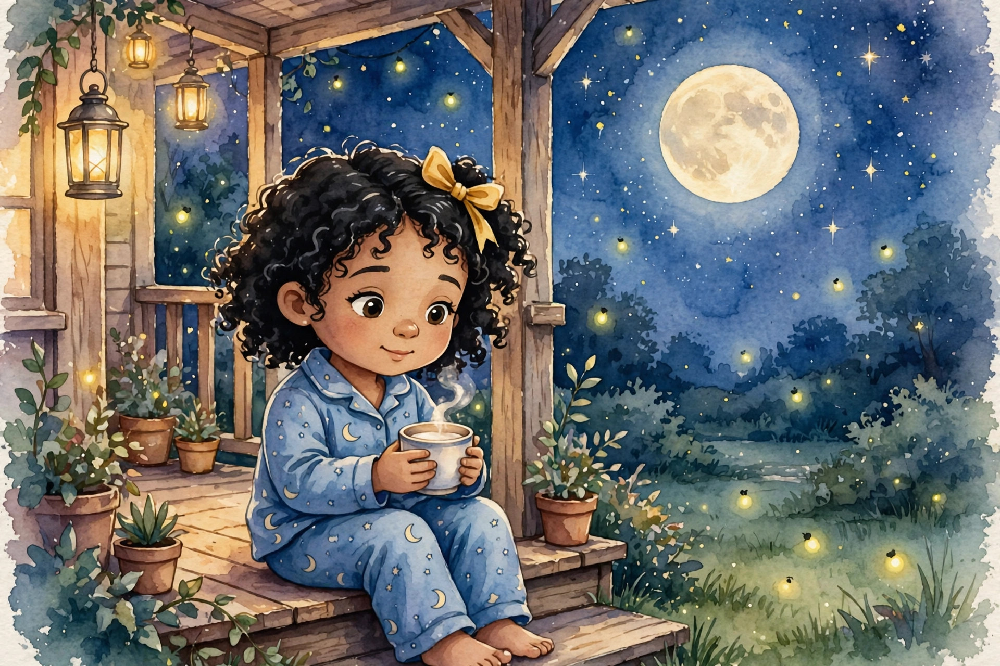
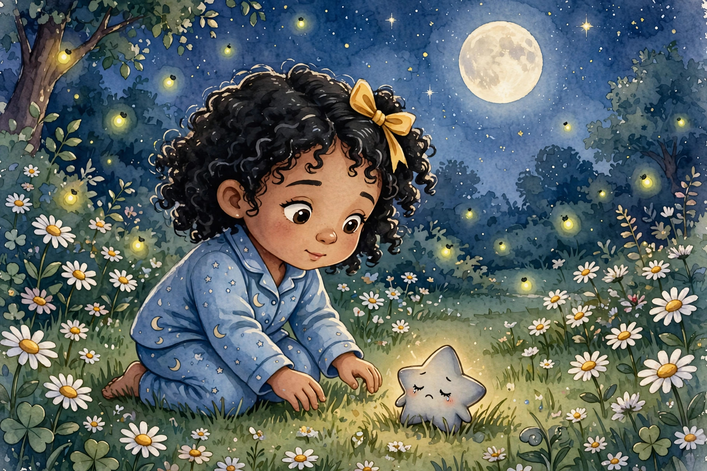
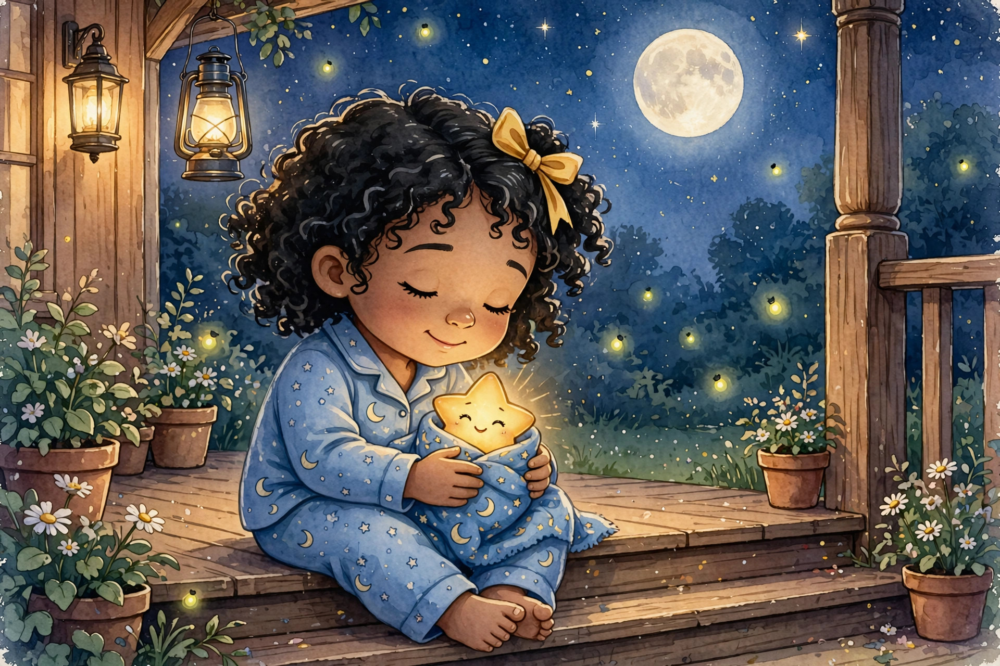

# Nia and the Sleepy Star

Every evening, just after dinner, Nia tiptoed onto the porch with her warm milk. The moon hung big and round in the sky, and the stars blinked at her like old friends. Nia always waved back. "Good night, moon," she whispered. "Good night, stars."

One evening, the wind was very quiet. Nia looked up and noticed something strange. One little corner of the sky was empty. A star was missing!

"Where did you go?" Nia called softly.

Just then, she heard the faintest sound from the garden. It was a tiny, sleepy sigh — like a yawn made of music.

Nia hurried down the porch steps, her slippers flopping on the cool grass. And there, nestled among the daisies, lay a tiny star. It was no bigger than her palm, and its glow had faded to a soft gray. It looked so, so tired.

"Oh, you poor thing," Nia said gently. "You fell, didn't you?"

The little star nodded very, very slowly. "I was dancing," it whispered in a voice like rustling leaves. "And I got so dizzy. And now I'm too sleepy to fly home."

Nia knew exactly what to do. Very carefully, so she wouldn't hurt its soft points, she scooped the little star into her hands. It was warm and trembly, like a kitten's purr.

She fetched her favorite blanket — the blue one with the yellow moons — and wrapped the star up snug as a burrito. Then she sat on the porch step and rocked it gently, back and forth.

"Hush now," Nia sang in her softest voice. "Close your sleepy eyes. The moon is watching over you tonight."

She sang the lullaby her grandma sang to her, the one about rivers of silver and boats made of dreams. As she sang, she felt the star grow heavier in her arms — the good kind of heavy, like a sleepy kitten settling in.

A little spark of gold flickered at the star's center. Then another. Then another! Soon the blanket glowed with the warmest, coziest light, like sunshine in a teacup.

"You did it," the star yawned, smiling with all five of its points. "You gave me your rest. Now I can shine again."

With a swish and a twinkle, the little star rose into the night sky. It soared past the moon, past the sleepy clouds, and tucked itself back into its empty corner — shining brighter than ever before.

Nia waved. "Good night, little star!"

And the star twinkled down at her, the happiest twinkle of all.

From that night on, whenever Nia waved at the sky, one little star always twinkled back first — the one that remembered how kindness had helped it rest.

**Kindness gives others the strength to shine again.**
